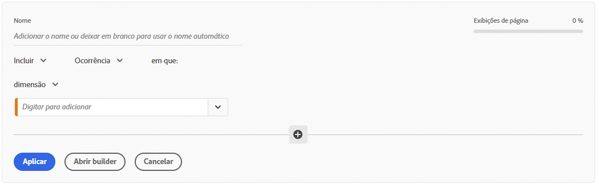
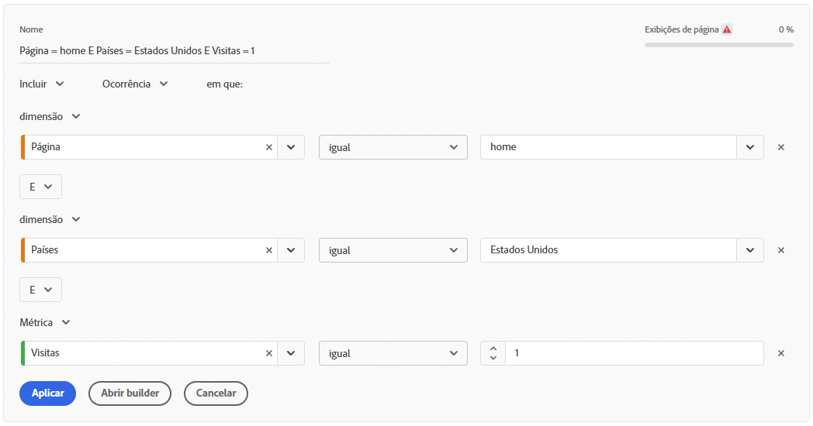
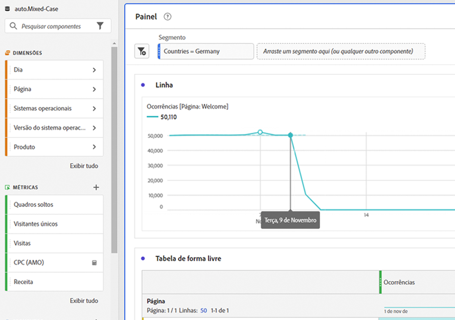
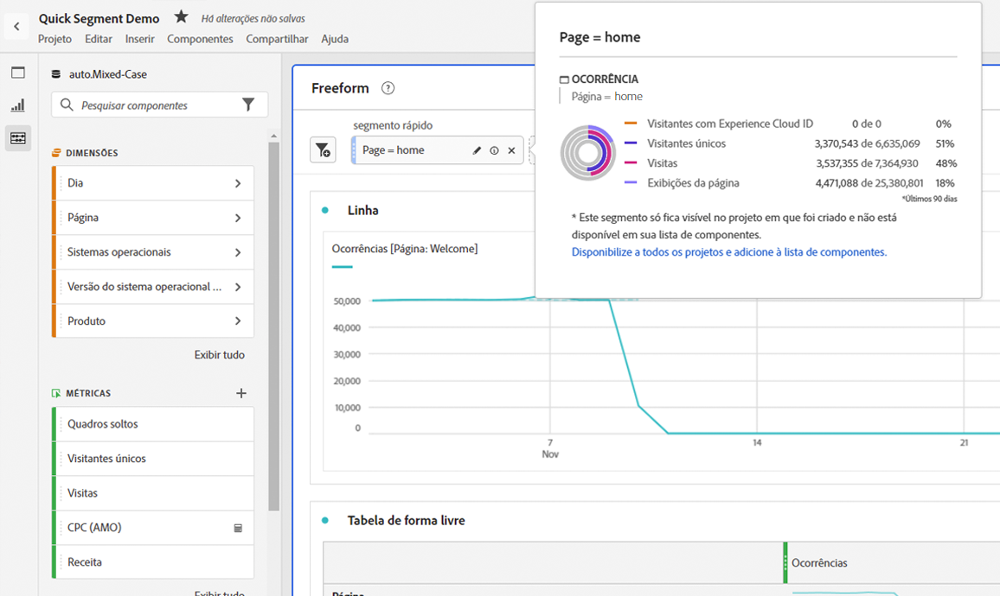
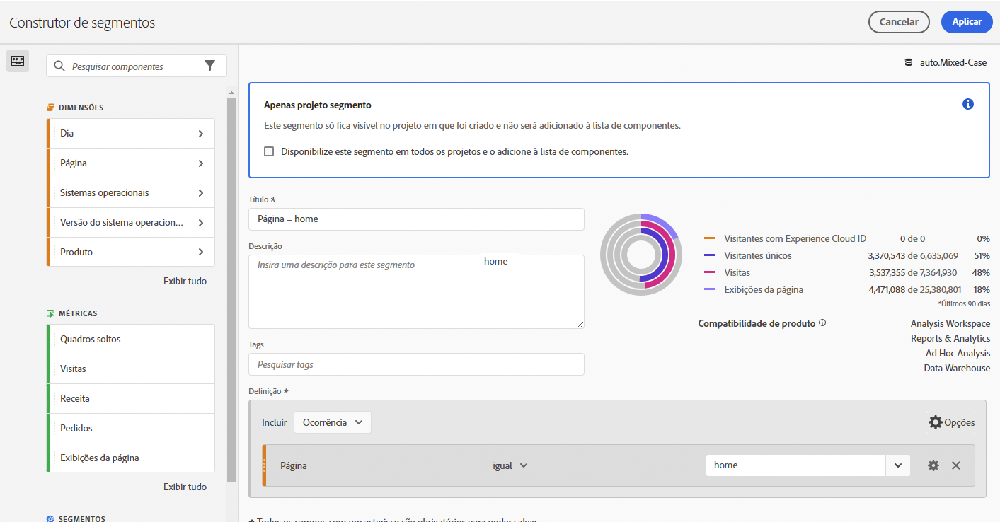
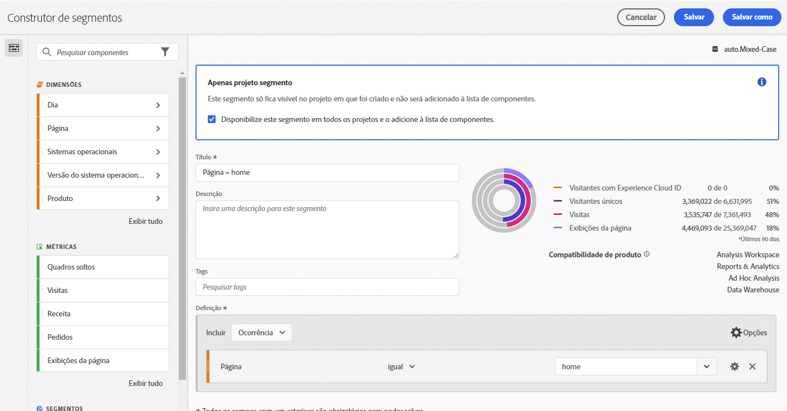

# Segmentos rápidos

Você pode criar segmentos rápidos em um projeto para ignorar a complexidade do [Criador de segmentos](/help/components/segmentation/segmentation-workflow/seg-build.md) completo. Segmentos rápidos

* Aplique-se somente aos projetos em que foram criados (é possível alterar isso).
* Permitir até 3 regras.
* Não acomode contêineres aninhados ou regras sequenciais.
* Trabalhe em projetos com vários conjuntos de relatórios.

Para uma comparação do que os segmentos rápidos podem fazer em relação aos segmentos da lista de componentes completos, acesse [aqui](/help/analyze/analysis-workspace/components/segments/t-freeform-project-segment.md).

>[!IMPORTANT]
> Os segmentos rápidos estão atualmente em testes limitados e estarão disponíveis em 21 de outubro de 2021.

## Pré-requisitos

Qualquer pessoa pode criar um [!UICONTROL Segmento rápido]. No entanto, é necessário a permissão [!UICONTROL Criação de segmentos] no [Adobe Admin Console](https://experienceleague.adobe.com/docs/analytics/admin/admin-console/permissions/summary-tables.html?lang=en#analytics-tools) para salvar segmentos rápidos ou abri-los no [!UICONTROL Construtor de segmentos].

## Criar segmentos rápidos

Em uma tabela de Forma livre, clique no ícone filter+ no cabeçalho do painel:

Configure o segmento rápido nesta tabulação em branco:

| Configuração | Descrição |
| --- | --- |
| Nome | O nome padrão de um segmento é uma combinação dos nomes das regras no segmento. Você pode renomear o segmento. |
| Incluir/excluir | Você pode incluir ou excluir componentes na definição do seu segmento, mas não ambos. |
| Contêiner de Ocorrência/Visita/Visitante | Os segmentos rápidos incluem um [contêiner de segmento](https://experienceleague.adobe.com/docs/analytics/components/segmentation/seg-overview.html?lang=en#section_AF2A28BE92474DB386AE85743C71B2D6) somente que permite incluir uma dimensão/métrica/intervalo de datas no (ou excluí-lo) segmento.  O Visitante contém dados abrangentes específicos para visitantes em visitas e visualizações de página. Um contêiner de [!UICONTROL Visita] permite definir regras para detalhar os dados do visitante com base em visitas e um contêiner de [!UICONTROL Ocorrência] permite detalhar as informações do visitante com base em visualizações de página individuais. O contêiner padrão é [!UICONTROL Hit]. |
| Componentes (Dimension/métrica/intervalo de datas) | Defina até 3 regras adicionando componentes (dimensões e/ou métricas e/ou intervalos de datas) e seus valores. Há 3 maneiras de encontrar o componente correto:<ul><li>Comece a digitar e o construtor [!UICONTROL Quick Segment] encontra automaticamente o componente apropriado.</li><li>Use a lista suspensa para localizar o componente.</li><li>Arraste e solte-os do painel esquerdo.</li></ul> |
| Operador | Use o menu suspenso para encontrar operadores padrão e operadores [!UICONTROL Distinct Count]. [Saiba mais](https://experienceleague.adobe.com/docs/analytics/components/segmentation/segment-reference/seg-operators.html?lang=en) |
| Sinal de mais (+) | Adicionar outra regra |
| Qualificadores E/OU | Você pode adicionar qualificadores &quot;AND&quot; ou &quot;OR&quot; às regras, mas não pode misturar &quot;AND&quot; e &quot;OR&quot; em uma única definição de segmento. |
| Aplicar | Aplique este segmento ao painel. Se o segmento não contiver dados, você será perguntado se deseja continuar. |
| Abrir builder | Abre o Construtor de segmentos. Depois de salvar ou aplicar o segmento no Construtor de segmentos, ele não é mais considerado um &quot;Segmento rápido&quot;. Ele se torna parte da biblioteca de segmentos da lista de componentes. |
| Cancelar | Cancele esse segmento rápido - não o aplique. |
| Intervalo de datas | O validador usa o intervalo de datas do painel para sua pesquisa de dados. Mas qualquer intervalo de datas aplicado em um segmento rápido substitui o intervalo de datas do painel na parte superior do painel. |
| Visualização (canto superior direito) | Permite ver se você tem um segmento válido e a amplitude deste. Representa o detalhamento do conjunto de dados que você pode esperar ver ao aplicar esse segmento. Você pode receber um aviso que indica que esse segmento não tem dados. Se esse for o caso, você pode continuar ou alterar a definição do segmento. |

Este é um exemplo de um segmento que combina dimensões e métricas:

O segmento aparece na parte superior. Observe a barra lateral com listras azuis, em vez da barra lateral azul para segmentos de nível de componente na biblioteca de segmentos à esquerda.

## Editar segmentos rápidos

1. Passe o mouse sobre o segmento rápido e selecione o ícone de lápis.
1. Edite a definição do segmento e/ou o nome do segmento.
1. Clique em [!UICONTROL Aplicar].

## Salvar segmentos rápidos

>[!IMPORTANT]
>Depois de salvar ou aplicar o segmento, não é mais possível editá-lo no Construtor de segmentos rápido, somente no Construtor de segmentos comum.

1. Depois de aplicar o segmento rápido, passe o mouse sobre ele e selecione o ícone de informações (&quot;i&quot;).

   

1. Clique em **[!UICONTROL Disponibilizar para todos os projetos e adicionar à lista de componentes]**.
1. (Opcional) Renomeie o segmento.
1. Clique em **[!UICONTROL Salvar]**.

Observe como a barra lateral do segmento muda de azul listrado para azul. Agora ele aparece na lista de componentes no painel esquerdo.

## O que são segmentos somente de projeto?

Os segmentos somente do projeto são segmentos rápidos ou segmentos de projeto ad-hoc do Workspace. Ao editá-los/abri-los no [!UICONTROL Construtor de segmentos], a caixa somente do projeto é exibida. Se você APLICAR um segmento rápido no construtor, mas não marcar a caixa disponibilizar , ele ainda será um segmento somente do projeto, mas não poderá mais ser aberto no [!UICONTROL Quick Segment Builder].

Se marcar a caixa e clicar em **[!UICONTROL SAVE]**, agora é um segmento da lista de componentes.

