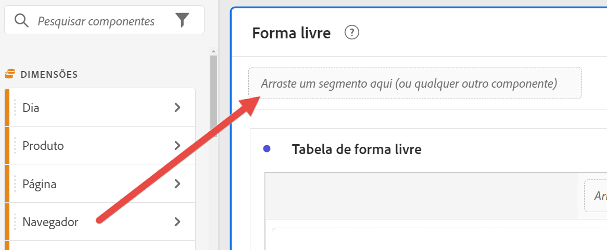

# Segmentos rápidos

Os segmentos rápidos permitem explorar dados de um determinado projeto com facilidade, sem a necessidade de criar um segmento de lista de componentes mais complexo no [construtor de segmentos](/help/components/segmentation/segmentation-workflow/seg-build.md).

Considere o seguinte ao criar segmentos rápidos:

* Os segmentos rápidos se aplicam somente ao projeto em que foram criados. Eles não estão disponíveis em outros projetos e não é possível compartilhá-los com outros usuários.
* São permitidas no máximo 3 regras.
* Não há suporte para containers aninhados ou regras sequenciais.

>[!BEGINSHADEBOX]

Consulte  [Quick segments](https://video.tv.adobe.com/v/341466?quality=12&learn=on){target="_blank"} para ver um vídeo de demonstração.

>[!ENDSHADEBOX]

## Criar um segmento rápido

Qualquer usuário no Analysis Workspace pode criar um segmento rápido.

Para criar um segmento rápido:

1. Escolha um dos seguintes métodos para começar a criar o segmento rápido:

   * **Ad hoc (arrastar e soltar):** no painel à esquerda, arraste um componente até a área de soltar segmentos no cabeçalho do painel.

     

     É possível editar o segmento conforme descrito em [Editar segmentos rápidos](#edit-quick-segments).

     >[!NOTE]
     >
     > Considere o seguinte ao criar um segmento rápido do tipo ad hoc (arrastar e soltar):
     > * Os seguintes tipos de componentes não são compatíveis: métricas calculadas e dimensões, bem como métricas a partir das quais não é possível criar segmentos.
     > * Para dimensões e eventos completos, o Analysis Workspace cria segmentos de ocorrência do tipo “existe”. Exemplos: `Hit where eVar1 exists` ou `Hit where event1 exists`.
     > * Se um segmento do tipo “não especificado” ou “nenhum” for solto na zona de destino, ele se converterá automaticamente em um segmento “não existe” para ser interpretado corretamente nos segmentos.

   * **Uso do ícone de segmento:** em uma tabela de forma livre, clique no ícone de **Segmento** no cabeçalho do painel.

     

1. Ajuste qualquer uma das seguintes configurações:

   | Configuração | Descrição |
   | --- | --- |
   | [!UICONTROL Nome] | O nome padrão de um segmento é uma combinação dos nomes das regras no segmento. É possível renomear o segmento com um nome mais intuitivo. |
   | [!UICONTROL Incluir/excluir] | Você pode incluir ou excluir componentes na definição do segmento, mas não ambos. |
   | [!UICONTROL Container de ocorrência/visita/visitante] | Os segmentos rápidos incluem apenas um [contêiner de segmento](https://experienceleague.adobe.com/docs/analytics/components/segmentation/seg-overview.html?lang=pt-BR#section_AF2A28BE92474DB386AE85743C71B2D6) que permite incluir (ou excluir) uma dimensão/métrica/intervalo de datas no segmento. [!UICONTROL O Visitante] contém dados abrangentes específicos para visitantes em visitas e visualizações de página. Um container de [!UICONTROL Visita] permite definir regras para detalhar os dados do visitante com base em visitas, e um container de [!UICONTROL Ocorrência] permite detalhar as informações do visitante com base em visualizações de página individuais. O container padrão é o de [!UICONTROL Ocorrência]. |
   | [!UICONTROL Componentes] (Dimensão/métrica/intervalo de datas) | Defina até 3 regras adicionando componentes (dimensões, métricas, intervalos de datas ou valores de dimensão). Há três maneiras de encontrar o componente correto:<ul><li>Comece a digitar e o construtor de segmentos rápido encontrará automaticamente o componente apropriado.</li><li>Use a lista suspensa para localizar o componente.</li><li>Arraste os componentes do painel esquerdo e solte-os.</li></ul> |
   | [!UICONTROL Operador] | Use o menu suspenso para encontrar operadores padrão e operadores de [!UICONTROL Contagem distinta]. Consulte [Operadores de segmento](/help/components/segmentation/seg-reference/seg-operators.md). |
   | Sinal de mais (+) | Adicionar outra regra |
   | Qualificadores AND/OR | Você pode adicionar qualificadores &quot;AND&quot; ou &quot;OR&quot; às regras, mas não pode misturar &quot;AND&quot; e &quot;OR&quot; em uma única definição de segmento. |
   | [!UICONTROL Aplicar] | Aplique este segmento ao painel. Se o segmento não contiver dados, será solicitado se você deseja continuar. |
   | [!UICONTROL Abrir o construtor] | Abre o Construtor de segmentos. Depois de salvar ou aplicar o segmento no Construtor de segmentos, ele não é mais considerado um “segmento rápido”. Ele se torna parte da biblioteca de segmentos da lista de componentes. 
Para disponibilizar o componente em todos os projetos e no painel esquerdo, selecione a opção [!UICONTROL **Disponibilizar este segmento em todos os projetos e adicioná-lo à lista de componentes**].

Para obter mais informações, consulte a seção [Salvar um segmento rápido como um segmento da lista de componentes](#save-a-quick-segment-as-a-component-list-segment) neste artigo.

**Nota:** somente usuários com a permissão de Criação de segmento no [Adobe Admin Console](/help/admin/admin-console/permissions/analytics-tools.md) podem abrir o Construtor de segmentos.
 |
   | [!UICONTROL Cancelar] | Cancele esse segmento rápido (não o aplique). |
   | [!UICONTROL Intervalo de datas] | O validador usa o intervalo de datas do painel para sua pesquisa de dados. Mas qualquer intervalo de datas aplicado em um segmento rápido substitui o intervalo de datas do painel na parte superior do painel. |
   | Pré-visualização (canto superior direito) | Permite visualizar se você tem um segmento válido e quão amplo é o segmento. Representa o detalhamento do conjunto de dados que você pode esperar ao aplicar esse segmento. Você poderá receber um aviso indicando que esse segmento não tem dados. Nesse caso, você pode continuar ou alterar a definição do segmento. |

1. Clique em [!UICONTROL **Aplicar**] para salvar suas alterações.

## Editar segmentos rápidos

1. Passe o mouse sobre o segmento rápido e clique no ícone **Editar**.

   

1. Edite a definição do segmento e/ou o nome do segmento.

1. Selecione [!UICONTROL **Aplicar**].

## Salvar segmentos rápidos como um segmento da lista de componentes

>[!IMPORTANT]
>
> Considere o seguinte ao salvar um segmento rápido:
> 
> * Para salvar um segmento rápido, você precisa ter a permissão de Criação de segmentos no [Adobe Admin Console](/help/admin/admin-console/permissions/analytics-tools.md).
> 
> * Depois de salvar ou aplicar o segmento, ele não pode mais ser editado no construtor de segmentos rápidos. Em vez disso, você deve usar o Construtor de segmentos tradicional.

Você pode optar por salvar segmentos rápidos como segmentos da lista de componentes. As vantagens dos segmentos da lista de componentes incluem:

* Disponibilidade em todos os projetos do espaço de trabalho
* Suporte a segmentos mais complexos, bem como segmentos sequenciais

Possibilidade de salvar segmentos no construtor de segmentos rápidos ou no [!UICONTROL Construtor de filtros].

### Salvar no construtor de segmentos rápidos {#save2}

1. Depois de aplicar o segmento rápido, passe o mouse sobre ele e selecione o ícone de informações (“i”).
1. Selecione **[!UICONTROL Disponibilizar em todos os projetos e adicionar à sua lista de componentes]**.
1. (Opcional) Renomeie o segmento.
1. Selecione **[!UICONTROL Salvar]**.

   O segmento agora aparece na sua lista de componentes no painel esquerdo. Além disso, observe que a barra lateral do segmento muda de azul-claro para azul-escuro, indicando que você não pode mais editá-lo ou abri-lo no construtor de segmentos rápidos.

### Salvar no Construtor de segmentos {#save3}

1. Depois de aplicar o segmento rápido, passe o mouse sobre ele e selecione o ícone de informações (“i”).
1. Selecione **[!UICONTROL Salvar segmento]**
1. (Opcional) Renomeie o segmento e clique em [!UICONTROL **Aplicar**].

   Volte para o espaço de trabalho e observe que a barra lateral do segmento muda de azul-claro para azul-escuro, indicando que você não pode mais editá-lo ou abri-lo no construtor de segmentos rápidos. E ao salvá-lo, ele se torna parte da lista de componentes.

Depois de aplicar o segmento, você poderá optar por adicioná-lo à lista de componentes do segmento e disponibilizá-lo em todos os seus projetos.

1. Passe o mouse sobre o segmento salvo e clique no ícone de lápis.

1. Selecione [!UICONTROL **Abrir construtor**].

1. Na parte superior do Construtor de segmentos, observe a caixa de diálogo [!UICONTROL **Segmento somente de projeto**]:

   

1. Marque a caixa de seleção ao lado de **[!UICONTROL Disponibilizar para todos os projetos e adicionar à lista de componentes.]**

1. Selecione **[!UICONTROL Salvar]**.

   O segmento agora aparece na lista de componentes do segmento para todos os seus projetos.
Você também pode [compartilhar o segmento](https://experienceleague.adobe.com/docs/analytics/analyze/analysis-workspace/curate-share/curate.html?lang=pt-BR#concept_4A9726927E7C44AFA260E2BB2721AFC6) com outras pessoas na sua organização.

## Exemplo de segmento rápido

Este é um exemplo de segmento que combina dimensões e métricas:

## Problema conhecido

1. Crie um segmento rápido com 2 entradas e **[!UICONTROL Salve]** como Test1.
1. Clique em **[!UICONTROL Salvar como]** e salve este segmento rápido como Test2.
1. Edite o segmento rápido Test2 e salve-o novamente como Test2.
Observe que o segmento rápido Test1 é modificado pelo Test2.
