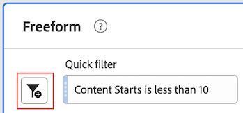

# Segmentos rápidos

Os segmentos rápidos permitem explorar dados facilmente em um determinado projeto, sem a necessidade de criar um segmento de lista de componentes mais complexo na [construtor de segmentos](/help/components/segmentation/segmentation-workflow/seg-build.md).

Considere o seguinte ao criar segmentos rápidos:

* Os segmentos rápidos se aplicam somente ao projeto em que foram criados. Eles não estão disponíveis em outros projetos e não podem ser compartilhados com outros usuários.
* São permitidas no máximo 3 regras.
* Não há suporte para contêineres aninhados ou regras sequenciais.

O vídeo a seguir demonstra como usar segmentos rápidos:

>[!VIDEO](https://video.tv.adobe.com/v/341466/?quality=12&learn=on)

## Criar um segmento rápido

Qualquer usuário no Analysis Workspace pode criar um segmento rápido.

Para criar um segmento rápido:

1. Escolha um dos seguintes métodos para começar a criar o segmento rápido:

   * **Ad hoc (arrastar e soltar):** No painel à esquerda, arraste um componente para a área designada próxima à **Segmento** no cabeçalho do painel, selecione o **Editar** ícone para ajustar o segmento.

     

     >[!NOTE]
     >
     > Considere o seguinte ao criar um segmento rápido ad hoc (arrastar e soltar):
     > * Os seguintes tipos de componentes não são compatíveis: métricas calculadas e dimensões, bem como métricas a partir das quais você não pode criar segmentos.
     > * Para dimensões e eventos completos, o Analysis Workspace cria segmentos de ocorrência &quot;existe&quot;. Exemplos: `Hit where eVar1 exists` ou `Hit where event1 exists`.
     > * Se as opções &quot;não especificado&quot; ou &quot;nenhum&quot; forem soltas na zona de soltar dos segmentos, serão automaticamente convertidas em um segmento &quot;não existe&quot; para que sejam tratadas corretamente nos segmentos.

   * **Usando o ícone de segmento:** Em uma tabela de Forma livre, selecione o **Segmento** no cabeçalho do painel.

     

1. Ajuste qualquer uma das seguintes configurações:

   | Configuração | Descrição |
   | --- | --- |
   | [!UICONTROL Nome] | O nome padrão de um segmento é uma combinação dos nomes das regras no segmento. É possível renomear o segmento para um nome mais amigável. |
   | [!UICONTROL Incluir/excluir] | Você pode incluir ou excluir componentes na definição do segmento, mas não ambos. |
   | [!UICONTROL Container de ocorrência/visita/visitante] | Os segmentos rápidos incluem apenas um [contêiner de segmento](https://experienceleague.adobe.com/docs/analytics/components/segmentation/seg-overview.html?lang=pt-BR#section_AF2A28BE92474DB386AE85743C71B2D6) que permite incluir (ou excluir) uma dimensão/métrica/intervalo de datas no segmento. [!UICONTROL O Visitante] contém dados abrangentes específicos para visitantes em visitas e visualizações de página. Um container de [!UICONTROL Visita] permite definir regras para detalhar os dados do visitante com base em visitas, e um container de [!UICONTROL Ocorrência] permite detalhar as informações do visitante com base em visualizações de página individuais. O container padrão é o de [!UICONTROL Ocorrência]. |
   | [!UICONTROL Componentes] (Dimensão/métrica/intervalo de datas) | Defina até 3 regras adicionando componentes (dimensões, métricas, intervalos de datas ou valores de dimensão). Há três maneiras de encontrar o componente correto:<ul><li>Comece a digitar e o construtor de segmentos rápidos encontrará automaticamente o componente apropriado.</li><li>Use a lista suspensa para localizar o componente.</li><li>Arraste os componentes do painel esquerdo e solte-os.</li></ul> |
   | [!UICONTROL Operador] | Use o menu suspenso para encontrar operadores padrão e operadores de [!UICONTROL Contagem distinta]. Consulte [Operadores de segmento](/help/components/segmentation/seg-reference/seg-operators.md). |
   | Sinal de mais (+) | Adicionar outra regra |
   | Qualificadores AND/OR | Você pode adicionar qualificadores &quot;AND&quot; ou &quot;OR&quot; às regras, mas não pode misturar &quot;AND&quot; e &quot;OR&quot; em uma única definição de segmento. |
   | [!UICONTROL Aplicar] | Aplique este segmento ao painel. Se o segmento não contiver dados, você será perguntado se deseja continuar. |
   | [!UICONTROL Abrir builder] | Abre o Construtor de segmentos. Depois de salvar ou aplicar o segmento no Construtor de segmentos, ele não é mais considerado um &quot;segmento rápido&quot;. Ele se torna parte da biblioteca de segmentos da lista de componentes. 
Para disponibilizar o componente em todos os projetos e no painel esquerdo, selecione a opção [!UICONTROL **Disponibilize este segmento para todos os projetos e adicione-o à lista de componentes**].

Para obter mais informações, consulte a seção [Salvar um segmento rápido como um segmento da lista de componentes](#save-a-quick-segment-as-a-component-list-segment) neste artigo.

**Nota:** Somente usuários com a permissão Criação de segmento no [Adobe Admin Console](/help/admin/admin-console/permissions/analytics-tools.md) Você pode abrir o Construtor de segmentos.
 |
   | [!UICONTROL Cancelar] | Cancele este segmento rápido (não o aplique). |
   | [!UICONTROL Intervalo de datas] | O validador usa o intervalo de datas do painel para sua pesquisa de dados. Mas qualquer intervalo de datas aplicado em um segmento rápido substitui o intervalo de datas do painel na parte superior do painel. |
   | Pré-visualização (canto superior direito) | Permite visualizar se você tem um segmento válido e quão amplo é o segmento. Representa o detalhamento do conjunto de dados que você pode esperar ao aplicar esse segmento. Você poderá receber um aviso indicando que esse segmento não tem dados. Nesse caso, você pode continuar ou alterar a definição do segmento. |

1. Selecionar [!UICONTROL **Aplicar**] para salvar as alterações.

## Editar segmentos rápidos

1. Passe o mouse sobre o segmento rápido e selecione o **Editar** ícone.

   

1. Edite a definição do segmento e/ou o nome do segmento.

1. Selecione [!UICONTROL **Aplicar**].

## Salvar segmentos rápidos como um segmento da lista de componentes

>[!IMPORTANT]
>
> Considere o seguinte ao salvar um segmento rápido:
> 
> * Para salvar um segmento rápido, você precisa da permissão Criação de segmentos no [Adobe Admin Console](/help/admin/admin-console/permissions/analytics-tools.md).
> 
> * Depois de salvar ou aplicar o segmento, ele não pode mais ser editado no construtor de segmentos rápido. Em vez disso, você deve usar o Construtor de segmentos comum.

Você pode optar por salvar segmentos rápidos como segmentos da lista de componentes. As vantagens dos segmentos da lista de componentes incluem:

* Disponibilidade em todos os projetos do Workspace
* Suportar segmentos mais complexos, bem como segmentos sequenciais

É possível salvar segmentos no Construtor de segmentos rápidos ou na [!UICONTROL Construtor de filtros].

### Salvar no construtor de segmentos rápido {#save2}

1. Depois de aplicar o segmento rápido, passe o mouse sobre ele e selecione o ícone de informações (&quot;i&quot;).
1. Selecionar **[!UICONTROL Disponibilizar para todos os projetos e adicionar à lista de componentes]**.
1. (Opcional) Renomeie o segmento.
1. Selecione **[!UICONTROL Salvar]**.

   O segmento agora aparece na lista de componentes no painel esquerdo. Além disso, observe que a barra lateral do segmento muda de azul-claro para azul-escuro, indicando que ela não pode mais ser editada ou aberta no construtor rápido de segmentos.

### Salvar no Construtor de segmentos {#save3}

1. Depois de aplicar o segmento rápido, passe o mouse sobre ele e selecione o ícone de informações (&quot;i&quot;).
1. Selecionar **[!UICONTROL Salvar segmento]**
1. (Opcional) Renomeie o segmento e selecione [!UICONTROL **Aplicar**].

   Volte para o Espaço de trabalho e observe que a barra lateral do segmento muda de azul-claro para azul-escuro, indicando que ele não pode mais ser editado ou aberto no construtor rápido de segmentos. E ao salvá-lo, ele se torna parte da lista de componentes.

Depois de aplicar o segmento, você pode optar por adicioná-lo à lista de componentes de segmento e disponibilizá-lo para todos os projetos.

1. Passe o mouse sobre o segmento salvo e selecione o ícone de lápis.

1. Selecionar [!UICONTROL **Abrir builder**].

1. Na parte superior do Construtor de segmentos, observe as [!UICONTROL **Segmento somente de projeto**] diálogo:

   

1. Marque a caixa de seleção ao lado de **[!UICONTROL Disponibilizar para todos os projetos e adicionar à lista de componentes.]**

1. Selecione **[!UICONTROL Salvar]**.

   O segmento agora aparece na lista de componentes de segmento para todos os projetos.
Também é possível [compartilhar o segmento](https://experienceleague.adobe.com/docs/analytics/analyze/analysis-workspace/curate-share/curate.html?lang=pt-BR#concept_4A9726927E7C44AFA260E2BB2721AFC6) com outras pessoas em sua organização.

## Exemplo de segmento rápido

O exemplo de segmento a seguir combina dimensões e métricas:

## Problema conhecido

1. Crie um segmento rápido com 2 entradas e **[!UICONTROL Salve]** como Test1.
1. Clique em **[!UICONTROL Salvar como]** e salve este segmento rápido como Test2.
1. Edite o segmento rápido Test2 e salve-o novamente como Test2.
Observe que o segmento rápido Test1 é modificado pelo Test2.
