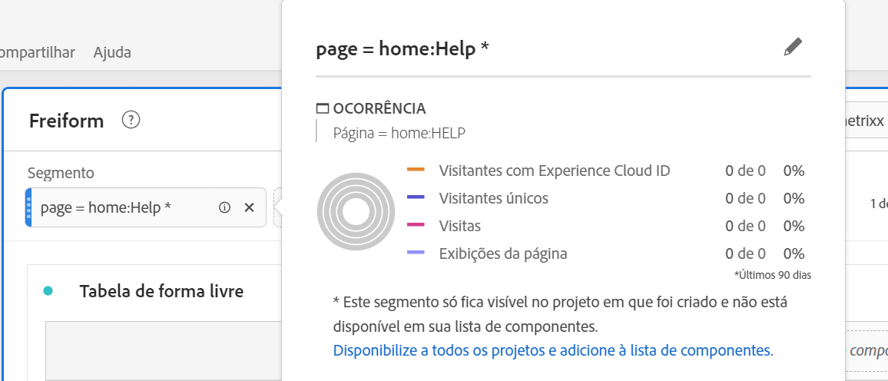

# Segmentos {#topic_DC2917A2E8FD4B62816572F3F6EDA58A}

Você pode criar diferentes tipos de segmentos, dependendo da complexidade que eles precisam ser, se eles devem se aplicar somente a este projeto etc. Este é um resumo dos tipos de segmentos:

| Tipo de segmento | Onde foi criado? | Onde aplicável? | Vários contêineres? | Cor da interface do usuário |
| --- | --- | --- | --- |
| Segmento da lista de componentes | [Construtor de segmentos](/help/components/segmentation/segmentation-workflow/seg-build.md) | Para todos os projetos, no painel esquerdo | Sim | Azul |
| Segmento rápido | [Construtor de segmentos rápido](/help/analyze/analysis-workspace/components/segments/quick-segments.md) | Somente nível do projeto | Não | Cinza? |
| Segmentos ad hoc: | Consulte abaixo | Somente nível do projeto | Não | ? |
| - Segmento de projeto Ad Hoc Workspace | Arrastar e soltar no segmento ? em um novo projeto |  |  |  |
| - Segmento calculado com base em métricas | Construtor de métrica calculada |  |  |  |
| - Segmento baseado em VRS | Construtor do conjunto de relatórios virtual |  |  |  |
| - Construtor de segmentos &quot;aplique&quot; &quot; | Construtor de segmentos |  |  |  |

Para obter uma discussão detalhada da segmentação no Adobe Analytics, acesse [aqui](/help/components/segmentation/seg-overview.md).

## Segmentos da lista de componentes no painel esquerdo {#section_3B07D458C43E42FDAF242BB3ACAF3E90}

O painel de segmentos do Menu de componentes mostra segmentos e modelos de segmentos, indicados por estes ícones:

[Usando segmentos na Analysis Workspace](https://experienceleague.adobe.com/docs/analytics-learn/tutorials/analysis-workspace/applying-segments/using-segments-in-analysis-workspace.html?lang=pt-BR) (6:46)

## Segmentos ad hoc (temporários) no Analysis Workspace

Este é um vídeo sobre segmentos ad hoc:

>[!VIDEO](https://video.tv.adobe.com/v/23978/?quality=12)

## Criar segmentos {#section_693CFADA668B4542B982446C2B4CF0F5}

É possível criar segmentos instantâneos ao soltar qualquer tipo de componente (dimensão, item de dimensão, evento, métrica, segmento, modelo de segmento, intervalo de datas) na zona de segmentos na parte superior de um painel.

Os tipos de componentes são convertidos automaticamente em segmentos. Como alternativa, você pode clicar no sinal “+” na caixa de depósito Adicionar segmento.

Lembre-se:

* **Não** é possível soltar os seguintes tipos de componentes na zona de segmentos: métricas calculadas e dimensões/métricas; a partir dos quais não pode-se criar segmentos.
* Para dimensões e eventos completos, o Analysis Workspace cria segmentos de ocorrência &quot;existe&quot;. Exemplos: “Ocorrência em que eVar1 existe” ou “Ocorrência em que event1 existe”.
* Se as opções “não especificado” ou “nenhum” forem soltas na zona de soltar dos segmentos, serão automaticamente convertidas em um segmento “não existe” para que sejam tratadas corretamente na segmentação.

>[!NOTE]
>
>Segmentos criados desse modo são internos no projeto.

Você pode escolher se deseja tornar os segmentos públicos (globais) seguindo estas etapas:

1. Passe o mouse sobre o segmento no local onde os segmentos são colocados e clique no ícone “i”.
1. No painel de informações que é exibido, clique em **[!UICONTROL Tornar público]**.

   

## Outros métodos para aplicar segmentos {#section_10FF2E309BA84618990EA5B473015894}

>[!VIDEO](https://video.tv.adobe.com/v/30994/?quality=12)

Existem vários outros métodos para aplicar os segmentos em um projeto de forma livre.

| Ação | Descrição |
|--- |--- |
| Criar segmento a partir da seleção | Criar um segmento em linha. Selecione as linhas, clique com o botão direito do mouse na seleção, em seguida, crie um segmento em linha. Este segmento se aplica somente ao projeto aberto e não é salvo como um segmento do Analytics. 1. Selecione as linhas.  2. Clique com o botão direito na seleção.  3. Clique em *Criar segmento a partir da seleção*. |
| Componentes > Novo segmento | Exibe o Construtor de segmentos. Consulte [Construtor de segmentos](https://experienceleague.adobe.com/docs/analytics/components/segmentation/segmentation-workflow/seg-build.html?lang=pt-BR) para mais informações sobre segmentação. |
| Compartilhar > Compartilhar projeto ou compartilhar > Preparar dados do projeto | Veja em [Preparar e compartilhar](https://experienceleague.adobe.com/docs/analytics/analyze/analysis-workspace/curate-share/curate.html?lang=pt-BR#concept_4A9726927E7C44AFA260E2BB2721AFC6) como os segmentos aplicados ao projeto ficam disponíveis para o destinatário em análise compartilhada. |
| Usar segmentos como Dimensões | Vídeo: [Usar segmentos como Dimensões no Analysis Workspace](https://experienceleague.adobe.com/docs/analytics-learn/tutorials/analysis-workspace/applying-segments/using-segments-as-dimensions-in-analysis-workspace.html?lang=pt-BR) |

