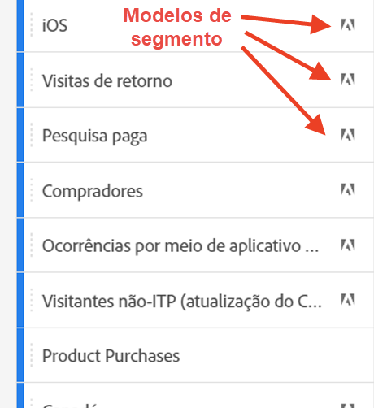

# Segmentos {#topic_DC2917A2E8FD4B62816572F3F6EDA58A}

Você pode criar diferentes tipos de segmentos no Workspace, dependendo da complexidade que eles precisam ser, se eles devem se aplicar somente a este projeto etc. Este é um resumo dos tipos de segmentos:

| Tipo de segmento | Criado onde? | Onde aplicável? | Quando usar |
| --- | --- | --- | --- |
| Segmento da lista de componentes | Clique em +, o que leva você ao [Construtor de segmentos](/help/components/segmentation/segmentation-workflow/seg-build.md) | Todos os projetos do Workspace | Para segmentos mais complexos, segmentos sequenciais |
| Segmento rápido | [Construtor de segmentos rápido](/help/analyze/analysis-workspace/components/segments/quick-segments.md) | Nível do projeto, mas pode salvar e adicionar à lista de segmentos. | Flexibilidade para adicionar/editar uma ou mais regras |
| Segmentos ad-hoc: |  |  |  |
| - Segmento de projeto ad-hoc do Workspace | [Arrastar e soltar na área de soltar de segmentos em um projeto](/help/analyze/analysis-workspace/components/segments/ad-hoc-segments.md) | Nível do projeto, mas pode salvar e adicionar à lista de segmentos. | Para segmentos padrão de regra única (sem limite) |
| - Segmento calculado com base em métricas | [Construtor de métrica calculada](https://experienceleague.adobe.com/docs/analytics/components/calculated-metrics/calcmetric-workflow/metrics-with-segments.html) | Para métrica calculada individual | Aplicar segmentos na definição de métricas |
| - Segmento baseado em VRS | [Construtor do conjunto de relatórios virtual](https://experienceleague.adobe.com/docs/analytics/components/virtual-report-suites/vrs-workflow/vrs-create.html) | Para um conjunto de relatórios virtual individual | Aplicar segmentos na definição de VRS |

Este é um vídeo sobre o uso de segmentos no Analysis Workspace:

>[!VIDEO](https://video.tv.adobe.com/v/23977/?quality=12)

## Criar segmentos {#section_693CFADA668B4542B982446C2B4CF0F5}

Você pode criar diferentes tipos de segmentos no Analysis Workspace:

* [Segmentos rápidos](/help/analyze/analysis-workspace/components/segments/quick-segments.md)
* [Segmentos ad-hoc](/help/analyze/analysis-workspace/components/segments/ad-hoc-segments.md)
* Segmentos de lista de componentes comuns que acabam na biblioteca de segmentos (veja abaixo)

### Criar segmentos da lista de componentes {#section_3B07D458C43E42FDAF242BB3ACAF3E90}

O painel de segmentos no menu Componentes mostra
* Segmentos criados por você ou pela sua empresa
* Modelos de segmento, conforme indicado pelo ícone de Adobe:

Para criar um segmento desse tipo, você tem 2 opções. Ambos levam você ao [Construtor de segmentos](/help/components/segmentation/segmentation-workflow/seg-build.md) no Adobe Analytics.

* No painel à esquerda, clique no sinal de mais (+) ao lado de [!UICONTROL Segmentos]:

ou

* Vá para [!UICONTROL Componentes] > [!UICONTROL Segmentos] e clique em [!UICONTROL + Adicionar].

### Outros métodos para aplicar segmentos {#section_10FF2E309BA84618990EA5B473015894}

>[!VIDEO](https://video.tv.adobe.com/v/30994/?quality=12)

Existem vários outros métodos para aplicar os segmentos em um projeto de forma livre.

| Ação | Descrição |
|--- |--- |
| Criar segmento a partir da seleção | Criar um segmento em linha. Este segmento se aplica somente ao projeto aberto e não é salvo como um segmento do Analytics. 1. Selecione as linhas.  2. Clique com o botão direito na seleção.  3. Clique em *Criar segmento a partir da seleção*. |
| Componentes > Novo segmento | Exibe o Construtor de segmentos. Consulte [Construtor de segmentos](https://experienceleague.adobe.com/docs/analytics/components/segmentation/segmentation-workflow/seg-build.html?lang=pt-BR) para mais informações sobre segmentação. |
| Compartilhar > Compartilhar projeto ou compartilhar > Preparar dados do projeto | Veja em [Preparar e compartilhar](https://experienceleague.adobe.com/docs/analytics/analyze/analysis-workspace/curate-share/curate.html?lang=pt-BR#concept_4A9726927E7C44AFA260E2BB2721AFC6) como os segmentos aplicados ao projeto ficam disponíveis para o destinatário em análise compartilhada. |
| Usar segmentos como Dimensões | Vídeo: [Usar segmentos como Dimensões no Analysis Workspace](https://experienceleague.adobe.com/docs/analytics-learn/tutorials/analysis-workspace/applying-segments/using-segments-as-dimensions-in-analysis-workspace.html?lang=pt-BR) |

## Segment IQ

O Segment IQ (também conhecido como Comparação de segmentos) inclui os seguintes recursos:

* [Painel de comparação de segmentos:](/help/analyze/analysis-workspace/c-panels/c-segment-comparison/segment-comparison.md) principal Segment IQ. Arraste dois segmentos para o painel e exiba um relatório abrangente que mostra as diferenças estatisticamente significativas e as sobreposições entre os dois públicos.
* [Comparação de segmentos no fallout:](/help/analyze/analysis-workspace/visualizations/fallout/compare-segments-fallout.md) veja como públicos diferentes se comparam entre si no contexto de uma visualização de fallout.

## Mais informações

Para obter uma discussão detalhada da segmentação no Adobe Analytics, acesse [aqui](/help/components/segmentation/seg-overview.md).