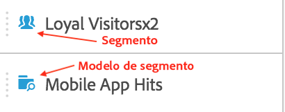
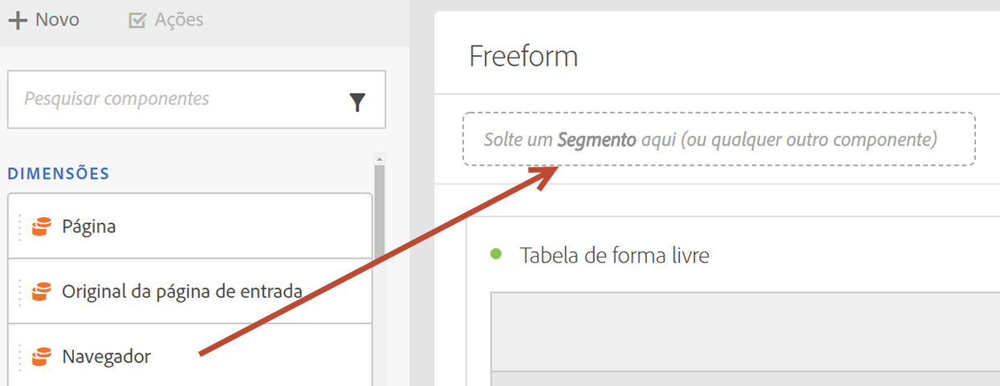
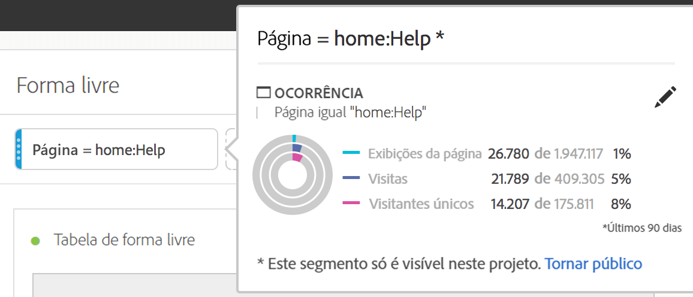

# Segmentos {#topic_DC2917A2E8FD4B62816572F3F6EDA58A}

## Painel de segmentos {#section_3B07D458C43E42FDAF242BB3ACAF3E90}

O painel de segmentos do Menu de componentes mostra segmentos e modelos de segmentos, indicados por estes ícones:

[Uso de segmentos no Analysis Workspace no YouTube](https://www.youtube.com/watch?v=QlUCdQDnni4)(6:46)

## Criar segmentos {#section_693CFADA668B4542B982446C2B4CF0F5}

Você pode criar segmentos instantâneos soltando qualquer tipo de componente (dimensão, item de dimensão, evento, métrica, segmento, modelo de segmento, intervalo de datas) na área de segmentos na parte superior de um painel.

Os tipos de componentes são convertidos automaticamente em segmentos. Como alternativa, você pode clicar no sinal “+” na caixa de depósito Adicionar segmento.

Lembre-se:

* Não é **possível** soltar os seguintes tipos de componentes na zona de segmentos: métricas calculadas e dimensões/métricas das quais não é possível criar segmentos.
* Para dimensões e eventos completos, o Analysis Workspace cria segmentos de ocorrência &quot;existe&quot;. Exemplos: &quot;Ocorrência em que eVar1 existe&quot; ou &quot;ocorrência em que o evento 1 existe&quot;.
* Se as opções “não especificado” ou “nenhum” forem soltas na zona de soltar dos segmentos, serão automaticamente convertidas em um segmento “não existe” para que sejam tratadas corretamente na segmentação.

>[!NOTE] Segmentos criados desse modo são internos no projeto.

Você pode optar por tornar esses segmentos públicos (globais) seguindo estas etapas:

1. Passe o cursor do mouse sobre o segmento na zona para soltar e clique no ícone &quot;i&quot;.
1. In the information panel that displays, click **[!UICONTROL Make public]**.

   

## Outros métodos para aplicar segmentos {#section_10FF2E309BA84618990EA5B473015894}

Existem vários outros métodos para aplicar segmentos a um projeto de forma livre.

| Ação | Descrição |
|--- |--- |
| Criar segmento a partir da seleção | Crie um segmento em linha. Selecione linhas, clique com o botão direito do mouse na seleção e crie um segmento em linha. Este segmento se aplica somente ao projeto aberto e não é salvo como um segmento do Analytics. 1. Selecione as linhas.  2. Clique com o botão direito na seleção.  3. Clique em *Criar segmento a partir da seleção*. |
| Componentes > Novo segmento | Exibe o Construtor de segmentos. Consulte [Construtor de segmentos](https://docs.adobe.com/content/help/pt-BR/analytics/components/segmentation/segmentation-workflow/seg-build.html) para mais informações sobre segmentação. |
| Compartilhar > Compartilhar projeto ou compartilhar > Preparar dados do projeto | Veja em [Preparar e compartilhar](https://docs.adobe.com/content/help/pt-BR/analytics/analyze/analysis-workspace/curate-share/curate.html#concept_4A9726927E7C44AFA260E2BB2721AFC6) como os segmentos aplicados ao projeto ficam disponíveis para o destinatário em análise compartilhada. |
| Usar segmentos como dimensões | Vídeo: [Usar segmentos como Dimensões no Analysis Workspace](https://www.youtube.com/watch?v=WmSdReKTWto&amp;list=PL2tCx83mn7GuNnQdYGOtlyCu0V5mEZ8sS&amp;index=39) |
