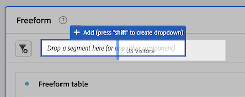

# Segmentos {#topic_DC2917A2E8FD4B62816572F3F6EDA58A}

## Segment rail {#section_3B07D458C43E42FDAF242BB3ACAF3E90}

O painel de segmentos do menu de Componentes mostra segmentos e modelos de segmentos, indicados por estes ícones:

[Uso de segmentos na Analysis Workspace no YouTube](https://www.youtube.com/watch?v=QlUCdQDnni4)(6:46)

## Criar segmentos {#section_693CFADA668B4542B982446C2B4CF0F5}

É possível criar segmentos instantâneos ao soltar qualquer tipo de componente (dimensão, item de dimensão, evento, métrica, segmento, modelo de segmento, intervalo de datas) na zona de segmentos na parte superior de um painel.

Os tipos de componentes são convertidos automaticamente em segmentos. Como alternativa, você pode clicar no sinal "+" na caixa Adicionar segmento.

Lembre-se:

* **Não** é possível soltar os seguintes tipos de componentes na zona de segmentos: métricas calculadas e dimensões/métricas; a partir dos quais não pode-se criar segmentos.
* Para dimensões e eventos completos, a Analysis Workspace cria segmentos de ocorrência "existe". Exemplos: “Ocorrência em que eVar1 existe” ou “Ocorrência em que event1 existe”.
* Se "não especificado" ou "nenhum" for solto na zona de segmentos, ele será automaticamente convertido em um segmento "não existe" para que seja tratado corretamente na segmentação.

> [!NOTE] Segmentos criados dessa forma são internos ao projeto.

Você pode escolher se deseja tornar os segmentos públicos (globais) seguindo estas etapas:

1. Passe o mouse sobre o segmento no local onde os segmentos são colocados e clique no ícone “i”.
1. No painel de informações que é exibido, clique em **[!UICONTROL Tornar público]**.

   

## Other methods for applying segments {#section_10FF2E309BA84618990EA5B473015894}

Existem vários outros métodos para aplicar os segmentos em um projeto de forma livre.

| Ação | Descrição |
|--- |--- |
| Criar segmento a partir da seleção | Criar um segmento em linha. Selecione as linhas, clique com o botão direito do mouse na seleção, em seguida, crie um segmento em linha. Este segmento se aplica somente ao projeto aberto e não é salvo como um segmento de Análise. 1. Selecionar linhas.  2. Clique com o botão direito do mouse na seleção.  3. Click *Create segment from selection*. |
| Componentes &gt; Novo segmento | Exibe o Construtor de segmentos. See [Segment Builder](https://docs.adobe.com/content/help/en/analytics/components/segmentation/segmentation-workflow/seg-build.html) for more information about segmentation. |
| Compartilhar &gt; Compartilhar projeto ou compartilhar &gt; Preparar dados do projeto | In [Curate and Share](https://docs.adobe.com/content/help/en/analytics/analyze/analysis-workspace/curate-share/curate.html#concept_4A9726927E7C44AFA260E2BB2721AFC6), learn how segments that you apply to the project are available in shared analysis for the recipient. |
| Usar segmentos como Dimensões | Vídeo: [Usar segmentos como Dimensões na Analysis Workspace](https://www.youtube.com/watch?v=WmSdReKTWto&list=PL2tCx83mn7GuNnQdYGOtlyCu0V5mEZ8sS&index=39) |
