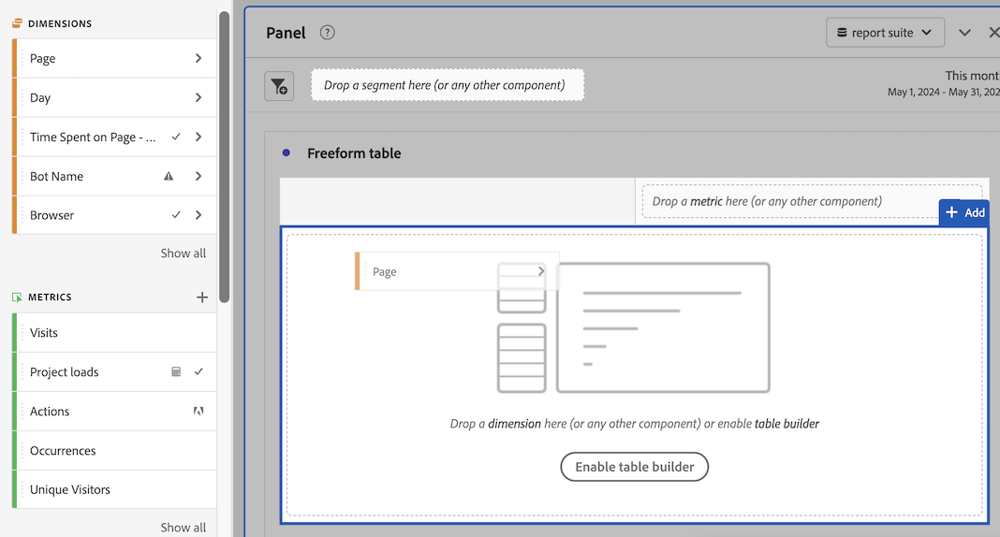

# Usar componentes no Analysis Workspace

Os componentes compõem os dados reais de qualquer projeto no Analysis Workspace. Os componentes consistem em dimensões, métricas, segmentos e intervalos de datas. Você pode adicionar componentes a um projeto arrastando-os para visualizações ou painéis.

Para obter informações gerais sobre os tipos de componentes que podem ser adicionados, consulte [Visão geral dos componentes](/help/analyze/analysis-workspace/components/analysis-workspace-components.md).

>[!TIP]
>
>Para obter informações sobre cada componente, selecione o ícone Informações ao lado do nome de um componente no painel esquerdo do Analysis Workspace ou consulte o [Guia de componentes do Analytics](/help/components/home.md).

## Começar a adicionar componentes a um projeto

1. [Criar um projeto no Analysis Workspace](/help/analyze/analysis-workspace/build-workspace-project/create-projects.md) se você ainda não tiver feito.

1. [Adicionar um painel](/help/analyze/analysis-workspace/c-panels/panels.md) ou [adicionar uma visualização](/help/analyze/analysis-workspace/visualizations/freeform-analysis-visualizations.md#add-visualizations-to-a-panel) ao projeto no Analysis Workspace.

   Se você adicionar um componente a um projeto em branco, uma visualização de tabela de forma livre será criada automaticamente.

1. Clique no ícone **[!UICONTROL Componentes]** no menu esquerdo.

   

1. Role até encontrar ou pesquise o componente que deseja adicionar, e arraste-o até um painel ou visualização dentro do projeto.

1. (Opcional) Arraste um componente para a área de destino do segmento em um cabeçalho do painel.

   Os segmentos se aplicam a todo o conteúdo do painel.

   Para obter informações sobre como usar a área de destino do segmento em um painel para filtrar o painel, consulte [Área para soltar](/help/analyze/analysis-workspace/c-panels/panels.md#drop-zone) in [Visão geral dos painéis](/help/analyze/analysis-workspace/c-panels/panels.md).

   

1. Para obter informações mais detalhadas, continue com uma das seções a seguir, dependendo do tipo de componente que você está adicionando:

   * [Adicionar dimensões a um projeto](#add-dimensions-to-a-project)

   * [Adicionar métricas a um projeto](#add-metrics-to-a-project)

   * [Adicionar segmentos a um projeto](#add-segments-to-a-project)

   * [Adicionar intervalos de datas a um projeto](#add-date-ranges-to-a-project)

## Adicionar dimensões a um projeto

[Dimension](/help/components/dimensions/overview.md) são variáveis no Adobe Analytics que normalmente contêm valores de string. As dimensões comuns incluem [Página](/help/components/dimensions/page.md), [Domínio de referência](/help/components/dimensions/referring-domain.md) ou uma [eVar](/help/components/dimensions/evar.md). Por outro lado, as [métricas](/help/components/metrics/overview.md) contêm valores numéricos que se vinculam a uma dimensão. Um relatório básico mostra linhas de valores da sequência de caracteres (dimensão) em relação a uma coluna de valores numéricos (métrica).

1. Comece a adicionar uma dimensão ao seu projeto no Analysis Workspace, conforme descrito em [Começar a adicionar componentes a um projeto](#begin-adding-components-to-a-project).

1. Escolha um dos métodos a seguir para adicionar dimensões e determinar o tipo de dados que deseja analisar:

   * Arraste uma dimensão para uma visualização (como uma tabela de forma livre) no Analysis Workspace.

     

   * Arraste uma ou mais dimensões do painel esquerdo para a área suspensa de segmentos para criar um segmento ad hoc, conforme descrito em [Adicionar segmentos a um projeto](#add-segments-to-a-project).

     

1. (Opcional) Você pode detalhar dimensões e itens de dimensão no Analysis Workspace com outros componentes.

   Para obter mais informações, consulte [Detalhar dimensões](/help/analyze/analysis-workspace/components/dimensions/t-breakdown-fa.md).

Para obter mais informações sobre como usar dimensões no Analysis Workspace, consulte [Visualizar dimensões](/help/analyze/analysis-workspace/components/dimensions/view-dimensions.md), [Detalhar dimensões](/help/analyze/analysis-workspace/components/dimensions/t-breakdown-fa.md), e [Dimensões de separação de tempo](/help/analyze/analysis-workspace/components/dimensions/time-parting-dimensions.md).

## Adicionar métricas a um projeto

[Métricas](/help/analyze/analysis-workspace/components/apply-create-metrics.md) permite quantificar pontos de dados no Analysis Workspace. Elas são usadas com mais frequência como colunas em uma visualização e são vinculadas a dimensões.

Para adicionar uma métrica a um projeto no Analysis Workspace:

1. Comece a adicionar uma métrica ao seu projeto no Analysis Workspace, conforme descrito em [Começar a adicionar componentes a um projeto](#begin-adding-components-to-a-project).

1. Escolha um dos seguintes métodos para adicionar uma métrica no Analysis Workspace:

   * Arraste uma métrica para a área de soltar métrica em uma tabela de forma livre vazia para ver a tendência da métrica no período de data do projeto.

     

   * Arrastar uma métrica quando uma dimensão estiver presente para ver essa métrica em comparada a cada item de dimensão.

   * Arrastar uma métrica sobre um cabeçalho de métrica já existente para substituí-lo.

   * Arrastar uma métrica ao lado de um cabeçalho para ver ambas as métricas lado a lado.

Para obter mais informações sobre como usar métricas no Analysis Workspace, consulte [Métricas](/help/analyze/analysis-workspace/components/apply-create-metrics.md).

## Adicionar segmentos a um projeto

[Segmentos](/help/components/segmentation/seg-overview.md) O permite identificar subconjuntos de visitantes com base em características ou interações específicas.

Você pode usar segmentos no Analysis Workspace de qualquer uma das seguintes maneiras:

### Adicionar segmentos a um painel

Ao adicionar segmentos a um painel, os segmentos se aplicam a todo o conteúdo do painel.

Para obter informações sobre como usar a área de destino do segmento em um painel para filtrar o painel, consulte [Área para soltar](/help/analyze/analysis-workspace/c-panels/panels.md#drop-zone) in [Visão geral dos painéis](/help/analyze/analysis-workspace/c-panels/panels.md).

### Adicionar segmentos a uma coluna em uma tabela de forma livre

Ao adicionar segmentos a uma coluna em uma tabela de forma livre, os segmentos se aplicam a todo o conteúdo na coluna da tabela.

### Usar segmentos ao criar métricas calculadas

No Criador de métrica calculada, você pode aplicar segmentos à definição de métricas.

Para obter mais informações, consulte [Métricas segmentadas](/help/components/c-calcmetrics/c-workflow/cm-workflow/c-build-metrics/metrics-with-segments.md).

## Adicionar intervalos de datas a um projeto

[Intervalos de datas](/help/analyze/analysis-workspace/components/calendar-date-ranges/custom-date-ranges.md) determine o intervalo de tempo do relatório no Analysis Workspace e possa ser aplicado a um ou mais painéis em um projeto.

Cada painel inclui um intervalo de datas por padrão. Há várias maneiras de atualizar um intervalo de datas para um painel. Uma maneira de atualizar um intervalo de datas para um painel no Analysis Workspace é arrastar um componente de intervalo de datas do painel esquerdo:

1. Comece a adicionar um intervalo de datas ao seu projeto no Analysis Workspace, conforme descrito em [Começar a adicionar componentes a um projeto](#begin-adding-components-to-a-project).

1. Arraste um intervalo de datas do painel esquerdo para o intervalo de datas atual na parte superior direita do painel.

   

Para obter mais informações sobre como usar calendários e intervalos de datas no Analysis Workspace, consulte [Visão geral do calendário e de intervalos de datas](/help/analyze/analysis-workspace/components/calendar-date-ranges/calendar.md).
