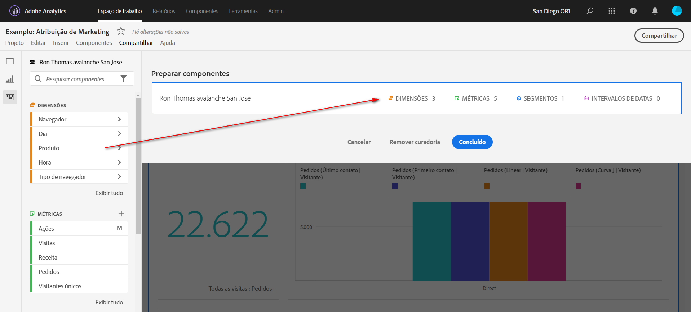
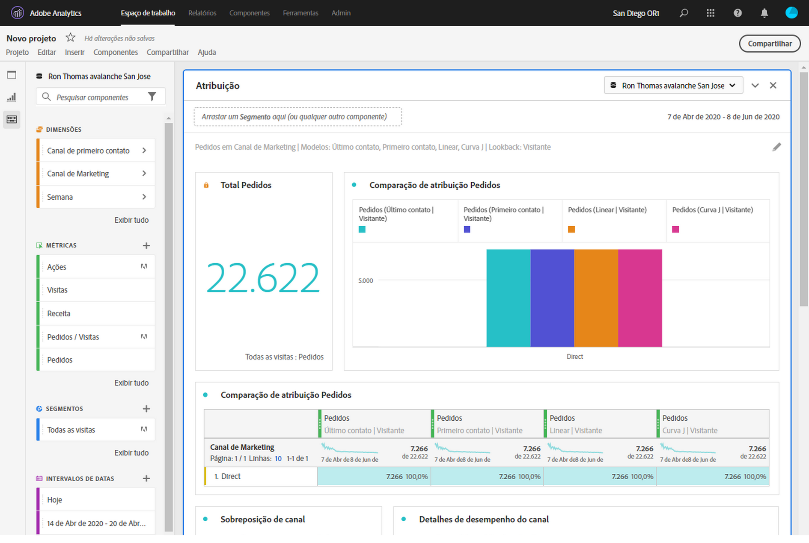

# Preparar projetos do Workspace

A preparação permite limitar os componentes (dimensões, métricas, segmentos, intervalos de datas) antes de compartilhar um projeto. Quando um recipient abrir o projeto, ele verá um conjunto limitado de componentes que você preparou para eles. A preparação é uma etapa opcional, mas recomendada, antes de compartilhar um projeto.

>[!NOTE]
> Os perfis de produto são o principal mecanismo que controla os componentes que um usuário pode ver. Eles são gerenciados por meio do Adobe Experience Cloud Admin Console. A Preparação é um filtro secundário.

## Aplicar preparação de projeto

1. Clique em **[!UICONTROL Compartilhar]** > **[!UICONTROL Preparar dados do projeto]**.
Os componentes usados no projeto serão adicionados automaticamente.
   **Observação**: se um projeto tiver vários conjuntos de relatórios, você verá um campo de preparação para cada conjunto de relatórios no projeto.
1. (Opcional) Para adicionar mais componentes, arraste os componentes que deseja compartilhar do painel esquerdo para o campo [!UICONTROL Preparar componentes].
1. Clique em **[!UICONTROL Concluído]**.

A preparação também pode ser aplicada no menu [!UICONTROL Compartilhar] clicando em **[!UICONTROL Preparar e Compartilhar]**. Essa opção organiza automaticamente o projeto para os componentes em uso no projeto. Você pode adicionar outros componentes seguindo as etapas acima.

## Visualização de projeto preparado

Quando um recipient abrir um projeto preparado, ele verá apenas o conjunto preparado de componentes que você definiu:

## Remover preparação do projeto

Para remover a preparação do projeto e restaurar o conjunto completo de componentes no painel esquerdo:

1. Clique em **[!UICONTROL Compartilhar]** > **[!UICONTROL Preparar dados do projeto]**.
1. Clique em **[!UICONTROL Remover preparação]**
1. Clique em **[!UICONTROL Concluído]**.

## Preparação do Conjunto de relatórios virtual (VRS)

Para aplicar curadoria em um nível de conjunto de relatórios, de modo que se aplique a muitos projetos ao mesmo tempo, é possível [preparar componentes em um conjunto de relatórios virtuais (VRS)](https://docs.adobe.com/content/help/pt-BR/analytics/components/virtual-report-suites/vrs-components.html).

>[!NOTE]
> A reparação do VRS é sempre aplicada antes da preparação do projeto. Isso significa que, mesmo se o projeto preparado incluir determinados componentes, eles serão filtrados se o VRS não preparado não os incluir.

## Opção Mostrar todos os componentes

Em um projeto com curadoria de VRS, o recipient terá a opção de **[!UICONTROL Mostrar todos]** os componentes no painel esquerdo. [!UICONTROL Mostrar tudo] revela conjuntos diferentes de componentes, dependendo do/da:

* Nível de permissão do usuário (admin ou non-admin)
* Função do projeto (proprietário/editor ou não)
* Tipo de preparação aplicada (VRS ou projeto)

| Tipo de preparação | Administradores | Proprietário do projeto não administrativo ou função de edição | Função de duplicação ou visualização não administrativo |
|---|---|---|---|
| Conjunto de relatórios virtual preparado | Todos os componentes de VRS não preparados | Componentes de VRS não preparados de propriedade desta função ou compartilhados com ela | Componentes de VRS não preparados de propriedade desta função ou compartilhados com ela |
| Projeto preparado | Todos os componentes de projeto não preparados | Todos os componentes de projeto não preparados | Componentes de projeto não preparados de propriedade desta função ou compartilhados com ela |
| Projeto preparado em um conjunto de relatórios virtual preparado | Todos os componentes não preparados, exibidos em **[!UICONTROL Componentes de projeto não preparados]** e **[!UICONTROL Componentes de VRS não preparados]** | Todos os componentes de projeto não preparados e os componentes de VRS não preparados dessa função ou que foram compartilhados com ela | Componentes de projeto e de VRS não preparados de propriedade dessa função ou compartilhados com ela |
