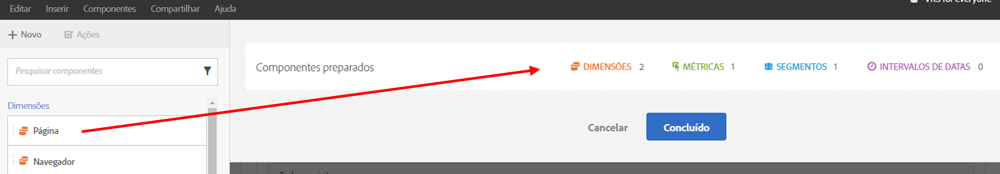
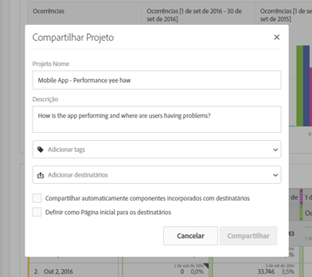

# Visão geral de curadoria/compartilhamento

A preparação permite limitar os componentes antes de compartilhar um projeto. É possível preparar e compartilhar um projeto e seus componentes com profissionais de marketing e outros profissionais não relacionados com as análises na sua empresa. Anote e aplique as tags aos projetos.

**Vídeo de visão geral**

>[!VIDEO](https://www.youtube.com/watch?v=LJJRskdmlOg&amp;index=79&amp;t=0s&amp;list=PL2tCx83mn7GuNnQdYGOtlyCu0V5mEZ8sS)

**[!UICONTROL Workspace]** > **[!UICONTROL Compartilhar]** > **[!UICONTROL Preparar dados do projeto]**

## Preparar dados do projeto

1. Especifique a permissão para criar e preparar os projetos.

   Antes de criar e preparar um projeto do Analysis Workspace, os administradores devem adicionar você a um [grupo](https://marketing.adobe.com/resources/help/pt_BR/reference/groups.html) que tenha a permissão **[!UICONTROL Acesso ao Analysis Workspace]** ativada ou ao grupo de usuários **[!UICONTROL Acesso a todos os relatórios]**. ( **[!UICONTROL Administrador]** > **[!UICONTROL Gerenciamento do usuário]** > **[!UICONTROL Grupos]**).

1. [Crie e salve](/help/analyze/analysis-workspace/build-workspace-project/t-freeform-project.md) um projeto, em seguida, clique em **[!UICONTROL Compartilhar]** > **[!UICONTROL Preparar dados do projeto]**.
1. Arraste os componentes que você deseja compartilhar da pilha de componentes arrastáveis à esquerda do campo **[!UICONTROL Componentes preparados]**.

   

   >[!IMPORTANT]
   >
   >A preparação dos componentes não é necessária para compartilhar um projeto. Você pode compartilhar um projeto com todos os componentes padrão disponíveis ou com os componentes selecionados. Para preservar todos os componentes padrão em um projeto, uma prática recomendada é criar uma cópia de um projeto (usando **[!UICONTROL Salvar como]**) antes de preparar os componentes. Depois de preparar os componentes em um projeto, os outros componentes não estarão mais disponíveis para esse projeto.

1. Clique em **[!UICONTROL Concluído]**.

O projeto resultante se comporta como um projeto típico no Analysis Workspace, mas somente com os componentes especificados para a escolha.

## Compartilhar um projeto preparado

O compartilhamento disponibiliza esse projeto para outros usuários do Analysis Workspace em sua organização. Qualquer preparação realizada aparecerá quando outras pessoas usarem o projeto.

1. Após preparar os componentes de um relatório, clique em **[!UICONTROL Compartilhar]** > **[!UICONTROL Compartilhar projeto]**.

   

1. Adicione destinatários.
1. (Opcional) É possível compartilhar componentes de projeto incorporados (segmentos, métricas calculadas e intervalos de data) com todos os destinatários. Após compartilhados, esses componentes aparecem no menu suspenso de componentes do Workspace do destinatário.

   >[!IMPORTANT]
   >
   >Essa configuração não persiste: é uma ação única no momento do compartilhamento.

1. Opcionalmente, é possível definir essa página como a página inicial para os destinatários.

   >[!IMPORTANT]
   >
   >Essa configuração não persiste: é uma ação única no momento do compartilhamento.

1. Clique em **[!UICONTROL Compartilhar]**.

<!-- 

 <b>Annotate and tag a project</b> 
 

An alternative way to collaborate on a project is to use the Information panel. This panel will be re-introduced in an upcoming release. 
 

 
 
<ul id="ul_EFD045FD9F3B4BF8A70637B00EE0BC9C"> 
 <li id="li_EC6C5EAF9C234E76BDA7FF0226B82083">Tag reports for sharing. </li> 
 <li id="li_CF6A438C55F847F8890F8CB674CAA4F7">Specify the recipient (filter by permission group or user name), the storage folder. In-product notifications let users know that they have a shared report waiting. </li> 
 <li id="li_C8E088DA43024277908705CB0F3A142A">Write messages or report descriptions for recipients. </li> 
 <li id="li_342EB4758C344B859757E23691068FA3"> Select the dimensions, metrics, and segments to recommend to a non-analyst colleague, who can view the report you are curating and sharing. Curating the component gives the recipient access to those components, based on their permission settings. </li> 
 <li id="li_6487500F9315481599B7F3897998879F"> Add suggested items to a previously configured report. These new items exist as recommended selectable options. </li> 
</ul>

 -->

