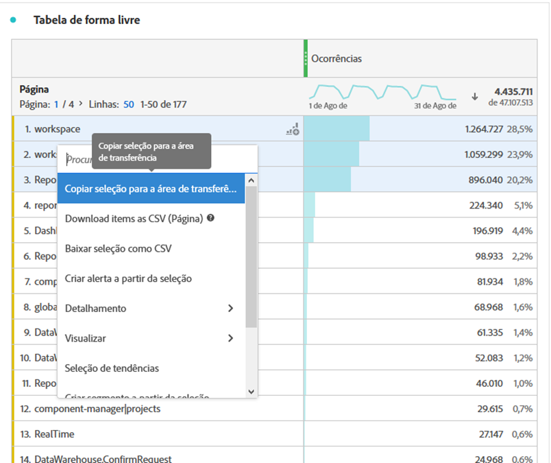

# Baixar arquivos PDF ou CSV da Workspace

Existem várias maneiras diferentes de exportar dados da Analysis Workspace, dependendo do conjunto de dados que você deseja analisar fora da ferramenta e de quem precisa receber as informações. Os dados exportados podem estar na forma de dados copiados, arquivos CSV ou PDF. Geralmente, um PDF é preferido se você deseja que as visualizações sejam incluídas no arquivo, enquanto um CSV (ou dados copiados) é preferido se você quiser apenas dados de texto simples.

>[!IMPORTANT]
>
> Algumas opções mencionadas nesta página, como **Download de itens como CSV**, estão atualmente em testes limitados. [Saiba mais](https://docs.adobe.com/content/help/pt-BR/analytics/landing/an-releases.html)

## Baixar projeto como CSV ou PDF {#download-project}

Você pode baixar um projeto completo indo até **[!UICONTROL Projeto > Baixar como PDF (ou como CSV)]**. O arquivo baixado contém todas as tabelas e visualizações exibidas (visíveis) no projeto. Geralmente, um PDF é preferido se você quiser que as visualizações sejam incluídas no arquivo, enquanto um CSV é preferido se você quiser apenas dados de texto simples.

Para downloads de projetos, lembre-se:

* O projeto pode ser salvo ou não quando você solicita um download do projeto. No entanto, somente projetos salvos podem ser [agendados](https://docs.adobe.com/content/help/en/analytics/analyze/analysis-workspace/curate-share/t-schedule-report.html).
* Os PDFs baixados no navegador podem levar vários minutos para serem exportados porque o projeto é executado novamente em servidores Adobe antes da renderização no formato PDF. Recomendamos não sair do projeto até que o PDF seja baixado no navegador. No entanto, você pode continuar fazendo alterações no projeto enquanto espera. Se um PDF demorar mais de 5 minutos para ser renderizado, você será solicitado a enviá-lo por email.
* Os downloads de PDF são renderizados como uma única página sem paginação aplicada.
* Quando um projeto é renderizado para PDF, nós renderizamos o que está na página. Se um projeto tiver visualizações e painéis com tamanhos personalizados, é necessário alterá-los para terem tamanhos automáticos (botão no canto superior direito) para que não haja truncamento de conteúdo.

## Copiar dados para a área de transferência (tecla de atalho: Ctrl+C) {#copy-data}

A opção de clique com o botão direito do mouse **[!UICONTROL Copiar para a área de transferência]** permite copiar dados rapidamente do Workspace e colá-los em outro lugar.

* Se desejar que a tabela exibida seja copiada, clique com o botão direito do mouse no cabeçalho da tabela e escolha **Copiar dados para a área de transferência**.
* Se desejar que um subconjunto de dados seja copiado, faça uma seleção na tabela e clique com o botão direito do mouse em > **Copiar seleção para a área de transferência**.

Além disso, a tecla de atalho `Ctrl+C` copia sua seleção para a área de transferência. Depois de copiada, você pode acessar outra ferramenta e colar as informações (ou pressionar `Ctrl+V`).

## Baixar dados como CSV {#download-data}

A opção de clique com o botão direito **[!UICONTROL Baixar dados como CSV]** permite baixar uma tabela de dados ou a fonte de dados de qualquer visualização como CSV.

* No cabeçalho de qualquer tabela ou visualização, clique com o botão direito do mouse em **[!UICONTROL Download de dados como CSV]**. Isso baixa os dados exibidos na tabela ou na fonte de dados subjacente para uma visualização como CSV. Observação: a visualização do mapa não suporta essa opção.
* Se uma seleção for feita na tabela, a opção indicará **[!UICONTROL Baixar seleção como CSV]**. Somente a seleção é baixada com essa opção, em vez da tabela exibida completa.

## Baixar itens como CSV {#download-items}

Se desejar analisar mais que as 400 linhas de dados visíveis em uma tabela, clique com o botão direito do mouse no cabeçalho da tabela ou em qualquer linha e selecione **Download de itens como CSV (nome do Dimension)**. Essa opção exportará até 50.000 itens de dimensão (com base na classificação da tabela) para a dimensão selecionada, com filtros e segmentos aplicados. Se você escolher essa opção na parte superior da tabela, a primeira dimensão da tabela será exportada. Embora nenhum limite seja aplicado na tabela de forma livre, recomenda-se que a opção Download de itens seja usada em tabelas com menos de 20 colunas para garantir o desempenho ideal.

>[!TIP]
>
> Se sua dimensão exceder 50.000 itens, baixe o arquivo com métricas de classificação diferentes aplicadas ou aplique um filtro. Por exemplo, classifique decrescente por Visitas em um download e, em seguida, crescente por Visitas em um segundo download. Esta dica pode ajudá-lo a recuperar itens de cauda mais longos.

Você pode fazer várias tarefas dentro do projeto e até mesmo navegar até um novo projeto da Workspace na mesma guia enquanto o download está em andamento. O download será pausado se você abrir uma nova guia do navegador. O download será cancelado se você sair do Workspace completamente ou fechar a guia do navegador.

### Arquivo de itens baixados

Os recursos da tabela serão aplicados ao arquivo baixado da seguinte forma:

* Todos os segmentos do painel são aplicados como filtros.
* Os detalhamentos **acima** da dimensão selecionada na tabela são aplicados como filtros acima de cada coluna.
* Os detalhamentos **abaixo** da dimensão selecionada na tabela são removidos.

No exemplo acima, os itens de página são baixados com o segmento do painel (Clientes de novos Visitantes) e os componentes acima (Canal de marketing = e-mail) aplicados como filtros, e os componentes abaixo (Tipo de dispositivo móvel) são removidos do CSV baixado.

### Notificações de download

À medida que o arquivo é baixado, você verá uma notificação informativa com o andamento. A qualquer momento, você pode cancelar o download clicando em **[!UICONTROL Cancelar download]**. Fechar o sistema não **** cancelará o download.

Quando o arquivo for concluído, você verá uma notificação de conclusão e o arquivo será baixado no seu navegador.

Se você solicitar mais de um download por vez, receberá uma notificação de que cada download adicional será colocado em fila até que o download anterior seja concluído.

## Perguntas frequentes {#faq}

| Pergunta | Resposta |
| --- | --- |
| Por que meu PDF baixado é uma página? | O Workspace não pagina os PDFs baixados no momento. |
| É possível exportar mais de 50.000 itens com a opção &quot;Baixar itens como CSV&quot;? | Embora cada download possa conter até 50.000 itens de dimensão, você pode alterar a classificação da tabela para recuperar itens de cauda mais longos ou aplicar um filtro para baixar itens mais específicos. |
| O que a visualização **** Copiar faz? | **[!UICONTROL A visualização]** de cópia não é uma opção de exportação. Permite copiar uma visualização ou painel de um local no Workspace para outro. Por exemplo, de um painel para outro no mesmo projeto ou de um projeto para outro. [Assista ao vídeo](https://www.youtube.com/watch?v=lvmAdKNfWQw) |

