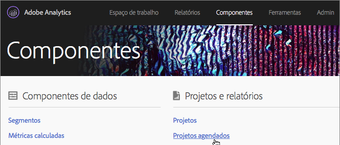
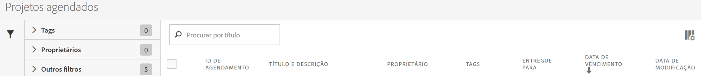

# Gerenciador de projetos agendados

Gerencie projetos da Analysis Workspace.

**[!UICONTROL Análises]** &gt; **[!UICONTROL Componentes]** &gt; **[!UICONTROL Projetos agendados]**.

No Gerenciador de agendamento de projetos, é possível editar e excluir entregas de projetos recorrentes. Você pode criar programas de entrega que enviam seus relatórios por email para um endereço especificado. Você pode configurar esses horários para enviar automaticamente relatórios em intervalos especificados por um período de tempo ou indefinidamente, ou interromper a entrega de um projeto periódico.

O Gerenciador de projetos agendados mostra os itens criados por um usuário específico. Se a conta de usuário estiver desabilitada na aplicação, todas as entregas programadas são interrompidas.

* Edite projetos agendados.
* Exiba a ID de agenda de um projeto (usada principalmente para fins de depuração).
* Pesquise projetos agendados.
* Adicione tags a projetos agendados.
* Especifique ou altere o proprietário de um projeto agendado.
* Adicione outros filtros como: Aprovados, Com falhas, Favoritos, Meus, Mostrar todos e Projetos expirados.

* Defina a data de expiração de um projeto agendado.

