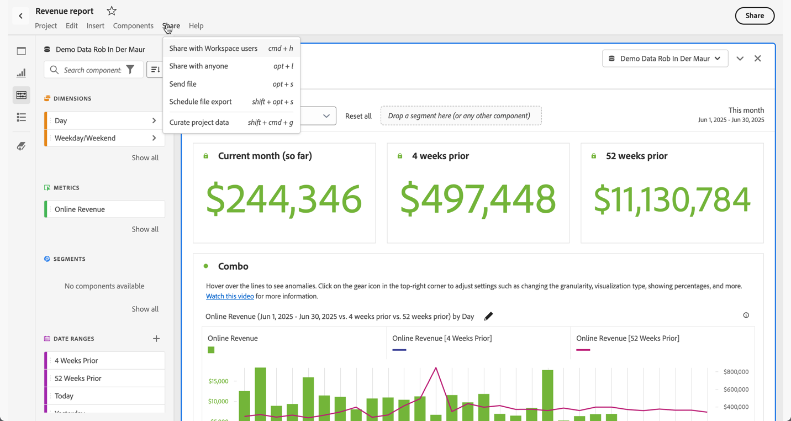

# Preparar e compartilhar a visão geral dos projetos

Você pode preparar e compartilhar projetos ou enviar e baixar projetos como arquivos PDF ou CSV para recipients em sua organização ou com qualquer outra pessoa usando as opções disponíveis no menu **[!UICONTROL Compartilhar]** do Analysis Workspace ou ao selecionar **[!UICONTROL Compartilhar]** na parte superior direita da interface.

| Opção | Descrição |
|---|---|
| **[!UICONTROL Preparar dados do projeto]** | Limitar os componentes (dimensões, métricas, segmentos, intervalos de datas) disponíveis em um projeto. [Saiba mais](/help/analyze/analysis-workspace/curate-share/curate.md) |
| **[!UICONTROL Compartilhar com usuários do espaço de trabalho]** | Disponibilize um projeto para outros usuários do Analysis Workspace em sua organização. Compartilhe com usuários específicos ou crie um link compartilhável para acesso rápido a um projeto. Usuários serão solicitados a fazer logon. [Saiba mais](/help/analyze/analysis-workspace/curate-share/share-projects.md) |
| **[!UICONTROL Compartilhar com qualquer pessoa]** | Conceda acesso de somente leitura aos projetos do Analysis Workspace para pessoas que não têm acesso ao Adobe Analytics. [Saiba mais](/help/analyze/analysis-workspace/curate-share/share-projects.md) |
| **[!UICONTROL Enviar arquivo]** | Envie um projeto como CSV ou PDF imediatamente para destinatários específicos. [Saiba mais](/help/analyze/analysis-workspace/curate-share/t-schedule-report.md) |
| **[!UICONTROL Agendar exportação de arquivo]** | Envie um projeto como CSV ou PDF em um agendamento para recipients especificados. [Saiba mais](/help/analyze/analysis-workspace/curate-share/t-schedule-report.md) |
| **[!UICONTROL Baixar como CSV]** **[!UICONTROL Baixar como PDF]** | Baixe um projeto como CSV do PDF. [Saiba mais](download-send.md). |
