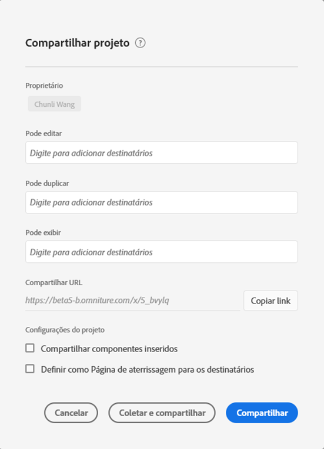
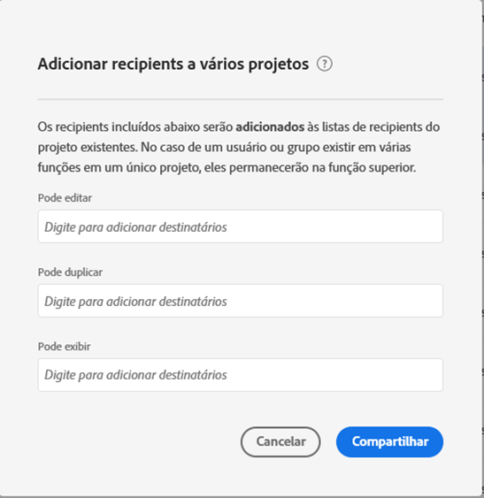

# Compartilhar projetos da Workspace

O compartilhamento disponibiliza um projeto para outros usuários do Analysis Workspace em sua organização. Qualquer [preparação](curate.md) aplicada será refletida quando os recipient abrirem o projeto.

## Funções do projeto {#Roles}

É possível adicionar recipient a uma das três funções do projeto. As funções do projeto estão vinculadas ao usuário e à ID do projeto específica. As funções do projeto são independentes das permissões de usuário gerenciadas no console [administrativo da](https://docs.adobe.com/content/help/pt-BR/core-services/interface/manage-users-and-products/admin-getting-started.html)Adobe Experience Cloud.

| Função | Controle de projeto |
|---|---|
| Pode editar | Os destinatários podem Salvar alterações em um projeto e trabalhar como coproprietários. Essa função é útil se você deseja co-editar projetos com outros colegas. Observação: No momento, o Analysis Workspace não oferece suporte à colaboração ao vivo, portanto, recomenda-se que somente um usuário edite um projeto em um determinado momento. Se os projetos forem salvos ao mesmo tempo, a última versão será mantida. |
| Pode duplicar | Os Recipient podem Salvar como e ter acesso ao painel esquerdo. As interações entre projetos não são limitadas nesta função. Essa função é útil se você deseja compartilhar um projeto com usuários que entendem os dados de sua organização e como usar o Analysis Workspace, mas não deseja alterar seu projeto. |
| Pode exibir | Os Recipient não podem Salvar como e não têm acesso ao painel esquerdo. As interações do projeto também são limitadas. Essa função é útil se você deseja compartilhar um projeto com usuários menos familiarizados com a estrutura de dados de sua organização, o Analysis Workspace ou o Adobe Analytics em geral. No entanto, você ainda deseja que eles consumam dados e insights em um ambiente seguro. Saiba mais sobre a experiência [do projeto](/help/analyze/analysis-workspace/curate-share/view-only-projects.md)Can visualização. |

>[!IMPORTANT]
> Os recipient do projeto adicionados antes de 18 de junho de 2020 foram migrados para uma função do projeto. Usuários administradores migraram para a função **[!UICONTROL Pode editar]** e usuários não administradores migraram para a função **[!UICONTROL Pode duplicado]** . Essas funções fornecem a mesma experiência de projeto que tinham anteriormente. Além disso, todos os grupos (incluindo &quot;Todos&quot;) migraram para a função **[!UICONTROL Can duplicado]** .

### Nenhuma função atribuída

Se uma função não for atribuída a um recipient e ele receber um link para o projeto (**[!UICONTROL Compartilhar]>[!UICONTROL Obter link]** do projeto), ele será colocado na função **[!UICONTROL Pode visualização]** por padrão.

### Várias funções atribuídas

Se um recipient for colocado em várias funções, ele sempre terá a maior experiência. Isso pode ocorrer se um usuário for adicionado como um indivíduo e como parte de um grupo. Por exemplo, se um usuário receber a função **[!UICONTROL Pode editar]** como um indivíduo e a função **[!UICONTROL Pode visualização]** como membro de um grupo, ele receberá uma experiência **[!UICONTROL Pode editar]** o projeto.

### Administradores e funções

Os administradores colocados em uma função **[!UICONTROL Can duplicado]** ou **[!UICONTROL Can visualização]** receberão essas experiências limitadas quando abrirem um projeto. Se desejar, um Administrador pode aumentar sua função para **[!UICONTROL Pode editar]** a qualquer momento por meio de **[!UICONTROL Componentes]>[!UICONTROL Projetos]**.

## Adicionar recipient ao projeto compartilhado {#Add}

Para adicionar recipient ao seu projeto compartilhado:

1. Clique em **[!UICONTROL Compartilhar]** > **[!UICONTROL Compartilhar projeto]**.
Se houver alterações não salvas, você será solicitado a salvar seu projeto primeiro.
1. Adicionar recipient ou grupos de usuários.
Consulte o ícone de ajuda na parte superior para obter descrições de cada função.
1. (Opcional) Compartilhe componentes de projeto incorporados (segmentos, métricas calculadas e intervalos de datas) com todos os recipient.
Depois de compartilhados, esses componentes aparecerão na lista suspensa Componentes da Workspace do recipient. Observe que essa configuração não persiste - é uma ação singular no momento do compartilhamento.
1. (Opcional) Defina esta página como a landing page para recipient.
Essa configuração não persiste: é uma ação única no momento do compartilhamento.
1. Clique em Compartilhar.
Você também pode clicar em **[!UICONTROL Preparar e compartilhar]** para aplicar automaticamente a preparação do projeto. Se um projeto já tiver sido compartilhado, esses botões dirão **[!UICONTROL Atualizar]** e **[!UICONTROL Preparar e atualizar]**. Saiba mais sobre a curadoria [do](https://docs.adobe.com/content/help/pt-BR/analytics/analyze/analysis-workspace/curate-share/curate.html)projeto.

## Compartilhar em grupos de recipient {#Groups}

Todos os usuários podem compartilhar projetos em grupos, que são uma coleção de recipient. No Adobe Analytics, os grupos são definidos por perfis de produtos no console [administrativo da](https://docs.adobe.com/content/help/pt-BR/core-services/interface/manage-users-and-products/admin-getting-started.html)Adobe Experience Cloud.

* Os administradores podem compartilhar com qualquer grupo, incluindo &quot;Todos&quot;.
* Os não administradores podem compartilhar com grupos dos quais são membros, com exceção de &quot;Todos&quot;.

## Compartilhar projetos no Gerenciador de projetos {#Manager}

Os projetos também podem ser compartilhados de **[!UICONTROL Componentes]>[!UICONTROL Projetos]**. Um único projeto pode ser compartilhado seguindo as mesmas etapas acima.

Se vários projetos forem selecionados para compartilhamento, os recipient serão adicionados à lista existente de recipient para cada projeto. Por exemplo:

* O projeto A é compartilhado com os usuários 1, 2, 3
* O projeto B é compartilhado com o usuário 4, 5, 6
* Com os projetos A e B selecionados, os usuários 4 e 7 são adicionados às listas do recipient. A nova lista de recipient para cada projeto agora é:
   * Projeto A: 1, 2, 3, 4, 7
   * Projeto B: 4, 5, 6, 7

   

## Perguntas frequentes {#FAQs}

| Pergunta | Resposta |
|---|---|
| O que acontece se dois editores salvam um projeto ao mesmo tempo? | As alterações não são mescladas e a última versão do projeto salva será mantida. Atualmente, o Analysis Workspace não oferece suporte à colaboração em tempo real. |
| Como administrador, que experiência de projeto irei ver? | Os administradores colocados em uma função **[!UICONTROL Can duplicado]** ou **[!UICONTROL Can visualização]** receberão essas experiências limitadas quando abrirem um projeto. Se desejar, um Administrador pode aumentar sua função para **[!UICONTROL Pode editar]** a qualquer momento por meio de **[!UICONTROL Componentes]>[!UICONTROL Projetos]**. |
| O que acontece se um usuário for colocado em uma função como indivíduo e outra como membro de um grupo? | Se um recipient for colocado em várias funções, ele sempre receberá a experiência mais alta. Por exemplo, se um usuário receber a função **[!UICONTROL Pode editar]** como um indivíduo e a função **[!UICONTROL Pode visualização]** como membro de um grupo, ele receberá uma experiência **[!UICONTROL Pode editar]** o projeto. |
| Por que um usuário recebe uma experiência somente de Visualização quando recebe um link de projeto? | Se uma função não for atribuída a um recipient e ele receber um link para o projeto (**[!UICONTROL Compartilhar]>[!UICONTROL Obter link]** do projeto), ele será colocado na função **[!UICONTROL Pode visualização]** por padrão. Se o usuário desejar um aumento na função do projeto, o proprietário ou editor do projeto poderá adicioná-los ao duplicado Can ou Pode editar a função por meio do modal de compartilhamento do projeto. |
