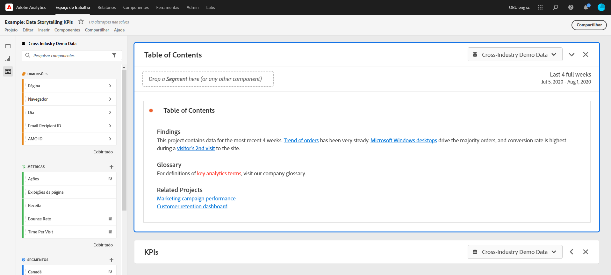
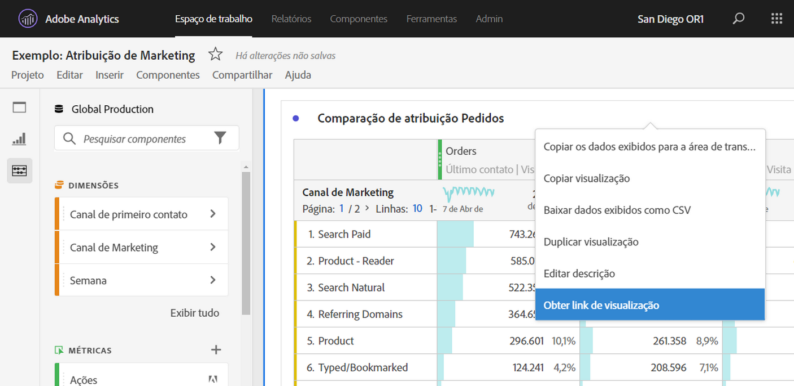

# Criar links compartilháveis

O Analysis Workspace oferece várias maneiras de compartilhar um projeto com seus usuários, incluindo a capacidade de obter um link para um projeto ou uma parte específica de um projeto. Alguns tipos de link exigem que o destinatário faça logon no Adobe Analytics antes de acessar o projeto, enquanto outros não.

## Obter um link do projeto para compartilhar com outros usuários do Workspace {#project-link}

Para compartilhar um link com um projeto, vá para o projeto que deseja compartilhar e selecione ir para **[!UICONTROL Compartilhar]** > **[!UICONTROL Obter link do projeto]** (ou **[!UICONTROL Compartilhar]** > **[!UICONTROL Compartilhar com usuários do Workspace]** > **[!UICONTROL Compartilhar por link]**). Usuários com os quais você compartilha o link são solicitados a fazer logon.

Se o destinatário do link não tiver uma [função do projeto](/help/analyze/analysis-workspace/curate-share/share-projects.md) atribuída, os administradores receberão **[!UICONTROL Editar original]** e os não administradores receberão experiências de **[!UICONTROL Editar cópia]**.

## Obter um link de somente leitura para compartilhar com qualquer pessoa

Você pode compartilhar um link somente leitura para projetos do Analysis Workspace com pessoas que não têm acesso ao Adobe Analytics.

Para obter mais informações, consulte [Compartilhar com qualquer pessoa](/help/analyze/analysis-workspace/curate-share/share-projects.md#share-a-project-with-anyone-no-login-required).

## Obter um painel ou link de visualização {#panel-link}

Você também pode compartilhar um link para uma parte específica de um projeto, como um painel ou uma visualização individual. Às vezes, esse compartilhamento é chamado de intravinculação. Ele pode ser útil para chamar a atenção dos usuários para os principais insights do projeto.

* No menu de contexto de um cabeçalho do painel, selecione **[!UICONTROL Obter link do painel]**
* No menu de contexto de um cabeçalho de visualização, selecione **[!UICONTROL Obter link de visualização]**

[Assista ao vídeo](https://experienceleague.adobe.com/docs/analytics-learn/tutorials/analysis-workspace/visualizations/intra-linking-in-analysis-workspace.html?lang=pt-BR) sobre como criar links e usá-los para direcionar recipients para partes específicas do seu projeto.

## Usar links em um índice {#TOC}

Uma dica para aproveitar as várias opções de link é sempre incluir um índice na parte superior do projeto do Workspace. No índice, você pode vincular a outros projetos relevantes, painéis específicos e visualizações específicas. Dessa forma, o recipient do projeto consegue navegar com mais facilidade.

[Assista ao vídeo](https://experienceleague.adobe.com/docs/analytics-learn/tutorials/analysis-workspace/navigating-workspace-projects/create-a-toc-in-analysis-workspace.html?lang=pt-BR) sobre como construir um índice usando links e o editor de rich text do Espaço de trabalho.

<!--
# Create shareable links

Analysis Workspace offers many ways to share a project to your users, including the ability to get a link to a project or a specific part of a project. Some link types require the recipient to log in to Adobe Analytics before accessing the project, while others do not. 

## Get a project link to share with other Workspace users {#project-link} 

To share a link to a project, go to the project you want to share, then select go to [!UICONTROL **Share**] > [!UICONTROL **Share with Workspace users**] > [!UICONTROL **Share by link**]. Users you share the link with are required to log in. 

If the recipient of the link has not been assigned a [project role](/help/analyze/analysis-workspace/curate-share/share-projects.md), admins receive **[!UICONTROL Edit original]** and non-admins receive **[!UICONTROL Edit copy]** experiences.

## Get a read-only link to share with anyone

You can share a read-only link to Analysis Workspace projects with people who don't have access to Adobe Analytics. Users you share the link with are not required to log in. 

For more information, see "Share a project with anyone (no login required)" in the article [Share projects](/help/analyze/analysis-workspace/curate-share/share-projects.md).

## Get panel or visualization link {#panel-link} 

You can also share a link to a specific part of a project, such as a panel or individual visualization. This is sometimes referred to as intra-linking. This can be useful to draw your users' attention to key insights within the project.  

* From any panel header, right-click **[!UICONTROL Get panel link]** 
* From any table or visualization header, right-click **[!UICONTROL Get visualization link]** 

[Watch the video](https://experienceleague.adobe.com/docs/analytics-learn/tutorials/analysis-workspace/visualizations/intra-linking-in-analysis-workspace.html) on how to create links and use them to drive recipients to specific parts of your project. 

-->