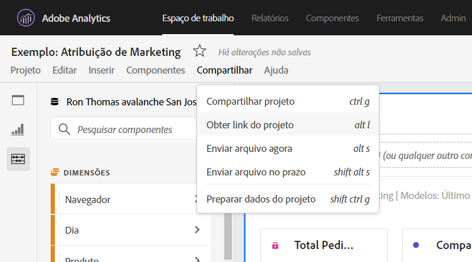
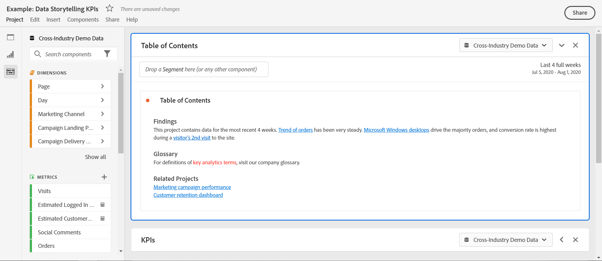

# Criar links compartilháveis

A Analysis Workspace oferta várias maneiras de compartilhar um projeto com seus usuários, incluindo a capacidade de obter um link para um projeto ou uma parte específica de um projeto. Os usuários que recebem um link precisam fazer logon na Adobe Analytics antes de poderem acessar o projeto.

## Get project link {#project-link}

Para compartilhar um link para o projeto completo, vá até **[!UICONTROL Compartilhar > Obter link]** do projeto. Se o recipient do link não tiver uma função [de](https://docs.adobe.com/content/help/pt-BR/analytics/analyze/analysis-workspace/curate-share/share-projects.html)projeto atribuída, os administradores receberão **[!UICONTROL Pode editar]** e os não administradores receberão experiências **[!UICONTROL Pode duplicado]**.

## Obter o painel ou link de visualização {#panel-link}

Você também pode compartilhar um link para uma parte específica de um projeto, como um painel ou uma visualização individual. Isso é, por vezes, chamado de intravinculação. Isso pode ser útil para chamar a atenção de seus usuários para os principais insights do projeto.

* Em qualquer cabeçalho do painel, clique com o botão direito do mouse no link **[!UICONTROL Obter painel]**
* Em qualquer tabela ou cabeçalho de visualização, clique com o botão direito do mouse em **[!UICONTROL Obter link de visualização]**

[Assista ao vídeo](https://www.youtube.com/watch?v=lvmAdKNfWQw) sobre como criar links e usá-los para direcionar recipient para partes específicas do seu projeto.

## Usar links em um índice {#TOC}

Uma dica para aproveitar as várias opções de link é sempre incluir um sumário na parte superior do projeto da Workspace. No sumário, você pode vincular a outros projetos relevantes, painéis específicos e visualizações específicas. Isso ajuda o recipient do projeto a navegar mais facilmente.

[Assista ao vídeo](https://www.youtube.com/watch?v=Xo6fTguWm-M) sobre como construir um Índice usando links e o editor de Rich Text da Workspace.

