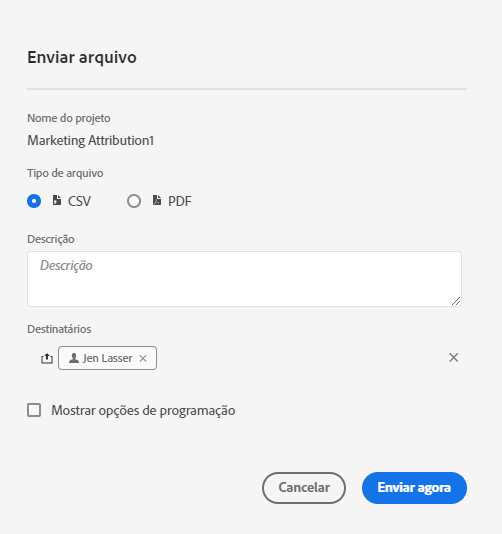
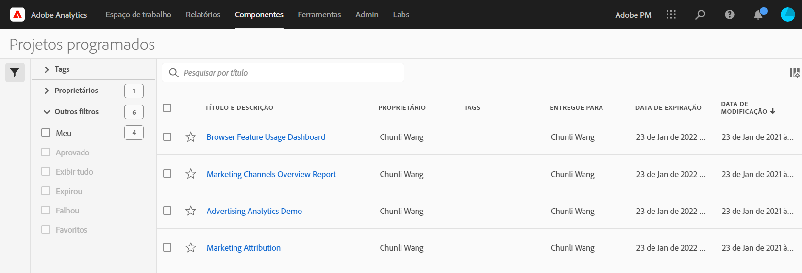

# Projetos agendados

No menu **** Compartilhamento de espaço de trabalho, você pode enviar projetos da Analysis Workspace por email para recipient selecionados. Os arquivos podem ser enviados no formato CSV ou PDF.

## Enviar arquivo agora

Para enviar um arquivo imediatamente aos recipient por email:

1. Click **Share > Send File Now**.
1. Especifique o tipo de arquivo (CSV ou PDF).
1. (Opcional) Adicione uma descrição que será incluída no email para explicar o arquivo que está sendo recebido.
1. Adicione recipient ou grupos. Endereços de email também podem ser inseridos.
1. Clique em **Enviar agora**.
1. (Opcional) Clique em **Mostrar opções** de agendamento para especificar um agendamento de delivery.

## Enviar arquivo agendado

Para enviar um arquivo de acordo com uma programação recorrente para recipient por email:

1. Click **Share > Send File on Schedule**.
1. Especifique o tipo de arquivo (CSV ou PDF).
1. (Opcional) Adicione uma descrição que será incluída no email para explicar o arquivo que está sendo recebido.
1. Adicione recipient ou grupos. Endereços de email também podem ser inseridos.
1. Especifique o intervalo no qual o agendamento deve ser entregue modificando Iniciando e Finalizando em entradas. A data de término deve estar dentro de um ano a partir do dia em que a programação for criada ou modificada.
1. Especifique a frequência do delivery. Cada frequência permite personalizações diferentes.
1. Clique em **Enviar de acordo com a programação**.

## Gerenciador de projetos agendados

Os projetos agendados da Analysis Workspace podem ser gerenciados em **Analytics > Componentes > Projetos** agendados.

No Gerenciador de projetos agendados, é possível editar e excluir agendamentos de projetos recorrentes. Procure um agendamento na barra de pesquisa ou usando as opções de filtro no painel esquerdo. Você pode filtrar por tag, programação aprovada, proprietários e muito mais.

As ações a seguir são comuns no Gerenciador de projetos agendados:

| Ação | Descrição |
|---|---|
| **Editar agendamento** | Clique no título do agendamento para atualizar suas configurações de delivery. |
| **Excluir agendamento** | Selecione o projeto agendado na lista e clique em Excluir no menu. Isto eliminará o calendário selecionado para o projeto; o projeto em si não será excluído. |
| **Adicionar tags** | Selecione o projeto agendado na lista e escolha &quot;Tag&quot; ou &quot;Aprovar&quot; para organizar seus agendamentos e facilitar a pesquisa. |
| **programações com falha de visualização** | Navegue até o painel esquerdo > Outros filtros > Falha ao visualizar programações que falharam. |
| **Visualização de agendamentos expirados** | Navegue até o painel esquerdo > Outros filtros > Expirado para ver as programações que expiraram. Clique no título do agendamento para configurar um novo agendamento de entrega. |
| **ID de agendamento de visualização** | Navegue até as opções de coluna na parte superior direita e adicione a coluna ID da programação à tabela. A ID agendada geralmente é útil para depuração. |

O Gerenciador de agendamento de projetos mostra os itens criados por um usuário específico. Se a conta de usuário estiver desabilitada no aplicativo, todas as entregas programadas são interrompidas. A propriedade do projeto agendado pode ser **transferida** para um novo usuário em **Admin > Usuários e ativos do Analytics > Transferir ativos**.
