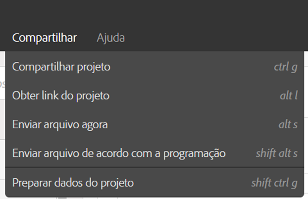
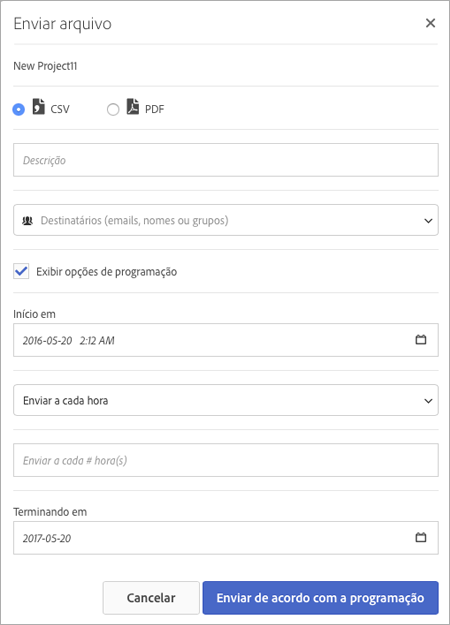

# Envio de arquivo - agendamento do envio de um projeto

Envie um projeto do Analysis Workspace por email ou agende o seu envio.

1. [Crie um projeto do Analysis Workspace](https://marketing.adobe.com/resources/help/en_US/analytics/analysis-workspace/t_freeform_project.html) e salve-o.
1. Clique em **[!UICONTROL Compartilhar]** &gt; **[!UICONTROL Enviar arquivo conforme agendado]**.

   

1. Na página [!UICONTROL Enviar arquivo], especifique o tipo de arquivo (CSV ou PDF).

   

1. Adicione destinatários e endereços de email ou nomes, depois clique em **[!UICONTROL Enviar agora]**.
1. (Opcional) Clique em **[!UICONTROL Exibir opções de agendamento]** para especificar um agendamento de envio, depois clique em **[!UICONTROL Enviar conforme agendado]**.
1. Gerencie projetos agendados em **[!UICONTROL Componentes]** &gt; [Projetos agendados](/help/analyze/analysis-workspace/curate-share/schedule-projects.md).
