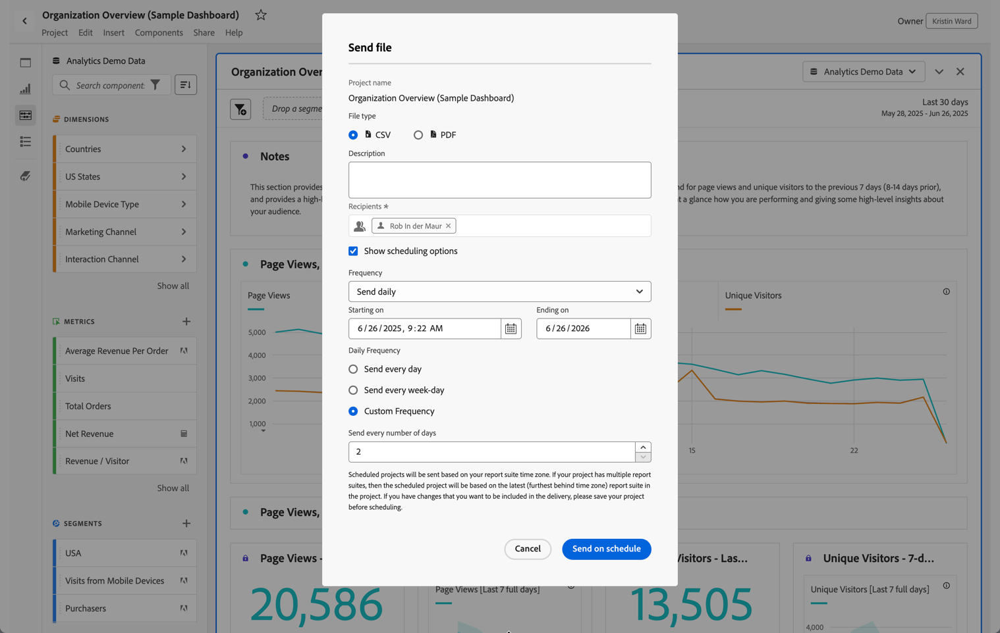

# Enviar arquivo - agendar um projeto para entrega

Envie um projeto da Analysis Workspace por email ou agende o seu envio.

1. [Crie um projeto da Analysis Workspace](https://marketing.adobe.com/resources/help/en_US/analytics/analysis-workspace/t_freeform_project.html) e salve-o.
1. Click **[!UICONTROL Share]** &gt; **[!UICONTROL Send File On Schedule]**.

   

1. Na página [!UICONTROL Enviar arquivo], especifique o tipo de arquivo (CSV ou PDF).

   

1. Add recipients email addresses or names, the click **[!UICONTROL Send Now]**.
1. (Optional) Click **[!UICONTROL Show Scheduling Options]** to specify a delivery schedule, then click **[!UICONTROL Send on Schedule]**.
1. Manage scheduled projects in **[!UICONTROL Components]** &gt; [Scheduled Projects](../../../analyze/analysis-workspace/curate-share/schedule-projects.md#concept_A7B9856EF2504BD791FE5A9E8AA7C29C).