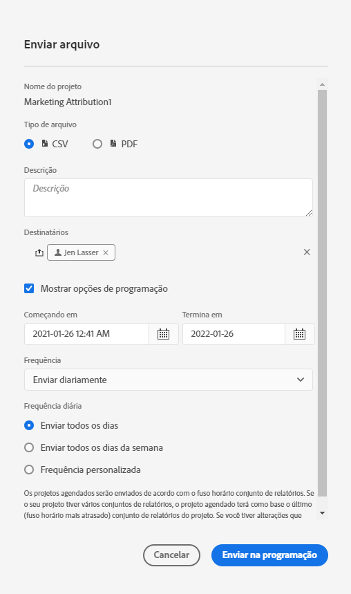

# Agendar projetos

No **menu Compartilhar**, do Workspace, você pode enviar projetos do Analysis Workspace por email para recipient selecionados. Os arquivos podem ser enviados no formato CSV ou PDF.

## Enviar arquivo agora

Para enviar um arquivo imediatamente aos recipients por email:

1. Clique em **[!UICONTROL Compartilhar] > [!UICONTROL Enviar arquivo agora]**.
1. Especifique o tipo de arquivo (CSV ou PDF).
1. (Opcional) Adicione uma descrição que será incluída no email para o arquivo que está sendo recebido.
1. Adicione recipients ou grupos. Endereços de email também podem ser inseridos.
1. Clique em **[!UICONTROL Enviar agora]**.
1. (Opcional) Clique em **[!UICONTROL Mostrar opções de agendamento]** para especificar um agendamento de delivery.

## Enviar arquivo agendado

Para enviar um arquivo por email de acordo com uma programação recorrente a recipients:

1. Clique em **[!UICONTROL Compartilhar] > [!UICONTROL Enviar arquivo agendado]**.
1. Especifique o tipo de arquivo (CSV ou PDF).
1. (Opcional) Adicione uma descrição que será incluída no email para o arquivo que está sendo recebido.
1. Adicione recipients ou grupos. Endereços de email também podem ser inseridos.
1. Especifique o intervalo ao longo do qual a programação deve ser entregue, modificando as entradas Início e Término. A data de término deve estar no prazo de um ano a partir do dia em que a programação foi criada ou modificada.
1. Especifique a frequência do delivery. Cada frequência permite personalizações diferentes.
1. Clique em **[!UICONTROL Enviar de acordo com a programação]**.

## Gerenciador de projetos programados

Os projetos programados do Analysis Workspace podem ser gerenciados em **Analytics > Componentes > Projetos programados**.

No Gerenciador de agendamento de projetos, é possível editar e excluir agendamentos de projetos recorrentes. Procure um agendamento na barra de pesquisa ou usando as opções de filtro no painel esquerdo. Você pode filtrar por tag, programação aprovada, proprietários e muito mais.

| Campo | Descrição |
| --- | --- |
| [!UICONTROL Favoritos] | Selecionar o ícone de estrela torna esta programação uma favorita. |
| [!UICONTROL ID de agendamento] | Essa ID é usada principalmente para fins de depuração. |
| [!UICONTROL Título e descrição] | Título e descrição deste projeto. |
| [!UICONTROL Proprietário] | A pessoa que criou e é proprietária do projeto. |
| [!UICONTROL Tags] | (opcional) Adicionar tags é uma boa maneira de organizar projetos. Todos os usuários podem criar tags e aplicar uma ou mais tags a um projeto. No entanto, é possível visualizar tags somente para os projetos que você possui ou que foram compartilhados com você. |
| [!UICONTROL Entregue para] | O(s) recipient(s) deste projeto programado. |
| [!UICONTROL Data de validade] | Para qualquer frequência de projeto agendada, você pode definir a data de expiração de até um ano no futuro. |
| [!UICONTROL Frequência] | Com que frequência deseja que esse projeto programado seja enviado ao(s) recipient(s). |
| [!UICONTROL Tempo de execução] | Em que hora do dia esse projeto programado é enviado. |
| [!UICONTROL Número de consultas] | O número de consultas relativas a este projeto. |

## Ações comuns

As ações a seguir são comuns no Gerenciador de projetos programados:

| Ação | Descrição |
|---|---|
| **[!UICONTROL Editar programação]** | Clique no título da programação para atualizar as configurações de delivery. |
| **[!UICONTROL Excluir programação]** | Selecione o projeto programado na lista e clique em Excluir no menu. Essa ação eliminará o calendário selecionado para o projeto; o projeto em si não será excluído. |
| **[!UICONTROL Adicionar tags]** | Selecione o projeto programado na lista e escolha “Tag” ou “Aprovar” para organizar as programações e facilitar a pesquisa. |
| **[!UICONTROL Exibir programações com falha]** | Acesse o painel esquerdo > Outros filtros > Falha para visualizar as programações que apresentaram falhas. |
| **[!UICONTROL Exibir programações expiradas]** | Acesse o painel esquerdo > Outros filtros > Expirado para ver as programações que expiraram. Clique no título da programação para configurar uma nova programação de delivery. |
| **[!UICONTROL Exibir ID de programação]** | Acesse as opções de coluna na parte superior direita e adicione a coluna ID de programação à tabela. A ID programada geralmente é útil para depuração. |

O Gerenciador de agendamento de projetos mostra os itens criados por um usuário específico. Se a conta de usuário estiver desabilitada no aplicativo, todas as entregas programadas são interrompidas. A propriedade do projeto programado pode ser **transferida** para um novo usuário em **Admin > Usuários e ativos do Analytics > Transferir ativos**.
