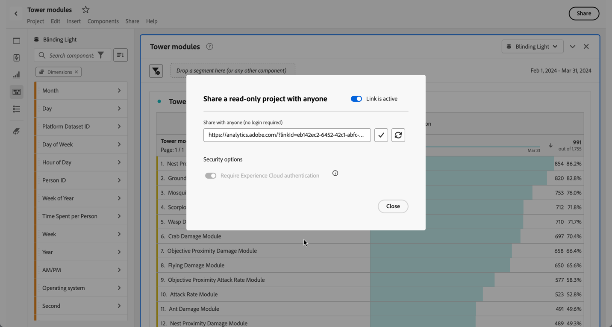

# Projetos somente leitura

Você pode compartilhar projetos como somente leitura com os destinatários por meio da [funcionalidade de compartilhamento](share-projects.md). Os destinatários colocados na função **[!UICONTROL Somente leitura]** receberão uma experiência de projeto mais limitada.

Essa opção pode ser útil se você estiver compartilhando um projeto com usuários menos familiarizados com a estrutura de dados da sua organização, com o Analysis Workspace ou o Adobe Analytics em geral, mas ainda assim quiser que eles vejam os dados e insights em um ambiente seguro.

As interações para os recipients somente leitura são limitadas.

## Interações desativadas

As interações desativadas em um projeto somente visualização incluem:

* Painel esquerdo oculto
* Intervalo de datas do calendário do painel. Observação: se quiser conceder o controle do calendário aos destinatários, adicione um [segmento suspenso com intervalos de datas](https://experienceleague.adobe.com/docs/analytics-learn/tutorials/analysis-workspace/using-panels/using-drop-down-filters.html?lang=pt-BR).
* Segmentação de forma livre
* Número de formas livres de linhas visíveis
* Configurações de linha, coluna ou visualização de forma livre
* Segmentos do painel
* Menus Editar, Inserir e Componente
* Dicas do Espaço de trabalho

## Interações ativadas

Algumas das interações ativadas mais importantes em um projeto somente visualização incluem:

| Área | Interações ativadas |
| --- | --- |
| **Tabelas de forma livre** | <li>Paginação e classificação</li><li>Passagem</li><li>Seleções de células que atualizam visualizações vinculadas</li><li>No menu de contexto > Obter link de visualização</li><li>No menu de contexto > Copiar para a área de transferência</li> |
| **Visualizações** | <li>Clicar para ativar/desativar legenda</li><li>Passagem</li><li>No menu de contexto > Obter link de visualização</li><li>Recolher/expandir</li><li>Fluxo - expandir nós de fluxo</li><li>Mapa - zoom</li></ul> |
| **Painéis** | <li>Segmentos suspensos interativos</li><li>No menu de contexto > Obter link do painel</li><li>Recolher/expandir</li> |
| **Projeto** | <li>Como inspecionar todos os ícones de informações</li><li>Menu Projeto - Novo, Abrir, Definir como página inicial, Atualizar, Baixar CSV/PDF, Informações e configurações limitadas do projeto</li><li>Menu Compartilhar - Obter link do projeto, Enviar arquivo agora</li><li>Menu Ajuda - Todas as ações, exceto as opções de Dicas e Depurador</li> |

## Compartilhe com qualquer pessoa

Se você selecionou um projeto usando [Compartilhar com qualquer pessoa](share-projects.md#share-a-project-with-anyone-no-login-required), o destinatário do link só poderá visualizar o projeto e não interagir com ele.

