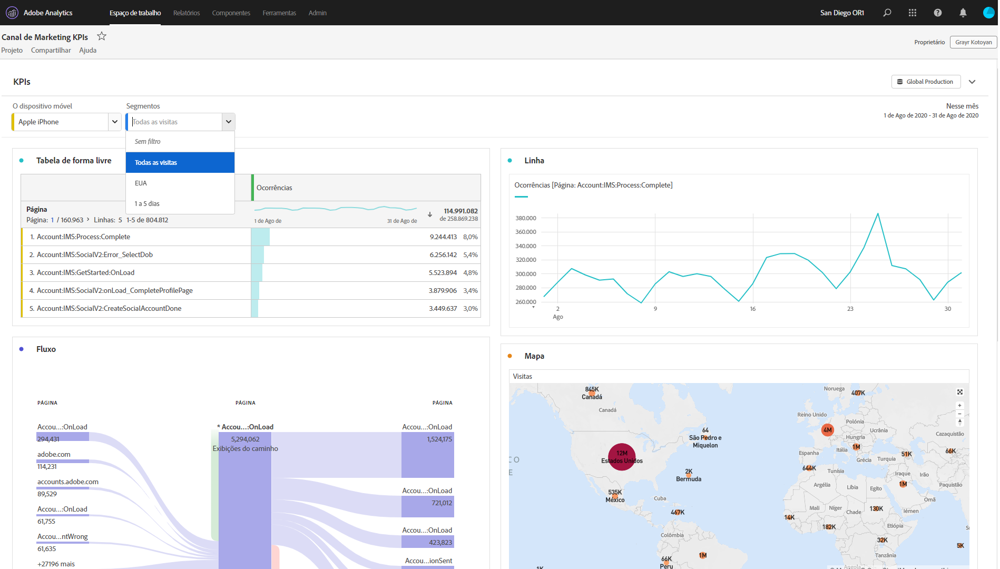

# Projetos da área de trabalho somente para Visualização

Você pode compartilhar projetos como &quot;somente visualização&quot; para recipient por meio do fluxo de trabalho [de compartilhamento do](/help/analyze/analysis-workspace/curate-share/share-projects.md)projeto. Os Recipient colocados na função Pode Visualização receberão uma experiência de projeto mais limitada. Isso pode ser desejado se você estiver compartilhando um projeto com usuários menos familiarizados com a estrutura de dados de sua organização, a área de trabalho de Análise ou o Adobe Analytics em geral, mas você quiser que eles consumam dados e insights em um ambiente seguro.

## Interações desativadas

As interações desativadas em um projeto somente visualização incluem:

* Trilho esquerdo oculto
* Conjunto de relatórios
* Intervalo de datas do calendário do painel. Observação: Se desejar conceder controle de calendário a recipient, adicione um filtro [suspenso com intervalos](https://docs.adobe.com/content/help/en/analytics-learn/tutorials/analysis-workspace/using-panels/using-drop-down-filters.html)de datas.
* Filtragem de forma livre
* Número de formas livres de linhas visíveis
* Configurações de linha, coluna ou visualização de forma livre
* Segmentos do painel
* Menus Editar, Inserir e Componente
* Dicas da área de trabalho

## Interações ativadas

Algumas das interações ativadas mais notáveis em um projeto somente visualização incluem:

| Área | Interações ativadas |
|---|---|
| Tabelas de forma livre | <ul><li>Paginação e classificação</li><li>Passagem</li><li>Seleções de células que atualizam visualizações vinculadas</li><li>Clique com o botão direito do mouse em > Obter link de visualização</li><li>Clique com o botão direito do mouse em > Copiar para a área de transferência</li></ul> |
| Visualizações | <ul><li>Clicar para ativar/desativar legenda</li><li>Passagem</li><li>Clique com o botão direito do mouse em > Obter link de visualização</li><li>Recolher/expandir</li><li>Fluxo - expandir nós de Fluxo</li><li>Mapa - zoom</li></ul> |
| Painéis | <ul><li>filtros suspensos interativos</li><li>Clique com o botão direito do mouse em > Obter link do painel</li><li>Recolher/expandir</li></ul> |
| Projeto   | <ul><li>Como inspecionar todos os ícones de informações</li><li>Menu Projeto - Novo, Abrir, Definir como landing page, Atualizar, Baixar CSV/PDF, Informações e configurações limitadas do projeto</li><li>Menu Compartilhar - Obter link do projeto, Enviar arquivo agora</li><li>Menu Ajuda - Todas as ações, exceto as opções de Dicas e Depurador</li></ul> |
