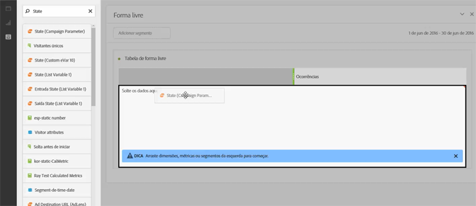
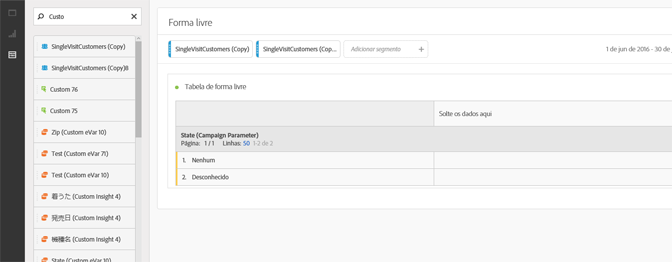
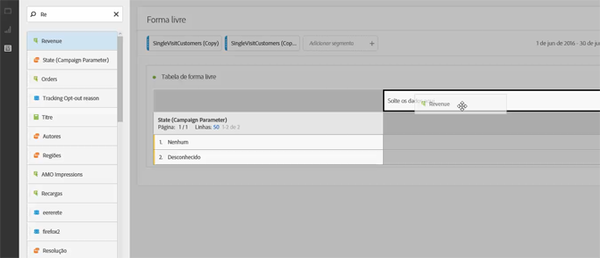
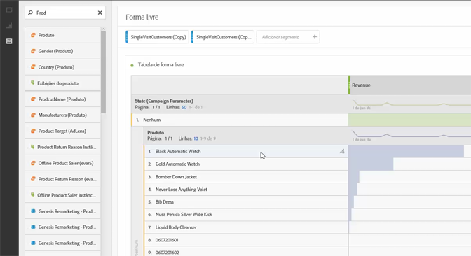
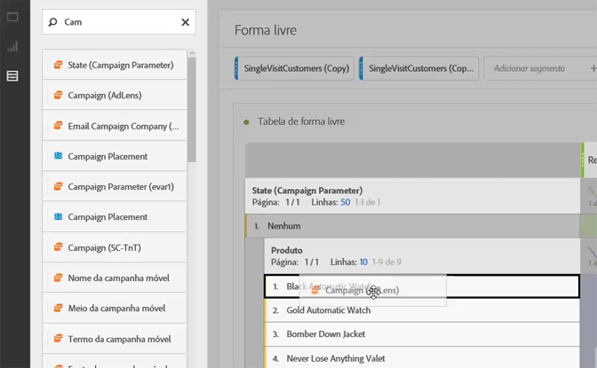
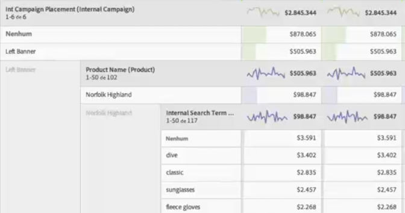

# Casos de uso da Analysis Workspace

Exemplos de como usar as tabelas de dados, os segmentos e as ideias dos casos de uso na Analysis Workspace.

Você pode realizar uma pesquisa direta em todos os seus dados para responder a perguntas específicas e reunir as narrativas sobre as interações do cliente e os interesses do público-alvo. Em um ambiente de forma livre você pode aplicar dimensões, métricas e segmentos ao longo de um período para recuperar diretamente os dados direcionados. Elabore a sua análise para ser personalizada para questões específicas e, em seguida, publique as informações em relatórios detalhados e visualizações, para serem compartilhados e facilmente interpretados, até mesmo por um usuário empresarial pioneiro com restrições de tempo.

**Exemplos**

* Como uma empresa de mídia, talvez você queira comparar os novos visitantes, os que visitam novamente e os visitantes mais leais, para observar como o consumo do conteúdo muda ao longo do tempo para cada segmento diferente.
* Compare as taxas de conversão para as palavras-chave de marca e sem marca.
* Analise as visualizações de páginas por pesquisa interna, pesquisa externa, páginas de aterrissagem e, assim por diante, para entender por que os termos de marca e sem marca funcionam de forma diferente.
* Analise o dia com o dia seguinte para comparar as colunas ou linhas e analisar o crescimento através de várias métricas.
* Faça uma consulta simples, como rejeições por dimensão.

## Exemplo de varejo {#section_9EFDEF038CAD4954BCFB118A8F33A96F}

Suponha que você é um analista de marketing de um revendedor de equipamentos para atividades externas e está encarregado de examinar o desempenho de uma promoção recente de Ação de Graças e fazer recomendações sobre como melhorar as campanhas no local. Este exemplo mostra como você pode comparar os dados de receita da campanha para diferentes segmentos e adicionar detalhamentos na campanha ainda mais específicos.

1. Selecione o conjunto de relatórios correto.
1. Pesquise, por exemplo, a dimensão dos seus Canais de campanha interna e arraste-a para a seção à esquerda da tela na tabela (estes dados vão formar as linhas da tabela.)

   

1. Agora, clique no ícone do segmento no canto superior esquerdo e arraste os diferentes segmentos de fidelização de clientes para a metade direita da tela. Você vai comparar os segmentos entre si, em tempo real. Isso vai formar as colunas da tabela.

   

1. Clique no ícone Eventos (Métricas) no canto superior esquerdo e adicione a métrica da receita abaixo de cada segmento. Observe como o relatório é gerado automaticamente. Agora você pode começar a comparar a receita da campanha para esses segmentos de clientes.

   

1. Agora, caso queira visualizar quais produtos foram mais eficazes na faixa do banner esquerdo em suas páginas, divida o Banner esquerdo por Nome do produto. Basta clicar no ícone Dimensões e arrastar a dimensão Nome do produto para a parte superior do Banner esquerdo.

   

1. Mas você pode especificar ainda mais. Você pode perguntar quais os termos de pesquisa as pessoas costumam usar para encontrar o seu produto mais vendido, Norfolk Highland. Tudo que você precisa fazer é arrastar a dimensão Termo de pesquisa interna para a parte superior do nome do produto:

   

   Um novo resultado de detalhamento será exibido:

   

   Você já dividiu os dados de uma forma que possa resultar em recomendações e vendas cruzadas, para que as suas equipes de merchandising implementem em outras campanhas e alcancem ainda mais receita para sua empresa. Você pode fazer outros detalhamentos até que consiga obter os resultados que deseja.

   Agora é possível [Compartilhe](../../analyze/analysis-workspace/curate-share/curate.md#concept_4A9726927E7C44AFA260E2BB2721AFC6) o relatório com as equipes de merchandising.

