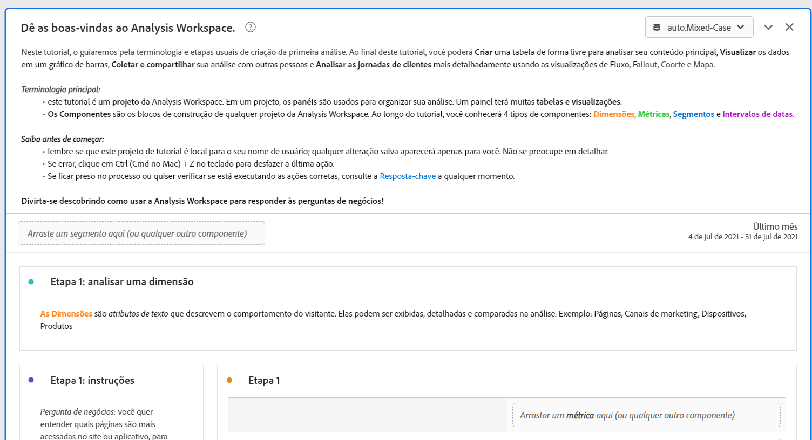
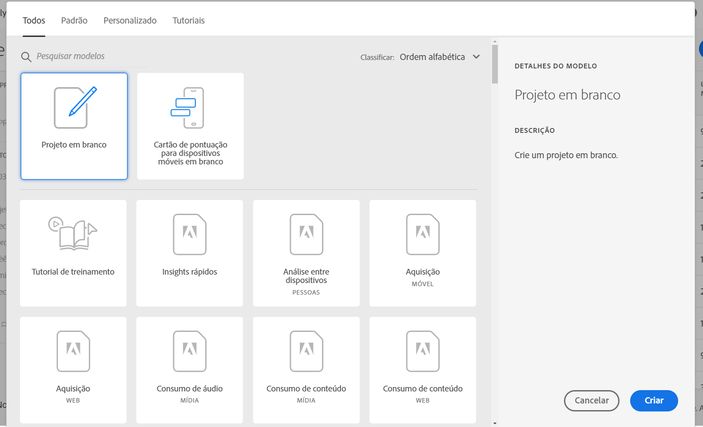
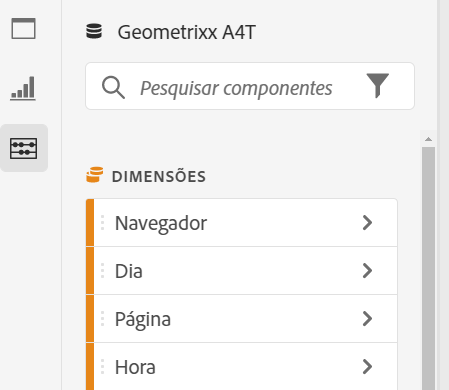
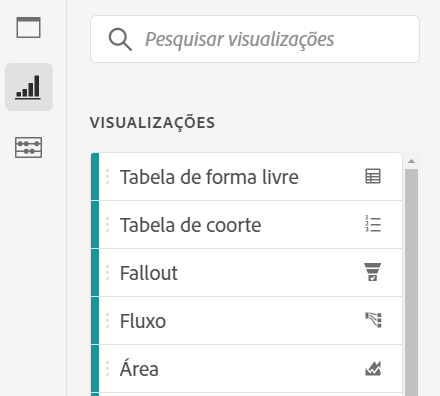
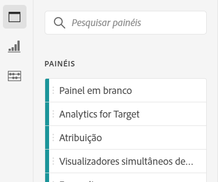

# Visão geral do Analysis Workspace

A Analysis Workspace é uma ferramenta de navegador flexível que permite criar análises e compartilhar insights rapidamente. Usando a interface de arrastar e soltar, você pode criar sua análise, adicionar visualizações para dar vida aos dados, preparar um conjunto de dados, compartilhar e agendar projetos com qualquer pessoa em sua organização.

Se você tiver apenas alguns minutos, assista a esta breve visão geral para ver o que é possível.

>[!VIDEO](https://video.tv.adobe.com/v/26266/?quality=12)

## Faça logon no Adobe Analytics {#login}

Para fazer o start usando o Analysis Workspace, faça logon no Adobe Analytics indo para [experience.adobe.com/analytics](http://experience.adobe.com/analytics). Você será direcionado para a página inicial de lista do projeto do Workspace se um projeto específico não tiver sido selecionado anteriormente para você.

## Usar o tutorial de treinamento {#training-tutorial}

Depois de conectado, sua primeira parada deve ser o Tutorial de treinamento da Analysis Workspace, que orienta você pela terminologia e etapas comuns para a criação da sua primeira análise no Workspace. Para iniciar o tutorial, clique em **[!UICONTROL Criar novo projeto]** e selecione Tutorial **de** treinamento no novo modal do projeto.

## Criar um novo projeto {#new-project}

Com o tutorial concluído, você está pronto para começar a criar seu primeiro projeto. O **novo modal** de projeto fornece opções diferentes para iniciar sua análise. Você pode optar por start a partir de um projeto em branco ou de um scorecard [móvel em](https://docs.adobe.com/content/help/pt-BR/analytics/analyze/mobapp/curator.html)branco, dependendo se planeja compartilhar sua análise do navegador ou do aplicativo móvel painéis Adobe Analytics.

Você também pode iniciar sua análise de **modelos** pré-criados, modelos padrão fornecidos pelo Adobe ou modelos personalizados criados pela sua organização. Há vários modelos diferentes disponíveis, dependendo da análise ou caso de uso que você tenha em mente. [Saiba mais](https://docs.adobe.com/content/help/pt-BR/analytics/analyze/analysis-workspace/build-workspace-project/starter-projects.html) sobre as diferentes opções de modelo disponíveis.

## Crie sua análise {#analysis}

No projeto da Workspace, **painéis, tabelas, visualizações e componentes** são acessados do painel esquerdo. Estes são os blocos componentes do projeto.

### Componentes

**Os componentes** são dimensões, métricas, segmentos ou intervalos de datas, todos os quais podem ser combinados em uma tabela **[!UICONTROL de forma]** livre para o start que responde às suas perguntas comerciais. Familiarize-se com cada tipo [de](/help/analyze/analysis-workspace/components/analysis-workspace-components.md) componente antes de mergulhar na análise. Depois de dominar a terminologia do componente, você pode começar a arrastar e soltar para [criar sua análise](https://docs.adobe.com/content/help/en/analytics/analyze/analysis-workspace/build-workspace-project/t-freeform-project.html) em uma tabela **[!UICONTROL de]** forma livre.

### Visualizações

**As visualizações**, como um gráfico de barras ou de linhas, são então adicionadas sobre os dados para dar vida visualmente a eles. No painel à esquerda, selecione o ícone do meio de **[!UICONTROL Visualizações]** para ver a lista completa de [visualizações](https://docs.adobe.com/content/help/pt-BR/analytics/analyze/analysis-workspace/visualizations/freeform-analysis-visualizations.html) disponíveis.

### Painéis

**Os painéis** são usados para organizar sua análise em um projeto e podem conter muitas tabelas e visualizações. Muitos dos painéis fornecidos no Analysis Workspace geram um conjunto completo de análises com base em algumas entradas do usuário. No painel da extrema esquerda, selecione o ícone **[!UICONTROL Painéis]** superior para ver uma lista completa de [painéis](https://docs.adobe.com/content/help/en/analytics/analyze/analysis-workspace/panels/panels.html) disponíveis.

## Recursos adicionais {#resources}

* Adobe oferta centenas de tutoriais [de treinamento em vídeo do](https://docs.adobe.com/content/help/en/analytics-learn/tutorials/overview.html)Analytics.
* Consulte [Novidades no Analysis Workspace](/help/analyze/analysis-workspace/new-features-in-analysis-workspace.md) para obter atualizações sobre novos recursos.
