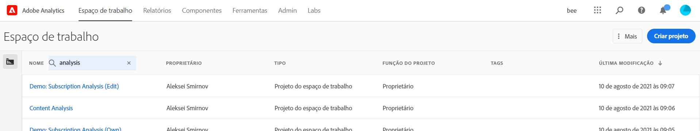

# Visão geral do Analysis Workspace

O Analysis Workspace é uma ferramenta de navegador flexível que permite criar análises e compartilhar insights rapidamente. Usando a interface de arrastar e soltar, você pode criar a análise, adicionar visualizações para dar vida aos dados, preparar um conjunto de dados, compartilhar e agendar projetos com qualquer pessoa em sua organização.

Se você tiver apenas alguns minutos, assista a esta breve visão geral para ver o que é possível.

>[!VIDEO](https://video.tv.adobe.com/v/26266/?quality=12)

## Faça logon no Adobe Analytics {#login}

Para começar a usar o Analysis Workspace, faça logon no Adobe Analytics acessando [experience.adobe.com/analytics](http://experience.adobe.com/analytics). Você será direcionado para a página inicial de lista de projetos do Workspace se um projeto específico não tiver sido selecionado anteriormente para você.

## Usar o tutorial de treinamento {#training-tutorial}

Depois de conectado, sua primeira parada deve ser o Tutorial de treinamento do Analysis Workspace, que orienta você pela terminologia e etapas comuns para a criação da sua primeira análise no Workspace. Para iniciar o tutorial, clique em **[!UICONTROL Criar novo projeto]** e selecione **Tutorial de treinamento** no novo modal do projeto.

## Criar um novo projeto {#new-project}

Com o tutorial concluído, você está pronto para começar a criar o primeiro projeto. O **novo modal do projeto** fornece opções diferentes para iniciar a análise. Você pode iniciar com um projeto em branco ou com um [scorecard móvel em branco](https://docs.adobe.com/content/help/pt-BR/analytics/analyze/mobapp/curator.html), dependendo se você planeja compartilhar a análise do navegador ou do aplicativo móvel dos painéis do Adobe Analytics.

Você também pode iniciar a análise de **modelos** pré-criados, modelos padrão fornecidos pela Adobe ou modelos personalizados criados pela sua organização. Há vários modelos diferentes disponíveis, dependendo da análise ou caso de uso que você tem em mente. [Saiba mais](https://docs.adobe.com/content/help/pt-BR/analytics/analyze/analysis-workspace/build-workspace-project/starter-projects.html) sobre as diferentes opções de modelo disponíveis.

## Crie sua análise {#analysis}

No projeto do Workspace, **painéis, tabelas, visualizações e componentes** são acessados pelo painel esquerdo. Estes são os componentes do projeto.

### Componentes

**Componentes** são dimensões, métricas, segmentos ou intervalos de datas que podem ser combinados em uma **[!UICONTROL tabela de forma livre]** para começar a responde às suas perguntas empresariais. Familiarize-se com cada [tipo de componente](/help/analyze/analysis-workspace/components/analysis-workspace-components.md) antes de mergulhar na análise. Depois de dominar a terminologia do componente, você pode começar a arrastar e soltar para [criar a análise](https://docs.adobe.com/content/help/pt-BR/analytics/analyze/analysis-workspace/build-workspace-project/t-freeform-project.html) em uma **[!UICONTROL tabela de forma livre]**.

### Visualizações

**Visualizações**, como um gráfico de barras ou de linhas, são adicionadas sobre os dados para dar vida visualmente a eles. No painel à esquerda, selecione o ícone do meio de **[!UICONTROL Visualizações]** para ver a lista completa de [visualizações](https://docs.adobe.com/content/help/pt-BR/analytics/analyze/analysis-workspace/visualizations/freeform-analysis-visualizations.html) disponíveis.

### Painéis

**Painéis** são usados para organizar a análise em um projeto e podem conter muitas tabelas e visualizações. Muitos dos painéis fornecidos no Analysis Workspace geram um conjunto completo de análises com base em algumas entradas do usuário. No painel à esquerda, selecione o ícone **[!UICONTROL Painéis]** superior para ver uma lista completa de [painéis](https://docs.adobe.com/content/help/pt-BR/analytics/analyze/analysis-workspace/panels/panels.html) disponíveis.

## Recursos adicionais {#resources}

* A Adobe oferece centenas de [tutoriais de treinamento em vídeo do Analytics](https://docs.adobe.com/content/help/pt-BR/analytics-learn/tutorials/overview.html).
* Consulte [Novidades no Analysis Workspace](/help/analyze/analysis-workspace/new-features-in-analysis-workspace.md) para obter atualizações sobre novos recursos.
