# Novidades no Analysis Workspace

## Março de 2020

Novos recursos lançados em 12 de março de 2020.

| Recurso | Descrição |
|--- |--- |
| Suporte para vários conjuntos de relatórios no Workspace | Agora é possível trazer dados de vários conjuntos de relatórios para um único projeto para visualização lado a lado. [Saiba mais...](https://docs.adobe.com/content/help/en/analytics/analyze/analysis-workspace/build-workspace-project/multiple-report-suites.html) |
| Modelo do Tutorial de treinamento | Este novo modelo padrão orienta você pela terminologia e etapas comuns para criar sua primeira análise no Workspace. Está disponível como modelo padrão no modal Novo projeto e substitui o projeto de amostra atual para novos usuários que não têm outros projetos na lista. [Saiba mais...](/help/analyze/analysis-workspace/build-workspace-project/starter-projects.md) |

## Fevereiro de 2020

Novos recursos lançados em 20 de fevereiro de 2020.

| Recurso | Descrição |
|--- |--- |
| Novo modelo da Workspace para organizações que usam o Cross-Device Analytics | Este modelo mostra como o CDA é eficaz ao unir visitas e educa você sobre dimensões e métricas exclusivas do CDA. É necessário um conjunto de relatórios que use o CDA. Consulte [Configuração de análises entre dispositivos](https://docs.adobe.com/content/help/en/analytics/components/cda/cda-setup.html) para obter mais informações. |
| Novas teclas de atalho no espaço de trabalho | <ul><li>Recolher/expandir todos os painéis: `alt + m`</li><li>Recolher/expandir painel ativo: `alt + ctrl + m`</li><li>Pesquisar painel esquerdo: `ctrl + /`</li><li>Move para o próximo painel: `alt + Right Key`</li><li>Mover para o painel anterior: `alt + Left Key`</li></ul>[Saiba mais...](https://docs.adobe.com/content/help/en/analytics/analyze/analysis-workspace/build-workspace-project/fa-shortcut-keys.html) |
| Outras melhorias na Workspace | <ul><li>Quando um painel ou visualização é solto no Workspace, o painel esquerdo agora alternará automaticamente para componentes para um fluxo de trabalho mais simples.</li><li>Os componentes do modelo agora podem ser ativados (por exemplo, marcados, favoritos, aprovados).</li><li>As listas de segmentos e métricas filtradas oferecem o botão + para adicionar um novo componente se você não encontrar o que precisa.</li></ul> |
| Depurador do espaço de trabalho | O depurador de espaço de trabalho foi adicionado ao menu Ajuda, fornecendo uma maneira mais simples de habilitá-lo para depurar solicitações de espaço de trabalho. [Saiba mais...](https://www.adobe.io/apis/experiencecloud/analytics/docs.html#!AdobeDocs/analytics-2.0-apis/master/reporting-tricks.md) |

## Janeiro de 2020

Novo recurso lançado em 16 de janeiro de 2020.

| Recurso | Descrição |
|--- |--- |
| [Construtor de tabelas de forma livre](https://docs.adobe.com/content/help/en/analytics/analyze/analysis-workspace/visualizations/freeform-table.html) | Com o Construtor de tabela ativado, você pode arrastar e soltar em muitas dimensões, detalhamentos, métricas e segmentos para criar tabelas que respondam a perguntas comerciais mais complexas. Os dados não serão atualizados imediatamente. Instead, updates occur after you click **[!UICONTROL Build]**, saving you time once you know what table you want to construct. Além disso, esse recurso oferece:<ul><li>**Visualização**: é possível visualizar o formato de uma tabela antes de gastar tempo para renderizar dados reais.</li><li>**Configurações flexíveis de linhas e detalhamento**: você pode definir seus níveis de linha e detalhamento para cada linha de dimensão. Anteriormente, o Workspace impunha padrões que não podiam ser alterados até que os dados fossem retornados.</li><li>**Detalhamento por posição**: é possível definir linhas de dimensão para sempre _detalhar por posição_ em vez de _por item específico_ (o padrão).</li><li>**Ordenação manual de linha estática**: é possível ordenar manualmente linhas estáticas para que as linhas da tabela sejam exibidas exatamente como você precisa. Anteriormente, as linhas estáticas podiam ser classificadas somente por uma coluna de métrica ou alfabeticamente.</li></ul> |

## Outubro de 2019

Melhorias lançadas em quinta-feira, 10 de outubro de 2019.

| Aprimoramento | Descrição |
|--- |--- |
| atualização dos totais das tabelas de forma livre | As tabelas de forma livre agora incluem dois totais, um **[!UICONTROL Table total]** e um **[!UICONTROL Grand total]**. As contas de linhas totais da tabela para os [filtros de relatório](https://docs.adobe.com/content/help/en/analytics/analyze/analysis-workspace/build-workspace-project/pagination-filtering-sorting.html) foram aplicadas. Anteriormente, somente a segmentação afetava os totais. [Saiba](https://docs.adobe.com/content/help/en/analytics/analyze/analysis-workspace/build-workspace-project/workspace-totals.html) maisAlém disso, **[!UICONTROL Show Totals]** e **[!UICONTROL Show Grand Total]** as opções foram adicionadas a **[!UICONTROL Column Settings]**. Com essa alteração nos totais de forma livre, as visualizações dependentes serão atualizadas (por exemplo, **[!UICONTROL Summary Number]** visualizações vinculadas), bem como os dados CSV e PDF exportados. |
| opção para remover Não especificado/Nenhum | A capacidade de remover facilmente &quot;Não especificado (Nenhum)&quot; foi adicionada como uma opção de filtro de relatório. |
| substituição de componentes com granularidade violeta | Os componentes de tempo com granularidade violeta (minuto, hora, dia, semana, mês, trimestre, ano) foram descontinuados. Os componentes de tempo violeta sempre se comportaram exatamente como seus equivalentes na dimensão laranja, então essa alteração simplificará a experiência. **Nenhuma ação** precisa ser executada se você tiver usado anteriormente um dos componentes de tempo violeta. Com essa alteração, a **[!UICONTROL Time]** seção violeta também foi renomeada para **[!UICONTROL Date Ranges]**. |

## Agosto de 2019

Melhorias lançadas em quinta-feira, 8 de agosto de 2019.

| Aprimoramento | Descrição |
|--- |--- |
| aumentar limite de itens para o filtro suspenso de 50 para 200 | Aumentamos o limite de itens que podem ser colocados em um filtro suspenso de 50 para 200. Esse aprimoramento abrange uma variedade de casos de uso, como adicionar todos os países (195) a um filtro, ou todos os estados e províncias dos EUA (52). |

## Julho de 2019

Melhorias lançadas em quinta-feira, 18 de julho de 2019.

| Aprimoramento | Descrição |
|--- |--- |
| Melhorias na análise de coorte | Novas [configurações de Análise de coorte](https://docs.adobe.com/content/help/en/analytics/analyze/analysis-workspace/visualizations/cohort-table/t-cohort.html) foram adicionadas: <ul><li>Mostrar somente a porcentagem</li><li>Arredondar porcentagem ao inteiro mais próximo</li><li>Mostrar uma linha de porcentagem média</li></ul> |
| Mostrar itens dos últimos 18 meses | No painel à esquerda, os usuários agora têm a opção de _Mostrar itens dos últimos 18 meses_. Anteriormente, o período de pesquisa era de no máximo 6 meses. Isso facilita a comparação com páginas ou campanhas do ano passado, até 18 meses atrás. |
| Novo modelo do Analysis Workspace | Adicionamos um novo modelo chamado [&quot;Magento: Marketing &amp; Commerce&quot;](https://docs.adobe.com/content/help/en/analytics/analyze/analysis-workspace/build-workspace-project/starter-projects.html) ao Analysis Workspace. Ele foi projetado especificamente para clientes de comércio eletrônico do Magento, mas qualquer varejista pode usá-lo para obter informações exclusivas sobre suas atividades de comércio. |

## Junho de 2019

Melhorias lançadas em quinta-feira, 13 de junho de 2019.

| Aprimoramento | Descrição |
|--- |--- |
| Novos filtros prontos para uso | Adição de novos filtros prontos para uso na pesquisa do painel à esquerda. Além do que você vê hoje (Dimensões, Métricas, Aprovado etc.), novos filtros como Métricas calculadas, Atributos do cliente, eVars, Props, Vídeo etc. foram adicionados para facilitar a localização dos componentes necessários. |

## Maio de 2019

Melhorias lançadas em 9 de maio de 2019.

| Aprimoramento | Descrição |
|--- |--- |
| Uma nova configuração foi adicionada às configurações da Visualização de fluxo: Incluir instâncias repetidas. | [Configurações de fluxo](/help/analyze/analysis-workspace/visualizations/c-flow/flow-settings.md) |

## Abril de 2019

Melhorias lançadas em 11 de abril de 2019.

| Aprimoramento | Descrição |
|--- |--- |
| Aprimoramentos das práticas recomendadas de otimização | [Otimizar o desempenho](/help/analyze/analysis-workspace/new-features-in-analysis-workspace.md) |

## Janeiro de 2019

Novos recursos e melhorias lançados em 17 de janeiro de 2019.

| Recurso | Descrição |
|--- |--- |
| [Análise de coorte](/help/analyze/analysis-workspace/visualizations/cohort-table/cohort-analysis.md) | Os aprimoramentos principais feitos à Análise de coorte permitem:<ul><li>Aplicar uma inclusão de segmento e retornar métricas separadamente. </li><li>Exibir alteração (churn) em vez de retenção.</li><li>Exibir tabelas de latência (tempo decorrido antes e depois de um evento de inclusão).</li><li>Personalizar dimensão de coorte (para agrupar visitantes com base em uma eVar, não somente no tempo).</li><li>Executar um cálculo acumulado de coorte: calcule a retenção/abandono com base em um período anterior, não na coorte original. </li><li>Adicionar várias métricas em campos de inclusão e de resultados, além de aplicar segmentos. (As métricas calculadas não são aceitas)</li></ul> |
| [Exibir densidade](/help/analyze/analysis-workspace/build-workspace-project/view-density.md) | Essa nova configuração permite ver mais dados em uma só tela ao reduzir o preenchimento vertical do painel à esquerda em tabelas de forma livre e de coorte. Acessível em Projeto > Informações e configurações do projeto. |
| [Compatível com variáveis de vários valores no Attribution IQ](attribution-iq.md) | Algumas dimensões no Analytics podem conter vários valores em uma única ocorrência, como listVars, a variável do produto, propriedades de lista ou eVars de merchandising. O Analysis Workspace permite aplicar o Attribution IQ a qualquer um desses tipos de variáveis no nível de ocorrência. |
| Melhorias de desempenho | Melhorias de velocidade a visualizações de detalhamento: projetos com mais detalhamentos serão carregados com mais rapidez. |

## Novembro de 2018

Novos recursos e melhorias lançados em 1 de novembro de 2018.

| Recurso | Descrição |
|--- |--- |
| [Preparar projetos e conjuntos de relatórios virtuais (VRS): melhorias](/help/analyze/analysis-workspace/curate-share/curate-projects-vrs.md) | Essas alterações foram introduzidas em outubro de 2018. As alterações foram feitas aos componentes que são visíveis por administradores e não administradores em projetos preparados do Workspace e em conjuntos de relatórios virtuais (VRS) preparados.   Anteriormente, qualquer pessoa podia ver componentes não preparados clicando em Mostrar todos os componentes. A experiência atualizada de preparação permite um controle mais polido sobre quais componentes ficam visíveis.  |

## Outubro de 2018

Novos recursos e melhorias lançados em 11 de outubro de 2018.

<table id="table_3DDC812B2F66416F868004416D248BF3"> 
 <thead> 
  <tr> 
   <th colname="col1" class="entry"> Recurso </th> 
   <th colname="col2" class="entry"> Descrição </th> 
  </tr> 
 </thead>
 <tbody> 
  <tr> 
   <td colname="col1"> 
<b>Gerenciamento do detalhamento de painel</b> 
 </td> 
   <td colname="col2"> 
Fizemos algumas alterações no gerenciamento de detalhamentos de painéis, que foram introduzidas na versão de manutenção de setembro. Ao clicar com o botão direito do mouse em um detalhamento, agora você pode 
 
    <ul id="ul_4BDEC66EEB2243628FE32B43E377E5BD"> 
     <li id="li_EF8277BE972540D3B2604D82BC7C0918">Excluir um detalhamento (esta opção está sempre presente). </li> 
     <li id="li_6A991208F2744274817DBE1E9D1B443F">Excluir uma etiqueta (caso haja uma etiqueta). </li> 
     <li id="li_5C1CFC465C2E41D2B35E8841EFDC82AA">Adicionar uma etiqueta (caso não haja uma etiqueta). </li> 
    </ul> </td> 
  </tr> 
  <tr> 
   <td colname="col1"> 
<b>Links em dicas de ferramentas de painel e visualização</b> 
 </td> 
   <td colname="col2"> 
Adicionamos links para vídeos e documentações relevantes a dicas de ferramentas de painel e visualização. 
 </td> 
  </tr> 
 </tbody> 
</table>

## Setembro de 2018

Novos recursos e melhorias lançados em 13 de setembro de 2018.

<table id="table_137719BFA03C44A78FDE872DF8B228A4"> 
 <thead> 
  <tr> 
   <th colname="col1" class="entry"> Recurso </th> 
   <th colname="col2" class="entry"> Descrição </th> 
  </tr> 
 </thead>
 <tbody> 
  <tr> 
   <td colname="col1"> 
<b>Detalhamentos de painel</b> 
 </td> 
   <td colname="col2"> 
A zona de soltar itens do painel agora tem recursos de detalhamento. Detalhamentos permitem que os usuários finais interajam com os dados em um projeto de maneira controlada. Exemplo: suponha que você tenha várias versões de um projeto para fornecer relatórios específicos de país. Agora, você pode recolher esses projetos em um único projeto e adicionar um menu suspenso para cada país. 
 </td> 
  </tr> 
  <tr> 
   <td colname="col1"> 
<b>Paletas de cores</b> 
 </td> 
   <td colname="col2"> 
Agora, é possível alterar o esquema de cores utilizado no Workspace, escolhendo em uma paleta de cores diferente ou especificando sua própria paleta. Isso afeta muitas coisas no Workspace, incluindo a maioria das visualizações. Isso <b>não</b> afeta o Resumo de alterações, a formatação condicional em tabelas de Forma livre e a visualização de Mapa. 
 
Observação: o suporte para a paleta de cores não está habilitado para o Internet Explorer 11. 
 </td> 
  </tr> 
  <tr> 
   <td colname="col1"> 
<b>Novo modelo: Consumo de áudio</b> 
 </td> 
   <td colname="col2"> 
Consulte <a href="https://marketing.adobe.com/resources/help/en_US/sc/appmeasurement/hbvideo/media-workspace-templates.html"  >Análise de áudio</a>. 
 </td> 
  </tr> 
 </tbody> 
</table>
## Agosto de 2018

Novos recursos e melhorias lançados em 9 de agosto de 2018.

<table id="table_DD77C02344414DCD9AC0A6A22E648B72"> 
 <thead> 
  <tr> 
   <th colname="col1" class="entry"> Recurso </th> 
   <th colname="col2" class="entry"> Descrição </th> 
  </tr> 
 </thead>
 <tbody> 
  <tr> 
   <td colname="col1"> 
<b>Guias de áreas para soltar</b> 
 </td> 
   <td colname="col2"> 
Esses guias explicam de maneira mais fácil o que faz cada ação de arrastar e soltar. Por exemplo, ao passar o cursor por uma coluna, mostraremos ações como Adicionar, Substituir, Filtrar por e Detalhar. 
 
Além disso, adicionamos guias de cores amarela e vermelha para alertá-lo quando você executar uma ação não recomendada ou que é proibida, como empilhar uma métrica sobre outra (o que resulta em dados inválidos). 
 </td> 
  </tr> 
  <tr> 
   <td colname="col1"> 
<b>Opção de Adicionar painel em branco</b> 
 </td> 
   <td colname="col2"> 
Adicionamos um símbolo + abaixo do painel inicial para facilitar a adição de mais painéis. 
 </td> 
  </tr> 
 </tbody> 
</table>

## Julho de 2018

Novos recursos e melhorias lançados em 19 de julho de 2018.

<table id="table_336E121310204DC492EA004F40830B0F"> 
 <thead> 
  <tr> 
   <th colname="col1" class="entry"> Recurso </th> 
   <th colname="col2" class="entry"> Descrição </th> 
  </tr> 
 </thead>
 <tbody> 
  <tr> 
   <td colname="col1"> 
<b> <a href="attribution-iq.md"  > Attribution IQ </a> </b> 
 </td> 
   <td colname="col2"> 
O Attribution IQ permite que você realize análises mais sofisticadas e inteligentes do desempenho de marketing. É possível usar os novos modelos de atribuição em métricas do Analysis Workspace (em qualquer tabela ou detalhamento) e em métricas calculadas. Um novo painel Atribuição permite uma melhor visualização e comparação. 
 </td> 
  </tr> 
  <tr> 
   <td colname="col1"> 
<b> Melhorias no painel esquerdo </b> 
 </td> 
   <td colname="col2"> 
Melhorias realizadas no painel esquerdo para torná-lo mais intuitivo e fácil de usar: 
 
    <ul id="ul_087BEDF4338946DA857CD82CB69F98C2"> 
     <li id="li_C751AACAC60442DC93118F0819F8EEA7"> Alinhamento da função Criar (+) dos componentes (métricas, segmentos, datas) aos cabeçalhos. </li> 
     <li id="li_DE2EB184A02D4CE58C23F518DB85EFDD"> Adição de “+ Ver todos” à parte inferior de cada lista de seção para tornar aparente que há mais de 5 opções. </li> 
     <li id="li_5208F3C6026647B09F4A85131B175175">Ações (como adicionar tag, adicionar aos favoritos) com ícones quando componentes são selecionados. </li> 
     <li id="li_11E601488A844515928231E09889BC54">Melhorias estéticas realizadas na interface do usuário. </li> 
    </ul> </td> 
  </tr> 
  <tr> 
   <td colname="col1"> 
<b>Totais para métricas calculadas </b> 
 </td> 
   <td colname="col2"> 
Quando possível, agora exibimos os totais das métricas calculadas, inclusive de porcentagens 
 </td> 
  </tr> 
  <tr> 
   <td colname="col1"> 
<b>Nova predefinição de <a href="/help/analyze/analysis-workspace/components/calendar-date-ranges/calendar.md"  >intervalo de datas</a></b> 
 </td> 
   <td colname="col2"> 
Adicionado 'Últimas 13 semanas completas' às predefinições de intervalo de datas no Analysis Workspace. 
 </td> 
  </tr> 
 </tbody> 
</table>

## Junho de 2018

Novos recursos e melhorias lançados em 14 de junho de 2018.

<table id="table_57035A06D99447A6BE6ED825A648ED3F"> 
 <thead> 
  <tr> 
   <th colname="col1" class="entry"> Recurso </th> 
   <th colname="col2" class="entry"> Descrição </th> 
  </tr> 
 </thead>
 <tbody> 
  <tr> 
   <td colname="col1"> 
<b> <a href="/help/analyze/analysis-workspace/components/dimensions/view-dimensions.md"  > Colunas de dimensão dinâmica </a> </b> 
 </td> 
   <td colname="col2"> 
Anteriormente, quando uma dimensão era solta em uma coluna, mostrávamos os 5 principais valores para dimensões non-time (que não são relacionadas ao tempo), e 15 para dimensões de tempo, e mantínhamos esses valores estáticos (isto é, os 5 valores nunca eram alterados). 
 
A partir de agora, por padrão, mostramos valores dinâmicos em vez de estáticos, com a opção de transformá-los em valores estáticos. Outras observações: 
 
    <ul id="ul_C802BC32CB084E30B4E58E9E90B9A63D"> 
     <li id="li_452466AB416F4737B532849C604BD4CC">Clique (i) na dimensão dinâmica e você verá a classificação (1 de 5 principais) e o tipo de dimensão. </li> 
     <li id="li_588F6199E38D47869AC855A4C2A4D1B7">Conforme seus dados atualizam, as colunas de dimensão dinâmica serão atualizadas para mostrar os itens de dimensão atuais de 5/15. </li> 
     <li id="li_19D47638D4D94416B0DAD2B2FB835ABE">Uma coluna de dimensão dinâmica que é copiada ou movida se tornará estática. </li> 
     <li id="li_B95411689AE04774B7B9BA128F2DB96F">Ao passar o cursor sobre uma coluna de dimensão estática, você verá um ícone de cadeado, indicando que a dimensão é estática. </li> 
    </ul> </td> 
  </tr> 
  <tr> 
   <td colname="col1"> 
<b>Novo modal de recursos do Workspace </b> 
 </td> 
   <td colname="col2"> 
Semelhante às Dicas do dia introduzidas no último mês, esse modal mostra os novos recursos do Workspace na primeira vez que você acessa o Workspace depois de atualizar para uma nova versão. 
 </td> 
  </tr> 
 </tbody> 
</table>

## Maio de 2018

Novos recursos e melhorias lançados em 10 de maio de 2018.

<table id="table_EE4C690A178B4F80BDAF2BB4424D6020"> 
 <thead> 
  <tr> 
   <th colname="col1" class="entry"> Recurso </th> 
   <th colname="col2" class="entry"> Descrição </th> 
  </tr> 
 </thead>
 <tbody> 
  <tr> 
   <td colname="col1"> 
<b>Dicas do dia</b> 
 </td> 
   <td colname="col2"> 
Oferecemos Dicas do dia (junto a um breve vídeo) no canto inferior direito da interface. Essas dicas são uma maneira de deixá-lo familiarizado com a multitude de recursos interessantes do Analysis Workspace. Você pode optar por descartar as Dicas ou acessá-las em  Ajuda &gt;  Dicas  a qualquer momento. 
 
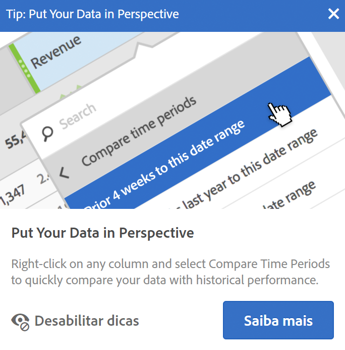 
 </td> 
  </tr> 
  <tr> 
   <td colname="col1"> 
<b> <a href="/help/analyze/analysis-workspace/components/t-freeform-project-segment.md"  > Modelos de segmentos </a> e <a href="/help/analyze/analysis-workspace/components/apply-create-metrics.md"  > modelos de métricas calculadas </a></b> 
 </td> 
   <td colname="col2"> 
O painel esquerdo agora apresenta modelos de segmentos e modelos de métricas calculadas. 
 </td> 
  </tr> 
  <tr> 
   <td colname="col1"> 
<b>Capacidade para rolar a página ao arrastar componentes</b> 
 </td> 
   <td colname="col2"> 
Agora você pode rolar a página para cima e para baixo ao arrastar componentes para um novo local. 
 </td> 
  </tr> 
  <tr> 
   <td colname="col1"> 
<b>Informações adicionais sobre   <a href="/help/analyze/analysis-workspace/virtual-analyst/c-anomaly-detection/view-anomalies.md"  > anomalias </a></b> 
 </td> 
   <td colname="col2"> 
Ao passar o cursor por uma anomalia em um gráfico de linha, as informações agora mostram a data e o valor bruto da anomalia. 
 </td> 
  </tr> 
 </tbody> 
</table>

## Abril de 2018

Novos recursos e melhorias lançados em 12 de abril de 2018.

<table id="table_B9E784CD14A1453EB360FCCDC612250F"> 
 <thead> 
  <tr> 
   <th colname="col1" class="entry"> Recurso </th> 
   <th colname="col2" class="entry"> Descrição </th> 
  </tr> 
 </thead>
 <tbody> 
  <tr> 
   <td colname="col1"> 
 <a href="/help/analyze/analysis-workspace/build-workspace-project/column-row-settings/column-settings.md"  > Quebra de texto de cabeçalho habilitada por padrão </a> 
 </td> 
   <td colname="col2"> 
A configuração de Quebra de texto de cabeçalho agora está habilitada por padrão nas tabelas de forma livre. 
 </td> 
  </tr> 
  <tr> 
   <td colname="col1"> 
 <a href="/help/analyze/analysis-workspace/build-workspace-project/column-row-settings/table-settings.md"  >Nova configuração de linha</a> 
 </td> 
   <td colname="col2"> 
A nova configuração Calcular porcentagem por linha força a tabela de forma livre a calcular as porcentagens de célula na linha, e não na coluna. Essa configuração é útil para porcentagens de tendência como a tendência de um valor de dimensão em relação ao restante ao longo do tempo. Está ativada por padrão se clicamos no ícone Visualizar. 
 </td> 
  </tr> 
  <tr> 
   <td colname="col1"> 
 <a href="/help/analyze/analysis-workspace/visualizations/freeform-analysis-visualizations.md#section_D3BB5042A92245D8BF6BCF072C66624B"  > Configuração da visualização “100% empilhada”</a> 
 </td> 
   <td colname="col2"> 
Uma nova configuração nas visualizações de área/barras/barras horizontais empilhadas transforma o gráfico em uma visualização 100% empilhada, assim você pode medir as proporções relativas. 
 
 
 </td> 
  </tr> 
  <tr> 
   <td colname="col1"> 
 <a href="/help/analyze/analysis-workspace/virtual-analyst/overview.md"  > A Detecção de anomalias e a Análise de contribuição</a> agora estão disponíveis no Analysis Workspace 
 </td> 
   <td colname="col2"> 
A Detecção de anomalias e a Análise de contribuição foram removidas do conjunto de recursos do Reports &amp; Analytics e agora estão disponíveis somente no Analysis Workspace. 
 
Observe que os clientes do Adobe Analytics Select e do Adobe Analytics Foundation só têm acesso à Detecção de anomalias de “granularidade diária” no Workspace. 
 </td> 
  </tr> 
 </tbody> 
</table>

## Março de 2018

Novos recursos e melhorias lançados em 8 de março de 2018.

<table id="table_580CF2C1322E4FB78870BE2B1F497B2F"> 
 <thead> 
  <tr> 
   <th colname="col1" class="entry"> Recurso </th> 
   <th colname="col2" class="entry"> Descrição </th> 
  </tr> 
 </thead>
 <tbody> 
  <tr> 
   <td colname="col1"> 
 <a href="/help/analyze/analysis-workspace/build-workspace-project/column-row-settings/column-settings.md"  > Quebra do texto do cabeçalho </a> 
 </td> 
   <td colname="col2"> 
Agora é possível quebrar o texto de cabeçalho em tabelas de forma livre para tornar os cabeçalhos mais legíveis e as tabelas mais compartilháveis. Adicionamos uma opção nas configurações de coluna chamada “Quebrar texto do cabeçalho”. Essa opção é especialmente útil para renderização de .pdf e para métricas com nomes compridos. 
 </td> 
  </tr> 
  <tr> 
   <td colname="col1"> 
 <a href="/help/analyze/analysis-workspace/components/apply-create-metrics.md"  > Clicar com o botão direito para criar métrica </a> 
 </td> 
   <td colname="col2"> 
Para facilitar a rápida criação de métricas calculadas, a opção Criar métrica a partir da seleção foi adicionada ao menu de clique com o botão direito nas Tabelas de forma livre. Essa opção é exibida quando uma ou mais células de coluna de cabeçalho são selecionadas. 
 </td> 
  </tr> 
  <tr> 
   <td colname="col1"> 
 <a href="/help/analyze/analysis-workspace/visualizations/map-visualization.md"  > Melhorias da visualização de mapa </a> 
 </td> 
   <td colname="col2"> 
Para que possa mostrar comparações periódicas (como anual, year-over-year) na Visualização de mapa, adicionamos os aprimoramentos a seguir: 
 
    <ul id="ul_F570E6AB174C45788620CF50E2742A08"> 
     <li id="li_746E329037764644A9CCF79161C26350">A Visualização de mapa agora pode apresentar números negativos. Por exemplo, se estiver traçando uma métrica anual, o mapa pode apresentar -33% em Nova York. </li> 
     <li id="li_E05F0380627044E6A4E8A60C98494BF7">Com métricas do tipo “percentual”, o clustering faz uma média das porcentagens. </li> 
     <li id="li_44C04306EA1B413E91B8256B340D5296">Um novo esquema de cor: Positivo/Negativo (verde/vermelho) </li> 
    </ul> </td> 
  </tr> 
  <tr> 
   <td colname="col1"> 
 <a href="/help/analyze/analysis-workspace/build-workspace-project/starter-projects.md"  > Atualizações no modelo personalizado </a> 
 </td> 
   <td colname="col2"> 
Nos modelos personalizados lançados recentemente, nós 
 
    <ul id="ul_787F48253F454163B99F6DD50F199FE2"> 
     <li id="li_828DD547DDB54A81B9FFB9FE92790F6C">Adicionamos um ícone de modelo na parte superior do projeto (próximo ao título) para ajudar na diferenciação do modo de edição de modelo para o uso de um modelo como o ponto inicial de um projeto. </li> 
     <li id="li_EEAA4D115CB74A57BABD524B2561E0CC">Permite que não administradores criem (salvar como) e editem modelos de projeto do Workspace, previsto que tenham a permissão para Criar/Preparar projetos no Analysis Workspace. (   Admin &gt; User Management &gt; Grupos &gt; Editar acesso a todos os relatórios &gt; Personalizar ferramentas do Analytics &gt; Criar/Preparar projetos no Analysis Workspace  ). </li> 
    </ul> </td> 
  </tr> 
 </tbody> 
</table>

## Fevereiro de 2018

Novo recurso e melhorias lançados em 8 de fevereiro de 2018.

<table id="table_824BBE4A554B4DB092ADA9044383D0FA"> 
 <thead> 
  <tr> 
   <th colname="col1" class="entry"> Recurso </th> 
   <th colname="col2" class="entry"> Descrição </th> 
  </tr> 
 </thead>
 <tbody> 
  <tr> 
   <td colname="col1"> 
 <a href="/help/analyze/analysis-workspace/build-workspace-project/starter-projects.md#create-custom-template"  > Modelos personalizados do Workspace </a> 
 </td> 
   <td colname="col2"> 
Agora é possível criar seus próprios modelos do Workspace e salvá-los para que outros usuários da organização possam começar com dados relevantes. 
 </td> 
  </tr> 
  <tr> 
   <td colname="col1"> 
 <a href="/help/analyze/analysis-workspace/build-workspace-project/t-freeform-project.md"  > Inicialização modal de Novo projeto </a> 
 </td> 
   <td colname="col2"> 
Clicar em “novo projeto” abre uma nova tela com a opção de começar com um 
 
    <ul id="ul_FE90E6B9AF334A029D66A43901F8FA0B"> 
     <li id="li_F1DFD9AE140C4E5B849D4C522D5968DB">projeto em branco ou </li> 
     <li id="li_23BD391D68674C299858A97BFE10598B">um modelo padrão (integrado) do Workspace, ou </li> 
     <li id="li_04D84FE375B84BF88843AA0D43A234BF">um modelo personalizado do Workspace (veja acima) </li> 
    </ul> </td> 
  </tr> 
  <tr> 
   <td colname="col1"> 
Suporte a clique com o botão direito para copiar 
 </td> 
   <td colname="col2"> 
Adicionamos uma opção “Copiar para a área de transferência” (ao clicar com o botão direito do mouse) para permitir copiar de forma consistente as células/tabelas. 
 </td> 
  </tr> 
  <tr> 
   <td colname="col1"> 
 <a href="/help/analyze/analysis-workspace/build-workspace-project/column-row-settings/column-settings.md"  >Melhoria na % da coluna</a> 
 </td> 
   <td colname="col2"> 
O “percentual do total” exibido em colunas foi fixado em 100%, mesmo no caso das linhas que representam mais do que 100% do total (como em médias). 
 
Agora compartilhamos percentuais maiores que 100%, para maior precisão. Também fixamos o limite superior para 1.000% para garantir que as colunas possam aumentar em largura. 
 </td> 
  </tr> 
  <tr> 
   <td colname="col1"> 
 <a href="/help/analyze/analysis-workspace/build-workspace-project/column-row-settings/column-settings.md#section_3DD847151DA14914888A70FC4FD7BDFB"  > Formatação condicional ativada nos detalhamentos </a> 
 </td> 
   <td colname="col2"> 
A aplicação de formatação condicional (cores, etc.) nas tabelas de forma livre agora é ativada automaticamente nos detalhamentos, a menos que sejam selecionados limites “Personalizados”. 
 </td> 
  </tr> 
  <tr> 
   <td colname="col1"> 
Alterações na exibição padrão do <a href="/help/analyze/analysis-workspace/components/calendar-date-ranges/calendar.md"  >calendário </a> 
 </td> 
   <td colname="col2"> 
Por padrão, o calendário do Workspace mostrará o mês atual e o último mês em vez de o mês atual e o próximo mês. 
 </td> 
  </tr> 
  <tr> 
   <td colname="col1"> 
Cores de seleção/posição do cursor melhoradas nas tabelas do Workspace 
 </td> 
   <td colname="col2"> 
A diferença entre as cores ao passar o mouse sobre uma célula da tabela de forma livre e ao clicar em uma célula foi realçada. 
 </td> 
  </tr> 
 </tbody> 
</table>

## Janeiro de 2018

Novos recursos e melhorias lançados em 18 de janeiro de 2018.

<table id="table_7A2E678577F94BDABB1276C826E6554F"> 
 <thead> 
  <tr> 
   <th colname="col1" class="entry"> Recurso </th> 
   <th colname="col2" class="entry"> Descrição </th> 
  </tr> 
 </thead>
 <tbody> 
  <tr> 
   <td colname="col1"> 
Mais <a href="/help/analyze/analysis-workspace/build-workspace-project/pagination-filtering-sorting.md"  >opções de filtragem</a> de itens de dimensão em tabelas de forma livre 
 </td> 
   <td colname="col2"> 
Estas opções de filtragem (avançadas) para itens de dimensão foram adicionadas (além das opções atuais “contém” e “não contém”): 
 
    <ul id="ul_869B3E943E304C0282D56AD96BB79E18"> 
     <li id="li_81A49BA0CA3041C7AB892FAD2D129E5A">Contém todos os termos </li> 
     <li id="li_2AB564F917844F82839A91949D0B684A">Contém qualquer termo </li> 
     <li id="li_16C7938EDC8F422EA006FB63F2881EF1">Contém a frase </li> 
     <li id="li_5130EBE9A7A54CCFA313F3C3C268B367">Não contém nenhum termo </li> 
     <li id="li_861825154EDC49EBA57514FD0A2AE462">Não contém a frase </li> 
     <li id="li_5364BFB73ECF4B92A6663693ABD4BCF5">Igual </li> 
     <li id="li_1EBF3119B6364842A35D39BAD645F4AF">Não é igual </li> 
     <li id="li_487886E0A6EC4245A0E85D2E8B4A20FB">Começa com </li> 
     <li id="li_A73F54DFBAAB44D4A4134342A3124E47">Termina com </li> 
    </ul> </td> 
  </tr> 
  <tr> 
   <td colname="col1"> 
 <a href="/help/analyze/analysis-workspace/visualizations/freeform-analysis-visualizations.md#section_05B7914D4C9E443F97E2BFFDEC70240C"  > Copiar e colar visualizações/painéis</a> em todos os painéis e projetos 
 </td> 
   <td colname="col2"> 
Agora é possível clicar com o botão direito do mouse e copiar uma visualização ou painel e depois colar (“inserir”) o elemento copiado em outro lugar dentro do projeto ou em um projeto diferente. 
 
É possível usar esta capacidade para criar “blocos de construção” (visualizações/painéis predefinidos) que podem ser copiados para dentro de outros projetos para iniciá-los mais rapidamente, com dados específicos da sua empresa. 
 </td> 
  </tr> 
  <tr> 
   <td colname="col1"> 
 <a href="/help/analyze/analysis-workspace/build-workspace-project/starter-projects.md"  >Novos modelos para dispositivos móveis para “Mensagens” e “Localização”</a> 
 </td> 
   <td colname="col2"> 
Dois novos modelos de projeto foram adicionados: 
 
    <ul id="ul_2F5976C849474A2B8A6BCDA2559F2855"> 
     <li id="li_51B7830E062A4CFDBDF219C56249A733">Um novo modelo de projeto para “Envio de mensagens” em dispositivos móveis que foca no desempenho do envio de mensagens de push e dentro do aplicativo. </li> 
     <li id="li_D2FB258EF3AF4EB19CEB258D08F4EBBE">Um novo modelo de projeto para “Localização” em dispositivos móveis que inclui um mapa mostrando os dados de localização. </li> 
    </ul> </td> 
  </tr> 
  <tr> 
   <td colname="col1"> 
Melhorias no redimensionamento de colunas 
 </td> 
   <td colname="col2"> 
Ao redimensionar a coluna mais à esquerda, o Workspace agora mantém as porcentagens de largura do resto das colunas (não ajusta apenas a largura da próxima coluna à direita). Essa mudança acelera a criação da tabela para análise e compartilhamento. 
 </td> 
  </tr> 
  <tr> 
   <td colname="col1"> 
Exibir <a href="/help/analyze/analysis-workspace/visualizations/freeform-table.md"  >400 linhas</a> em uma tabela 
 </td> 
   <td colname="col2"> 
Agora é possível exibir 400 linhas em uma tabela (antes 200), o que permite verificar tendências por 365 dias. 
 </td> 
  </tr> 
  <tr> 
   <td colname="col1"> 
 Suporte para <a href="/help/analyze/analysis-workspace/visualizations/map-visualization.md"  >visualização de mapas</a> em PDF 
 </td> 
   <td colname="col2"> 
A visualização de mapas, introduzida em outubro de 2017, agora pode ser renderizada em PDF. 
 </td> 
  </tr> 
  <tr> 
   <td colname="col1"> 
 <a href="/help/analyze/analysis-workspace/build-workspace-project/t-freeform-project.md"  > Links internos relativos</a> ao copiar/salvar como projeto 
 </td> 
   <td colname="col2"> 
Anteriormente, ao copiar um projeto ou usar o recurso “Salvar como”, todos os links internos salvos no projeto vinculavam o projeto original, não a cópia. 
 
Os links internos agora vinculam o projeto em que se encontram, uma vez feita a cópia ou usada a opção “Salvar como”. 
 </td> 
  </tr> 
  <tr> 
   <td colname="col1"> 
Análise de contribuição: <a href="https://marketing.adobe.com/resources/help/en_US/analytics/contribution/ca_main.html"  >notificação de tokens </a> 
 </td> 
   <td colname="col2"> 
Se a sua empresa tem um número limitado de tokens para análise de contribuição, a interface do usuário do Analysis Workspace agora mostra uma notificação quando você usa um token. Isso permite que você saiba quantos tokens ainda tem.  
 
(Usuários administradores: podem restringir quem pode usar esses tokens editando as permissões do grupo. A permissão se chama “Detecção de anomalias e Análise de contribuição” e fica em Analytics &gt; Admin &gt; User Management  &gt; Editar grupos &gt; Editar acessos a relatórios &gt; Personalizar ferramentas do conjunto de relatórios &gt; Ferramentas e relatórios. )  
 </td> 
  </tr> 
  <tr> 
   <td colname="col1"> 
Arquivos CSV com caracteres de vários bytes 
 </td> 
   <td colname="col2"> Arquivos CSV enviados por email que contenham caracteres com vários bytes agora podem ser abertos no MS Excel. </td> 
  </tr> 
  <tr> 
   <td colname="col1"> 
Alterações em event#, eVar# e prop# 
 </td> 
   <td colname="col2"> 
Event#, eVar# e prop#, que eram adicionadas aos nomes das dimensões no painel à esquerda (na versão de 2017), apenas aparecerão quando você <b>pesquisar</b> pelo componente. 
 
(Também se aplica ao construtor do conjunto de relatórios virtuais.) 
 </td> 
  </tr> 
  <tr> 
   <td colname="col1"> 
Alterações a Nenhum/Não especificado 
 </td> 
   <td colname="col2"> 
Alteração de como Nenhum/Não especificado funciona no Analysis Workspace para que seja consistente com o Reports &amp; Analytics, o Construtor de segmentos e o menu de valores de dimensão no Analysis Workspace. 
 
Isso significa que o valor será exibido como “Não especificado” em vez de “Nenhum” na maioria dos projetos no Analysis Workspace. 
 </td> 
  </tr> 
 </tbody> 
</table>

## Novembro de 2017

Novo recurso lançado em 9 de novembro de 2017.

<table id="table_C502E81253634E6CBAE7F12C7B62F7B6"> 
 <thead> 
  <tr> 
   <th colname="col1" class="entry"> Recurso </th> 
   <th colname="col2" class="entry"> Descrição </th> 
  </tr> 
 </thead>
 <tbody> 
  <tr> 
   <td colname="col1"> 
Lista de componentes incompatíveis 
 </td> 
   <td colname="col2"> 
Às vezes, nem todos os componentes incluídos em um projeto são incluídos no conjunto de relatórios. A mensagem resultante “Conjunto de relatórios incompatível” que aparece ao carregar um projeto ou trocar para um conjunto de relatórios agora lista os componentes que não são compatíveis. 
 </td> 
  </tr> 
 </tbody> 
</table>

## Outubro de 2017

Novos recursos lançados em 26 de outubro de 2017.

<table id="table_892279F2B4AF4DB38C64AA9AFC5657A7"> 
 <thead> 
  <tr> 
   <th colname="col1" class="entry"> Recurso </th> 
   <th colname="col2" class="entry"> Descrição </th> 
  </tr> 
 </thead>
 <tbody> 
  <tr> 
   <td colname="col1"> 
 <a href="/help/analyze/analysis-workspace/visualizations/map-visualization.md"  > Visualização de mapa </a> 
 </td> 
   <td colname="col2"> 
A nova Visualização de mapa permite ver facilmente as interações do cliente no contexto de suas localizações. De uma exibição macro (global) para micro (cidade), é possível aumentar ou diminuir o zoom facilmente nos diferentes níveis de hierarquia na visualização para ver os grupos de usuários nas regiões. 
 
É possível visualizar dados de localização por meio do endereço IP (para conjuntos de dados não móveis) ou você pode dar vida aos dados de latitude e longitude (para clientes que utilizam o Mobile SDK) no Analysis Workspace.  
 </td> 
  </tr> 
  <tr> 
   <td colname="col1"> 
 <a href="/help/analyze/analysis-workspace/visualizations/line.md"  > Seletor de granularidade para visualizações de tendências </a> 
 </td> 
   <td colname="col2"> 
Agora é possível alternar facilmente entre as granularidades de tempo quando a dimensão na fonte de dados for uma dimensão de tempo. É possível alternar granularidades a partir de um menu suspenso nas configurações de visualização. 
 </td> 
  </tr> 
  <tr> 
   <td colname="col1"> 
 <a href="/help/analyze/analysis-workspace/components/t-freeform-project-segment.md"  > Dimensões e eventos completos na área de soltar de segmentos</a> 
 </td> 
   <td colname="col2"> 
Anteriormente, você podia soltar somente itens de dimensão, intervalos de datas ou segmentos em uma área de soltura de segmentos. Agora é possível soltar uma dimensão completa ou evento em uma área de segmento. Em ambos os casos, o Analysis Workspace criará segmentos de ocorrências “existentes”. 
 
Exemplos: “Ocorrência em que eVar1 existe” ou “Ocorrência em que event1 existe”. 
 
Observação: não é possível soltar métricas calculadas em uma área de segmento. Apenas as dimensões/métricas para as quais você pode criar segmentos podem ser soltas na área de segmentos. 
 </td> 
  </tr> 
  <tr> 
   <td colname="col1"> 
 <a href="/help/analyze/analysis-workspace/visualizations/t-sync-visualization.md"  > Visualizações conectadas listadas nas Configurações de fonte de dados </a> 
 </td> 
   <td colname="col2"> 
Se houver visualizações conectadas a uma tabela de forma livre ou de coorte, o ponto mais à esquerda (Configurações de fonte de dados) agora listará as visualizações conectadas. Passar o mouse destacará a visualização vinculada e clicar nela levará você para o link especificado. 
 
Além disso, há uma caixa de seleção “Mostrar/ocultar tabela de dados” que permite mostrar ou ocultar a tabela de dados. 
 </td> 
  </tr> 
  <tr> 
   <td colname="col1"> 
 <a href="/help/analyze/analysis-workspace/build-workspace-project/t-freeform-project.md"  > Adição do número do evento aos nomes de evento no painel esquerdo </a> 
 </td> 
   <td colname="col2"> 
Antes de outubro de 2017, evar# e prop# eram adicionados aos nomes das dimensões e você podia pesquisar por tais números. A mesma funcionalidade agora está disponível para eventos. 
 
Exemplo: “Assinaturas” agora é exibido no trilho esquerdo como “Assinaturas (evento1)”. 
 
Lembre-se: 
 
    <ul id="ul_5DF85C65F7004539949DDC4F23922296"> 
     <li id="li_A685834B4914460D87568583BB39C474">O número do evento não é mostrado na tabela (para manter os títulos curtos). </li> 
     <li id="li_D742D04470244633900335B7F5A79FD9">Para fins de consistência, props e eVars não mostram mais seus números nas tabelas. </li> 
    </ul> </td> 
  </tr> 
  <tr> 
   <td colname="col1"> 
 <a href="/help/analyze/analysis-workspace/build-workspace-project/t-freeform-project.md"  > Dimensões prontas para uso classificadas em ordem lógica (por padrão) </a> 
 </td> 
   <td colname="col2"> 
A ordem de classificação padrão de algumas dimensões não incluídas foi atualizada nos seguintes casos: 
 
    <ul id="ul_B9C0C761F39E43A4977EC028F4D4525C"> 
     <li id="li_FE72ADDCD32A4FF7907462726D6E7758">Quando são arrastados a uma tabela de forma livre. </li> 
     <li id="li_5D78DD0DCB7347AC85E260F53109010C">Quando exibidos no trilho esquerdo. </li> 
    </ul> 
Por exemplo, se “Hora do dia” for solto em uma tabela, será classificado de 00 para 23. Você ainda pode classificar por qualquer coluna de métrica. 
 </td> 
  </tr> 
  <tr> 
   <td colname="col1"> 
 <a href="/help/analyze/analysis-workspace/virtual-analyst/c-anomaly-detection/view-anomalies.md"  > Opção para permitir que um intervalo de confiança redimensione um gráfico </a> 
 </td> 
   <td colname="col2"> 
O intervalo de confiança da Detecção de anomalias não dimensiona automaticamente o eixo Y de uma visualização para tornar potencialmente o gráfico mais legível. 
 
Agora você tem a opção de permitir o dimensionamento do intervalo de confiança no gráfico. 
 </td> 
  </tr> 
  <tr> 
   <td colname="col1"> 
 <a href="/help/components/c-alerts/alert-manager.md"  > Alertas: adição da opção <b>Renovar</b> </a> 
 </td> 
   <td colname="col2"> 
No Gerenciador de alertas, quando um ou mais alertas são selecionados, eles podem ser renovados, clicando em Renovar. 
 
Essa ação estende as datas de expiração em 1 ano a partir do dia da renovação, independentemente da data de expiração original. 
 </td> 
  </tr> 
  <tr> 
   <td colname="col1"> 
Melhorias na interface do usuário 
 </td> 
   <td colname="col2"> 
    <ul id="ul_645B43AC6F554353B887DD58F0AA86E8"> 
     <li id="li_05B16A84008E4DA3A5DE91AF3C942D55">Painel em branco: começamos destacando todas as visualizações que podem ser adicionadas ao painel, como Mapa, Fallout, Fluxo, Histograma, Coorte e Venn. Você tem a opção de salvar este painel como estado de início de projeto padrão. </li> 
     <li id="li_9F1ED138DB0E453DA6BD4B4A512492CC">Novo estilo do trilho esquerdo torna os Painéis, Visualizações e Componentes do painel esquerdo mais visíveis e utilizáveis. </li> 
     <li id="li_5DF6177F0EFD4D4D9D432768DEA3F37D">Tabela de forma livre: tabelas de forma livre em branco agora mostrarão um GIF animado que demonstra o paradigma de “arrastar e soltar” do Analysis Workspace. </li> 
    </ul> </td> 
  </tr> 
 </tbody> 
</table>

## Setembro de 2017

Novos recursos lançados em 21 de setembro de 2017.

<table id="table_DC0DA93B8A3B481080FCB2BA8F985753"> 
 <thead> 
  <tr> 
   <th colname="col1" class="entry"> Recurso </th> 
   <th colname="col2" class="entry"> Descrição </th> 
  </tr> 
 </thead>
 <tbody> 
  <tr> 
   <td colname="col1"> 
 <a href="/help/analyze/analysis-workspace/components/dimensions/time-parting-dimensions.md"  >Dimensões de separação de tempo no Analysis Workspace</a> 
 </td> 
   <td colname="col2"> 
As dimensões baseadas no carimbo de data e hora foram adicionadas prontas para uso à Analysis Workspace. As dimensões incluem: 
 
    <ul id="ul_9BDBC0B344504E85840040E493873A47"> 
     <li id="li_826A8CBF4FDB4C98AC176C7145C09DB2">Hora do dia (por exemplo, 01, 12, 15, 23) </li> 
     <li id="li_FD6AAD4D3F544224A757D8124F973BE5">AM/PM (por exemplo, AM PM) </li> 
     <li id="li_5CAE35FB8E3E490A8FCF72DF8AC619CC">Dia da semana (por exemplo, segunda-feira, terça-feira, quarta-feira etc) </li> 
     <li id="li_930DFC6BFCC740A392EC7FA859FF0E73">Final de semana/dia da semana (por exemplo, final de semana, dia da semana) </li> 
     <li id="li_C09F8BF8C598498392732C183C5BB720">Dia do mês (por exemplo, 1, 2, .... 30, 31) </li> 
     <li id="li_E80A8932C32B4410A9BC703090FB5CFF">Mês do ano (por exemplo, janeiro, fevereiro, março) </li> 
     <li id="li_67620F09B58244B2B17317E0DB97067A">Dia do ano (por exemplo, Dia 1, Dia 2 etc) </li> 
     <li id="li_A96CD77357064FC19D92EFA8244560D6">Trimestre do ano (por exemplo, Trimestre1, Trimestre2 etc) </li> 
    </ul> </td> 
  </tr> 
  <tr> 
   <td colname="col1"> 
 <a href="/help/analyze/analysis-workspace/build-workspace-project/column-row-settings/column-settings.md"  > Gerenciar várias colunas ao mesmo tempo nas tabelas de forma livre </a> 
 </td> 
   <td colname="col2"> 
Agora você pode alterar as configurações em várias colunas ao mesmo tempo. Basta selecionar várias colunas e clicar no ícone de configurações de qualquer uma dessas colunas. Todas as alterações feitas serão aplicadas a todas as colunas com as células selecionadas. 
 </td> 
  </tr> 
  <tr> 
   <td colname="col1"> 
 <a href="/help/analyze/analysis-workspace/visualizations/c-flow/multi-dimensional-flow.md"  > Fluxo: rotulagem interdimensional </a> 
 </td> 
   <td colname="col2"> 
Um novo rótulo de dimensão na parte superior de cada coluna de Fluxo torna mais intuitivo o uso de várias dimensões em uma visualização de fluxo. 
 </td> 
  </tr> 
  <tr> 
   <td colname="col1"> 
 <a href="/help/analyze/analysis-workspace/visualizations/histogram.md#section_09D774C584864D4CA6B5672DC2927477"  > Método de contagem de ocorrências do histograma </a> 
 </td> 
   <td colname="col2"> 
Anteriormente, havia 2 métodos de contagem em uma visualização de Histograma: Acessos e Visitantes (padrão). 
 
Agora você pode usar um terceiro método de contagem, “Ocorrências”, como um contêiner de segmento. “Ocorrências” é usado como métrica do eixo “y” na tabela de forma livre. 
 </td> 
  </tr> 
  <tr> 
   <td colname="col1"> 
 Botão Limpar tudo para configurar a Comparação de segmentos e a Análise de contribuição 
 </td> 
   <td colname="col2"> 
Em vez de excluir manualmente cada elemento, agora você pode apagar todos os elementos nas seguintes áreas do Workspace: 
 
    <ul id="ul_73E06D64CDCA4E83B9FEC2FD99D41CD3"> 
     <li id="li_A51EF8FADFA04CC19FD79C1675597659"> <a href="/help/analyze/analysis-workspace/virtual-analyst/contribution-analysis/run-contribution-analysis.md#section_F6932F4BF74544B5872164E7B1E0C6FC"  >Componentes excluídos da Análise de contribuição </a> </li> 
     <li id="li_30E612D5A7584484967260931DB9E30E"> <a href="/help/analyze/analysis-workspace/c-panels/c-segment-comparison/segment-comparison.md"> Componentes excluídos da Comparação de segmentos </a> </li> 
    </ul> </td> 
  </tr> 
  <tr> 
   <td colname="col1"> 
 <a href="/help/analyze/analysis-workspace/visualizations/summary-number-change.md"  > Nomes atualizados para tipos de exibição da alteração do resumo</a> 
 </td> 
   <td colname="col2"> 
Duas opções do resumo de alterações foram renomeadas para esclarecer seu significado: 
 
    <ul id="ul_7301D1C73E72424F911EE8DAAD9247A0"> 
     <li id="li_89D94632E0C94263A84887AF5B360E27">Mostrar alteração &gt; Mostrar alteração de porcentagem </li> 
     <li id="li_D48EB4055019449DAF2998CB9A5D23DF">Mostrar diferença &gt; Mostrar diferença bruta </li> 
    </ul> </td> 
  </tr> 
  <tr> 
   <td colname="col1"> 
 <a href="/help/analyze/analysis-workspace/visualizations/summary-number-change.md"  > Casas decimais ampliadas para o Resumo de alterações/números abreviados</a> 
 </td> 
   <td colname="col2"> 
Anteriormente, as visualizações do resumo de alterações/números abreviados mostravam 0 casas decimais. 
 
Agora você pode escolher de 0 a 3 casas decimais para melhorar seus relatórios. 
 </td> 
  </tr> 
 </tbody> 
</table>

## Agosto de 2017

Novos recursos lançados em 17 de agosto de 2017.

<table id="table_C29887097C894B1C91AD7086F0DAEC73"> 
 <thead> 
  <tr> 
   <th colname="col1" class="entry"> Recurso </th> 
   <th colname="col2" class="entry"> Descrição </th> 
  </tr> 
 </thead>
 <tbody> 
  <tr> 
   <td colname="col1"> 
 <a href="/help/analyze/analysis-workspace/build-workspace-project/t-freeform-project.md"  > Adicionar tag a um projeto ao salvar </a> 
 </td> 
   <td colname="col2"> 
Agora, é possível adicionar uma tag a um projeto ao salvá-lo. 
 </td> 
  </tr> 
  <tr> 
   <td colname="col1"> 
 <a href="/help/analyze/analysis-workspace/build-workspace-project/freeform-overview.md"  > Coluna de tags na página da lista de projetos </a> 
 </td> 
   <td colname="col2"> 
Adicionamos uma coluna Tags à página inicial do Workspace. Essa coluna exibe as tags de cada projeto. 
 </td> 
  </tr> 
  <tr> 
   <td colname="col1"> 
 <a href="/help/analyze/analysis-workspace/visualizations/c-flow/flow.md"  > Exportação de Visualizações de Fluxo como arquivos .CSV </a> 
 </td> 
   <td colname="col2"> 
É possível baixar Visualizações do Fluxo como arquivos .csv, o que permite analisar os resultados de Fluxo no Microsoft Excel (exibidos em uma tabela) ou em outro aplicativo. 
 </td> 
  </tr> 
  <tr> 
   <td colname="col1"> 
 <a href="/help/components/c-alerts/intellligent-alerts.md"  > Alertas inteligentes: intervalos de confiança adicionais </a> 
 </td> 
   <td colname="col2"> 
Para alertas com base em Detecção de anomalias, foram adicionados dois novos níveis de confiança (99,75% e 99,9%). Os padrões para algumas seleções de granularidade também foram alterados: 
 
    <ul id="ul_EB1F07A4D2204D57B2DDD9838CE4F5D9"> 
     <li id="li_542AAACE703F4EBFBD91F11F5ABC2929">por hora: agora 99,75% </li> 
     <li id="li_D01E4598FB33473FAAC5D60441FD081B"> diariamente: agora 99% </li> 
    </ul> </td> 
  </tr> 
 </tbody> 
</table>

## Julho de 2017

Novos recursos lançados em 20 de julho de 2017.

<table id="table_64E3A9960F314E2F9FFC738696EACDF7"> 
 <thead> 
  <tr> 
   <th colname="col1" class="entry"> Recurso </th> 
   <th colname="col2" class="entry"> Descrição </th> 
  </tr> 
 </thead>
 <tbody> 
  <tr> 
   <td colname="col1"> 
<b> <a href="/help/analyze/analysis-workspace/visualizations/text.md"  > Editor de Rich Text </a></b> 
 </td> 
   <td colname="col2"> 
Permite alterar as configurações da fonte (negrito, itálico, entre outros) e fazer o hyperlink dentro das visualizações da caixa de texto e das descrições do painel ou da visualização. 
 </td> 
  </tr> 
  <tr> 
   <td colname="col1"> 
<b> <a href="/help/analyze/analysis-workspace/analysis-workspace-features.md#section_253EA04E067F4A29A8B54CE2B7631086"  > Intravinculação (rápida visualização de links) </a></b> 
 </td> 
   <td colname="col2"> 
<b>Intravinculação</b> permite se vincular a painéis e visualizações específicos em um projeto por meio de uma caixa de texto, como para criar um índice de projeto. É possível compartilhar esses links da mesma maneira usada para compartilhar um link de projeto, a fim de direcionar alguém a uma visualização ou um painel específico de um projeto. Foram adicionadas novas opções ao menu exibido após o clique com o botão direito, chamadas “Obter link do painel” e “Obter link da visualização”. 
 </td> 
  </tr> 
  <tr> 
   <td colname="col1"> 
<b> <a href="/help/analyze/analysis-workspace/visualizations/freeform-analysis-visualizations.md#section_94F1988CB4B9434BA1D9C6034062C3DE"  > Edição de etiqueta da legenda </a></b> 
 </td> 
   <td colname="col2"> 
Permite renomear os nomes de séries nas legendas de visualização (Fallout, Área, Área empilhada, Barra, Barra empilhada, Rosca, Histograma, Barra horizontal, Barra horizontal empilhada, Linha, Dispersão e Venn) para ajudá-lo a tornar as exibições mais consumíveis. 
 
A Edição de legenda <b>não</b> se aplica a: Treemap, Marcador, Alteração ou Número do resumo, Texto, Forma livre, Histograma, Coorte ou visualizações de Fluxo. 
 </td> 
  </tr> 
  <tr> 
   <td colname="col1"> 
<b> <a href="/help/analyze/analysis-workspace/visualizations/t-sync-visualization.md"  > Atualizações feitas em “Gerenciar fontes de dados” </a></b> 
 </td> 
   <td colname="col2"> 
Reestruturamos o modo como as fontes de dados (que viabilizam as visualizações) são gerenciadas. Não há mais tabelas separadas e ocultas ao bloquear sua fonte de dados a uma tabela. 
 
Em vez disso, manteremos o visual associado à tabela da qual você o criou. Além disso, essa ação solucionará uma falha nas tabelas vinculadas em tempo real que faz com que a granularidade alterada seja revertida para a granularidade anterior na próxima vez que o projeto é carregado. 
 </td> 
  </tr> 
  <tr> 
   <td colname="col1"> 
<b> <a href="/help/analyze/analysis-workspace/virtual-analyst/contribution-analysis/run-contribution-analysis.md"  > Capacidade para destacar uma anomalia específica </a></b> 
 </td> 
   <td colname="col2"> 
Agora destacamos a anomalia com um ponto azul na análise de contribuição e nos projetos de alertas inteligentes vinculados a ela. Essa ação oferece uma indicação mais clara da anomalia que está sendo analisada. 
 </td> 
  </tr> 
  <tr> 
   <td colname="col1"> 
<b>“Obter link do projeto” para logons da Experience Cloud</b> 
 </td> 
   <td colname="col2"> 
Antes, se você fizesse logon com as credenciais da Experience Cloud e navegasse até o Analytics, não era possível usar o recurso  Compartilhar &gt; Obter link do projeto. Resolvemos esse problema. Porém, continua sendo necessário salvar o projeto antes que essa opção seja clicável. 
 </td> 
  </tr> 
  <tr> 
   <td colname="col1"> 
<b><a href="/help/analyze/analysis-workspace/curate-share/schedule-projects.md"  >Filtro “Projetos expirados” no Gerenciador de projetos agendados</a></b> 
 </td> 
   <td colname="col2"> 
Agora é possível filtrar os projetos expirados no Gerenciador de projetos agendados. Você pode decidir reiniciar ou excluir esses projetos. 
 </td> 
  </tr> 
 </tbody> 
</table>

## Junho de 2017

Novos recursos lançados em 8 de junho de 2017.

<table id="table_5B859A64363A44A98FC55E7AFB3C1D0C"> 
 <thead> 
  <tr> 
   <th colname="col1" class="entry"> Recurso </th> 
   <th colname="col2" class="entry"> Descrição </th> 
  </tr> 
 </thead>
 <tbody> 
  <tr> 
   <td colname="col1"> Melhorias de <b><a href="/help/analyze/analysis-workspace/visualizations/fallout/configuring-fallout.md"  >fallout</a></b> </td> 
   <td colname="col2"> 
    <ul id="ul_8A979BC0BE0F4D008F68B019A2D83A08"> 
     <li id="li_C8093834980B43A094FA9E2A7906E135">Segmentos ilimitados para comparação </li> 
     <li id="li_45D709C9B04F4E6A9BD94FD03E0C80FA">Capacidade de nomear e gerenciar com mais facilidade grupos de pontos de contato (adicionar, remover, mover etc). </li> 
     <li id="li_BC609CDFD9AA4EB081987922DB318040">Clique com o botão direito &gt; Colocar ponto de contato em tendência (%) : coloca o percentual de fallout total em tendência </li> 
     <li id="li_C72BB725368644DDA3FCE479A918CDB3">Clique com o botão direito &gt; Colocar todas as porcentagens dos pontos de contato em tendência (%) : coloca em tendência todos os percentuais dos pontos de contato no fallout (exceto para Todas as visitas, se essa opção estiver incluída), no mesmo gráfico. </li> 
     <li id="li_40D0A8B481B04F21BEC0A4E421C77865">Capacidade de restringir pontos de contato individuais à próxima ocorrência (em vez de eventualmente) dentro do caminho </li> 
    </ul> </td> 
  </tr> 
  <tr> 
   <td colname="col1"> Melhorias do <a href="/help/analyze/analysis-workspace/visualizations/c-flow/flow-settings.md"  ><b>Fluxo</b></a> </td> 
   <td colname="col2"> 
    <ul id="ul_54675DB3F59E4B24AF0C8F6E6AB2F3C1"> 
     <li id="li_DEF7D9BF03CD4A2D86A4BDD89FB3731A">Foi adicionada uma nova configuração de visualização chamada Desativar o truncamento de rótulos (padrão = desmarcado). </li> 
    </ul> </td> 
  </tr> 
  <tr> 
   <td colname="col1"> Alterações no <b> <a href="/help/analyze/analysis-workspace/components/calendar-date-ranges/calendar.md"  > Calendário </a></b> </td> 
   <td colname="col2"> Alterações no calendário para alinhá-lo ao calendário dos Reports &amp; Analytics: 
    <ul id="ul_BD706B07369F4339BF4925F22FEC1C7F"> 
     <li id="li_33A47BAAD3C04C8784D2FC00A6F6782E">O primeiro clique inicia uma seleção de intervalo de datas. Em seguida, destaca o intervalo em qualquer direção até o segundo clique, que seleciona o final do intervalo de datas. Se a tecla Shift estiver sendo pressionada (ou o clique com o botão direito do mouse estiver sendo usado) ao clicar na primeira data, ela será anexada ao intervalo. </li> 
     <li id="li_C3BEC56ABCED482C82A41EA0550B3077">Períodos de referência estendidos para as diferentes partes das datas contínuas (por exemplo, permitir voltar dois anos no tempo) </li> 
    </ul> </td> 
  </tr> 
  <tr> 
   <td colname="col1"> 
<b>Pesquisa aprimorada para itens de dimensão</b> 
 </td> 
   <td colname="col2"> 
    <ul id="ul_E955585818FF4553A869003B94DDB697"> 
     <li id="li_A37D2DB6290842578FE752DD8E712B73">Aumentar a velocidade </li> 
     <li id="li_BADFD0FF3D574F1C8F19EFB37F95969C">A opção Mostrar itens superiores dos últimos 6 meses extrai mais dados, se necessário </li> 
    </ul> </td> 
  </tr> 
  <tr> 
   <td colname="col1"> 
<b> <a href="/help/analyze/analysis-workspace/build-workspace-project/column-row-settings/column-settings.md"  > Caixa de seleção Usar limites de porcentagem </a></b> 
 </td> 
   <td colname="col2"> 
    <ul id="ul_7B6B794EDF874A4D87770AB9BAB42F33"> 
     <li id="li_0B403D892320434FBAD9A7F7B808947C"> Adição de uma caixa de seleção para indicar limites de porcentagem, especialmente para métricas com base em porcentagem (também funciona para métricas que não são baseadas em porcentagem). </li> 
    </ul> </td> 
  </tr> 
  <tr> 
   <td colname="col1"> 
<b>Melhorias no gerenciador de componentes</b> 
 </td> 
   <td colname="col2"> 
    <ul id="ul_BB22F84ABFB04685A9752AD4BDE6E60A"> 
     <li id="li_B3D460C15C454911A9D7254F50815355">Adicionadas datas de expiração para alertas e projetos agendados </li> 
    </ul> </td> 
  </tr> 
  <tr> 
   <td colname="col1"> 
Melhorias no <b> <a href="/help/components/c-alerts/alert-manager.md"  > Gerenciador de alertas</a></b> 
 </td> 
   <td colname="col2"> 
    <ul id="ul_72464DC499744290BA37DB3B1E143F74"> 
     <li id="li_C687F0A3A99F4CC39B482BDA0F7B75DD">Adicionada a capacidade de ativar ou desativar alertas. </li> 
     <li id="li_F7415EE7DF29417FAF416594E36A38A4">Adicionada a coluna “ativado/desativado”. </li> 
     <li id="li_61B3A60A2AFB4BD0AA4D83803AB95B1E">Adicionado um filtro para alertas ativados/desativados. </li> 
    </ul> </td> 
  </tr> 
  <tr> 
   <td colname="col1"> 
Novas <b>  <a href="/help/analyze/analysis-workspace/build-workspace-project/fa-shortcut-keys.md"  > Teclas de atalho </a></b> 
 </td> 
   <td colname="col2"> 
Adição das seguintes teclas de atalho: 
 
    <ul id="ul_5AE965D910DA4883BC2067CDFDBBA75A"> 
     <li id="li_6DBD6DFB9CA54F89B9A0627F3B1D5928">alt + shift + 1 = Ir para o painel Painéis </li> 
     <li id="li_1B7E7C1115A84DB8A1BC07EA1C3AB15F">alt + shift + 2 = Ir para o painel Visualizações </li> 
     <li id="li_1BDB09DDEEDC4E7DB0D1C08A4E02A613">alt + shift + 3 = Ir para o painel Componentes </li> 
    </ul> </td> 
  </tr> 
 </tbody> 
</table>

## Abril de 2017

Novos recursos lançados em 20 de abril de 2017.

<table id="table_53EEFB870ED943F5BFD71FAB2DBCE49B"> 
 <thead> 
  <tr> 
   <th colname="col1" class="entry"> Recurso </th> 
   <th colname="col2" class="entry"> Descrição </th> 
  </tr> 
 </thead>
 <tbody> 
  <tr> 
   <td colname="col1"> 
 <a href="/help/analyze/analysis-workspace/build-workspace-project/starter-projects.md"  > Modelo Pessoas </a> 
 </td> 
   <td colname="col2"> 
Observação: o modelo Pessoas e a respectiva métrica Pessoas estão disponíveis para uso somente como parte do <a href="https://marketing.adobe.com/resources/help/en_US/mcdc/mcdc-people.html"  >Device Co-op da Adobe Experience Cloud</a>. 
 
O modelo é baseado na métrica de Pessoas, que é uma versão deduplicada da métrica Visitantes únicos. A métrica de Pessoas oferece uma medida da frequência que os clientes que usam vários dispositivos interagem com a sua marca. 
 </td> 
  </tr> 
  <tr> 
   <td colname="col1"> 
Melhorias na opção Desfazer/Refazer 
 </td> 
   <td colname="col2"> 
Estas listas exibem o que pode ou não ser   <a href="/help/analyze/analysis-workspace/build-workspace-project/undo-redo.md"  >desfeito ou refeito no Analysis Workspace</a>. 
 </td> 
  </tr> 
 </tbody> 
</table>

## Fevereiro de 2017

Novo recurso lançado em 16 de fevereiro de 2017:

<table id="table_227D3668E9FD4FF4A1906FC619DCAFBF"> 
 <thead> 
  <tr> 
   <th colname="col1" class="entry"> Recurso </th> 
   <th colname="col2" class="entry"> Descrição </th> 
  </tr> 
 </thead>
 <tbody> 
  <tr> 
   <td colname="col1"> 
 <a href="/help/analyze/analysis-workspace/build-workspace-project/column-row-settings/table-settings.md"  > Detalhamento por posição </a> 
 </td> 
   <td colname="col2"> 
Permite detalhamento por posição de tabela. Exemplo: “Quero que as 7 primeiras linhas da tabela de forma livre sejam sempre detalhadas.” Agora há uma caixa de seleção ao criar uma tabela de forma livre que permite habilitar o "Detalhamento por posição." Essa configuração é desativada pelo padrão. 
 
Anteriormente, a lista de valores no detalhamento era “bloqueada”. Por isso, se você fizesse um detalhamento de Data por Página, receberia uma lista das 50 primeiras páginas para o intervalo de data selecionado. 
 
Se salvasse o relatório e o executasse um mês depois, seria provável que as 50 páginas tivessem mudado. Entretanto, o Analysis Workspace "confiaria" os resultados do detalhamento original e retornaria as mesmas páginas, porém com o mês atual como intervalo de data. 
 </td> 
  </tr> 
 </tbody> 
</table>

## Janeiro de 2017

Novo recurso lançado em 19 de janeiro de 2017:

<table id="table_0AB06B81BFA34521A9BF1150E64663C3"> 
 <thead> 
  <tr> 
   <th colname="col1" class="entry"> Recurso </th> 
   <th colname="col2" class="entry"> Descrição </th> 
  </tr> 
 </thead>
 <tbody> 
  <tr> 
   <td colname="col1"> 
 <a href="/help/analyze/analysis-workspace/curate-share/download-send.md"  > Enviar e baixar um PDF sem precisar salvar o projeto</a> 
 </td> 
   <td colname="col2"> 
Agora é possível enviar e baixar um PDF no Workspace sem precisar salvar o projeto. O nome do arquivo PDF corresponde ao nome atual do projeto. O PDF baixado inclui as alterações que não foram salvas no projeto. Observe que não é possível agendar projetos que não foram salvos. (É possível enviar e baixar arquivos CSV não salvos, mas não é possível agendá-los). 
 </td> 
  </tr> 
  <tr> 
   <td colname="col1"> 
 <a href="/help/analyze/analysis-workspace/curate-share/curate.md"  > Compartilhar os componentes do projeto automaticamente</a> 
 </td> 
   <td colname="col2"> 
Agora há a opção de compartilhar componentes do projeto automaticamente (segmentos, métricas calculadas e intervalos de datas) com todos os destinatários. Após compartilhados, esses componentes aparecem no menu suspenso de componentes do Workspace do destinatário. 
 </td> 
  </tr> 
  <tr> 
   <td colname="col1"> 
Visualização do fallout no formato CSV 
 </td> 
   <td colname="col2"> 
Adicionado suporte para a visualização de fallout no formato CSV. 
 </td> 
  </tr> 
  <tr> 
   <td colname="col1"> 
 <a href="/help/analyze/analysis-workspace/components/t-freeform-project-segment.md"  > Intervalos de datas em segmentos </a> 
 </td> 
   <td colname="col2"> 
É possível colocar intervalos de data nas “zonas para soltar” do segmento (por exemplo, “zonas para soltar” de segmentos e painéis, da visualização de Fallout segmento etc.). Os intervalos de data são convertidos em segmentos automaticamente. Os intervalos de data podem ser personalizados ou padrão, mas não podem ser granularidades como hora/dia/semana/mês/trimestre/ano. 
 </td> 
  </tr> 
  <tr> 
   <td colname="col1"> 
 <a href="/help/analyze/analysis-workspace/components/calendar-date-ranges/time-comparison.md"  > Adicionar um período a cada coluna na tabela </a> 
 </td> 
   <td colname="col2"> 
A partir de agora, é possível adicionar um período de tempo a cada coluna de uma tabela, permitindo que você adicione períodos diferentes daqueles definidos no seu calendário. Esse recurso é mais uma forma de comparar datas. É possível alinhar as datas de cada coluna para que todas iniciem na mesma linha. 
 </td> 
  </tr> 
 </tbody> 
</table>

## Novembro de 2016

Novo recurso lançado em 10 de novembro de 2016:

<table id="table_9B2B9CC7A3574A99A716BF1C9745E32B"> 
 <thead> 
  <tr> 
   <th colname="col1" class="entry"> Recurso </th> 
   <th colname="col2" class="entry"> Descrição </th> 
  </tr> 
 </thead>
 <tbody> 
  <tr> 
   <td colname="col1"> 
 <a href="/help/analyze/analysis-workspace/components/calendar-date-ranges/time-comparison.md"  > Comparação de datas </a> 
 </td> 
   <td colname="col2"> 
O novo recurso de Comparação de datas permite que você use qualquer coluna para criar uma comparação de datas em comum como: ano por ano, trimestre por trimestre, mês por mês etc. 
 
As Comparações de data incluem automaticamente uma   coluna de diferença, que exibe a alteração de percentual. 
 </td> 
  </tr> 
 </tbody> 
</table>

## Outubro de 2016

Novos recursos lançados em 20 de outubro de 2016:

<table id="table_56258080C60F480AA83E1D5DE7D2C782"> 
 <thead> 
  <tr> 
   <th colname="col1" class="entry"> Novo recurso </th> 
   <th colname="col2" class="entry"> Como pode ser usado </th> 
  </tr> 
 </thead>
 <tbody> 
  <tr> 
   <td colname="col1"> <b> <a href="/help/analyze/analysis-workspace/visualizations/fallout/fallout-flow.md"  > Análise de fallout </a></b> </td> 
   <td colname="col2"> 
O novo recurso de fallout adicionará a funcionalidade de funil de marketing à Analysis Workspace. Um funil permite identificar onde os clientes abandonam uma campanha de marketing ou desviam de um caminho de conversão definido ao interagir com o seu site ou campanha entre canais. A Análise de fallout permite criar funis avançados com novas visualizações e a flexibilidade inerente fornecida pelo Analysis Workspace para identificar a conversão de métricas de sucesso principais. A análise de fallout permite 
 
 
 
    <ul id="ul_E7C8255BA5D84F74ABBC6CC0E148DFB0"> 
     <li id="li_B7AC104F2A9348DCB2BCAA2FC9D3F3E6">Arrastar, soltar e reorganizar as etapas do funil (pontos de contato) </li> 
     <li id="li_CC85524BC64546CD84794CC02C24CF21">Analise fallouts multidimensionais (combine valores de diferentes dimensões e métricas) </li> 
     <li id="li_FA59CEE0211E4894B9109FF6A2FA3F80">Identifique as próximas etapas para saber para onde os clientes vão imediatamente depois de sair </li> 
    </ul> 
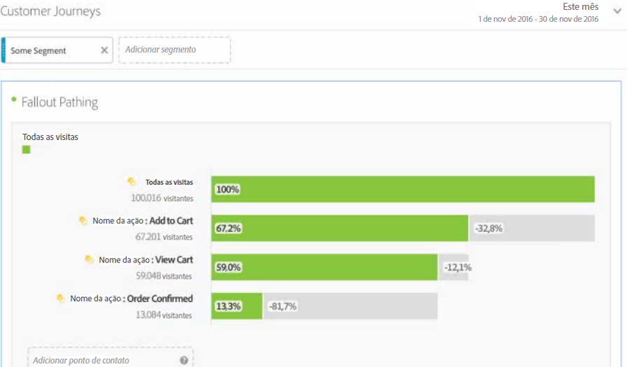 
 </td> 
  </tr> 
  <tr> 
   <td colname="col1"> <b> <a href="/help/analyze/analysis-workspace/visualizations/c-flow/flow.md"  > Visualização de Fluxo </a></b> </td> 
   <td colname="col2"> 
O novo recurso de fluxo permite ver o fluxo/jornada do cliente pelos sites/aplicativos através de novas visualizações atualizadas e flexíveis no Analysis Workspace a fim de descobrir como os clientes se movem e avançam pelos sites/aplicativos. O novo fluxo permite 
 
 
 
    <ul id="ul_F1D4A99743664CB3B17E9485CF5E72FC"> 
     <li id="li_0F7AF953EAB746DC95032FF9A533E560">Visualizar a jornada do cliente pelos ativos </li> 
     <li id="li_697A47BE06CF4284ACA3DBE4CA4012BF">Analise as próximas etapas imediatas da entrada, da saída ou de um item de dimensão específico na jornada do cliente </li> 
     <li id="li_D13AD928AC434D599D43836FB334B14D">Criar um segmento de usuários dinamicamente, designando um ponto específico em um determinado caminho </li> 
    </ul> 
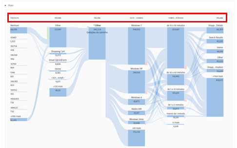 
 </td> 
  </tr> 
  <tr> 
   <td colname="col1"> <b><a href="/help/components/c-alerts/intellligent-alerts.md"  >Alertas inteligentes</a></b> </td> 
   <td colname="col2"> 
O Alertas inteligentes é o novo sistema de alertas do Adobe Analytics, e permite criar e gerenciar alertas no Analysis Workspace, junto à visualização de alertas e contribuição de regras. É possível: 
 
 
 
    <ul id="ul_02BD64D3047942009880B8F1DA1F2A40"> 
     <li id="li_01504AABBC514DF38354683843222541">Criar alertas com base em anomalias (limite de 90%, 95% ou 99%; % de mudança; acima/abaixo). </li> 
     <li id="li_9BFE2B4C429D441287F1A37A08E62A40">Visualizar a frequência de disparo de um alerta. </li> 
     <li id="li_08D310196581483DB499C00358835B73">Enviar alertas por email ou SMS com links para projetos do Analysis Workspace gerados automaticamente. </li> 
     <li id="li_2ADF9465EE474CDB839ED867662CCE6F">Criar alertas “empilhados”, capazes de capturar várias métricas de um só alerta. </li> 
    </ul> 
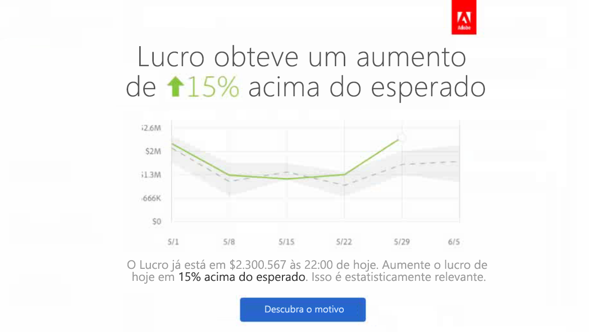 
 </td> 
  </tr> 
  <tr> 
   <td colname="col1"> <b> <a href="/help/analyze/analysis-workspace/virtual-analyst/c-anomaly-detection/anomaly-detection.md"  > Detecção de anomalias e Análise de contribuição </a></b> </td> 
   <td colname="col2"> 
Permitem saber se uma mudança em dados de tendência é significativa e qual a sua causa. 
 
Agora, a Detecção de anomalias e a Análise de contribuição são fluxos de trabalho importantes do Analysis Workspace. 
 
Importante: a Análise de contribuição está disponível somente para clientes do Adobe Analytics Premium. 
 
É possível: 
 
 
 
    <ul id="ul_9CEE47788F3640838D8598F2E2C020D6"> 
     <li id="li_787236BB5EA545B8833B311C06C24337">Detectar anomalias de dados estatisticamente significativas em seus dados. </li> 
     <li id="li_2FB3D94DEEF14DD5ADA6AD69E15F243D">Executar a Análise de contribuição em relação a qualquer anomalia diária e integre-a ao seu projeto do Analysis Workspace. </li> 
    </ul> 
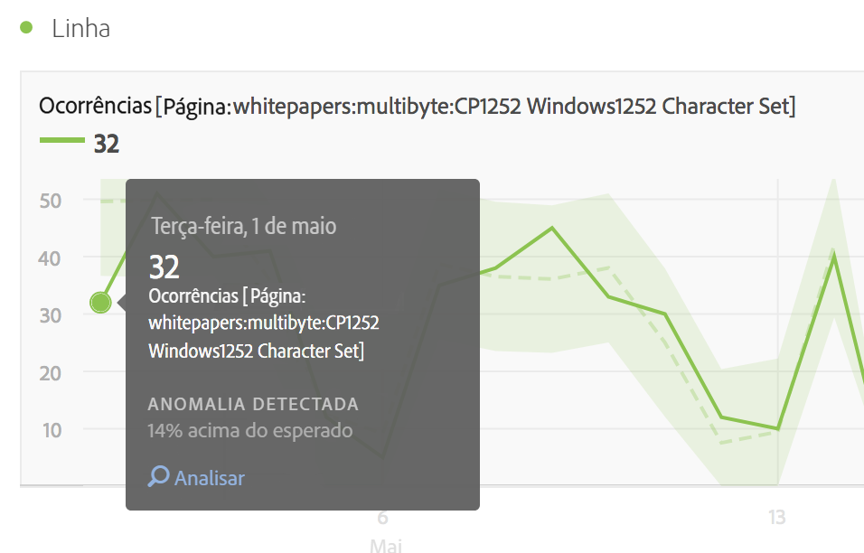 
 
 
 </td> 
  </tr> 
  <tr> 
   <td colname="col1"> <b> <a href="/help/analyze/analysis-workspace/build-workspace-project/starter-projects.md"  > Projetos iniciais </a></b> </td> 
   <td colname="col2"> Para facilitar para os usuários começarem a usar o Analysis Workspace, criamos alguns modelos de projeto pré-construídos para problemas comerciais comuns, como 
 
 
    <ul id="ul_603F5ACC16F74D53AEB9F762FAC91656"> 
     <li id="li_6B3F2E5D4B044EC19D45E5501E33DB91">Retenção de usuários </li> 
     <li id="li_7240EE8852FC4642B3AD4837C990A775">Aquisição de aplicativos móveis </li> 
    </ul> 
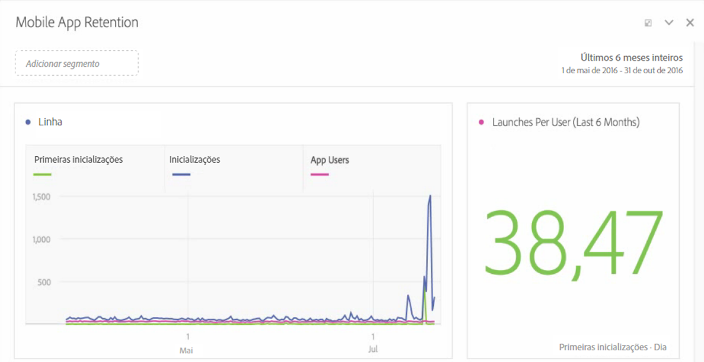 
 </td> 
  </tr> 
  <tr> 
   <td colname="col1"> <b><a href="/help/analyze/analysis-workspace/visualizations/freeform-analysis-visualizations.md"> Visualização do histograma </a></b> </td> 
   <td colname="col2"> 
Os histogramas permitem aos usuários ver as distribuições dos usuários ao longo de qualquer evento de sucesso. Você pode personalizar os grupos e tamanhos dos grupos para acomodar qualquer distribuição e identificar usuários de alto e baixo valor. 
 
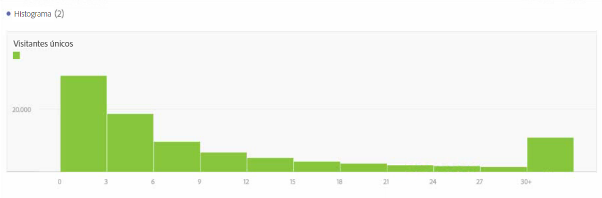 
 </td> 
  </tr> 
  <tr> 
   <td colname="col1"> Atualizações diversas </td> 
   <td colname="col2"> 
    <ul id="ul_2585F74DC7754C819017F280E16BF06F"> 
     <li id="li_412446013E7F42DBB1BF50F9E2C4D92F"> 
      <!--AN-124610: -->Foi adicionada a opção “Contar instâncias repetidas” como configuração no nível do projeto (Projeto &gt; Informações e configurações do projeto ). Esta definição especifica se as instâncias repetidas são contadas nos relatórios. Se você tiver vários valores em sequência para a mesma variável, pode contá-las como uma ou várias instâncias dessa variável. </li> 
     <li id="li_480E1B307C62418CBC2F50ADE32B9EE9">Foi adicionado um novo botão, chamado “Aplicar a todos os painéis”, ao lado de “Cancelar” e “Executar” no Calendário. Mudança de “Executar” para “Aplicar”. Se você clicar no novo botão, ele mudará o intervalo de datas selecionado para o painel atual e para todos os outros do projeto. </li> 
     <li id="li_4D10DFE307344D06AA60792FABE5B57E"> 
      <!--AN-124168: -->Foi adicionado um botão “Ações” ao painel de navegação esquerdo, com estas ações: Tag, Adicionar aos favoritos, Aprovar e <b>Compartilhar (nova!)</b> e <b>Excluir (novo!)</b>. </li> 
     <li id="li_946EC05568D4447193E9307546DF6F9B">Foi adicionado um filtro à barra de pesquisa que permite filtrar por tags, favoritos, itens aprovados e componentes. </li> 
     <li id="li_4EA118ACCD3B4F88B0ECF72717F631FA">Foi adicionado um ícone de visualização às linhas manuais (e não às listas dinâmicas que listam os itens da dimensão) que permite visualizar os segmentos, métricas, intervalos de datas. </li> 
     <li id="li_81D5241EA3FD49CEA0E9F412837D87A8"> 
      <!--AN-128702: -->Foi atualizado o link do YouTube para tutoriais do Analysis Workspace: <a href="https://www.youtube.com/playlist?list=PL2tCx83mn7GuNnQdYGOtlyCu0V5mEZ8sS"  >https://www.youtube.com/playlist?list=PL2tCx83mn7GuNnQdYGOtlyCu0V5mEZ8sS</a>. </li> 
     <li id="li_D81DB98C49664D2884CCCC1DB0058CD8"> 
      <!--AN-124004:-->Para facilitar as visualizações, adicionamos uma opção de clique com o botão direito chamada Recomeçar no menu de contexto (funcionará para Fluxo, Venn, Gráfico de barras), que exclui a configuração da visualização atual e abre um novo painel onde você refaz a configuração. </li> 
     <li id="li_84632BFCE1794B49A31FF45067FA04B7">Foi adicionada uma nova configuração de visualização chamada “Legenda visível”, que permite ocultar o texto de detalhes do filtro para a visualização Número do resumo/Alteração do resumo. </li> 
     <li id="li_EE8C48642DD54A04B08F4222F9565BF6">Foi adicionada uma nova configuração das visualizações de Alteração do resumo que permite “Mostrar a diferença” entre duas porcentagens. No caso de valores não percentuais, se você selecionar a opção “Mostrar a diferença”, ela mostrará um número. </li> 
     <li id="li_17AAABCA7B3A477182FB70453CA2EEBB">Foi ajustado o número de linhas das dimensões de tempo. </li> 
     <li id="li_35A91D50CD514CD0B939C24AEEC64BF4">Atualização da aparência da navegação do trilho à esquerda no Criador de segmentos e do Criador de métricas calculadas para parecer com o Analysis Workspace. </li> 
    </ul> </td> 
  </tr> 
 </tbody> 
</table>

## Junho de 2016

Novos recursos lançados em 16 de junho de 2016:

* [Nova permissão](https://marketing.adobe.com/resources/help/en_US/reference/groups.html) de grupo que permite aos administradores permitir ou negar acesso à guia **[!UICONTROL Analytics]** > **[!UICONTROL Workspace]** para usuários. A partir de 16 de junho de 2016, todos os usuários têm permissão para acessar essa aba. Para negar o acesso, basta remover os usuários do grupo Acesso à Analysis Workspace.
* O [Painel de comparação de segmentos](/help/analyze/analysis-workspace/c-panels/c-segment-comparison/segment-comparison.md) mostra as diferenças estatisticamente mais importantes entre dois segmentos por meio de uma análise automatizada de todas as métricas e dimensões às quais você tem acesso.
* Estrutura do menu [Novos projetos](/help/analyze/analysis-workspace/build-workspace-project/freeform-overview.md) que reorganiza o menu principal e o torna mais expansível. Por exemplo, para criar um novo **Painel de coorte**, agora é necessário criar um painel em branco e arrastar uma visualização de Tabela de coorte.
* [Novo painel à esquerda](/help/analyze/analysis-workspace/build-workspace-project/freeform-overview.md): Painéis, Visualizações, Componentes
* Foi incluído um novo tipo de [visualização de Venn](/help/analyze/analysis-workspace/visualizations/venn.md) que permite arrastar até três segmentos e uma métrica e criar um diagrama de Venn.
* A opção [Colocar seleção em tendência](/help/analyze/analysis-workspace/analysis-workspace-features.md#section_34930C967C104C2B9092BA8DCF2BF81A) (gráfico de linhas) em uma tabela classificada agora é vinculada.
* [Ícone “Criar visual”](/help/analyze/analysis-workspace/visualizations/freeform-analysis-visualizations.md): se clicamos nesse ícone, é criada uma visualização inteligente de acordo com nossas ações anteriores (gráfico de barras, de Venn...)
* Funcionalidade [Linhas do manual](/help/analyze/analysis-workspace/build-workspace-project/column-row-settings/manual-vs-dynamic-rows.md) ampliada
* Zona [Adicionar segmento](/help/analyze/analysis-workspace/components/t-freeform-project-segment.md)
* Atualizações secundárias:

   * Capacidade de excluir todas as visualizações em um painel e todos os painéis em um projeto. (Anteriormente, era necessário manter pelo menos uma visualização ou um painel.)
   * Alterações nas   [teclas de atalho](/help/analyze/analysis-workspace/build-workspace-project/fa-shortcut-keys.md) (hotkeys) que podem facilitar o trabalho no Analysis Workspace.
   * Alterações de estilo: fontes menores nas visualizações; amostras de cores nas linhas; o seletor de data foi movido para baixo (nos painéis).

## Abril de 2016

Novos recursos lançados em 21 de abril de 2016:

<table id="table_2649645FDED84B71952F741ABB3FC20E"> 
 <thead> 
  <tr> 
   <th colname="col1" class="entry"> Recurso </th> 
   <th colname="col2" class="entry"> Descrição </th> 
  </tr> 
 </thead>
 <tbody> 
  <tr> 
   <td colname="col1"> Envio de arquivo </td> 
   <td colname="col2"> 
Envie um projeto do Analysis Workspace por email ou agende o seu envio. Consulte   <a href="/help/analyze/analysis-workspace/curate-share/t-schedule-report.md"  >Enviar arquivo: agendar o envio de um projeto</a>. 
 </td> 
  </tr> 
  <tr> 
   <td colname="col1"> Baixar o PDF </td> 
   <td colname="col2"> 
No menu Ação, é possível baixar o projeto do Analysis Workspace em formato PDF (assim como o download em formato CSV). 
 </td> 
  </tr> 
 </tbody> 
</table>

## Janeiro de 2016

Novos recursos lançados em 21 de janeiro de 2016.

* [Desfazer ações](/help/analyze/analysis-workspace/new-features-in-analysis-workspace.md#section_12890C393D5E4FC8A3CF050318BD8482)
* [Link para o projeto](/help/analyze/analysis-workspace/new-features-in-analysis-workspace.md#section_453E70F7409F4501B8E976A0D18C9A46)
* [Gráfico de marcadores, Gráfico de dispersão e Visualizações de mapa de árvores](/help/analyze/analysis-workspace/new-features-in-analysis-workspace.md#section_B19EA50EBF5546E99D3A142827153FD6)
* [Salvar como para Segmentos, Métricas e Datas](/help/analyze/analysis-workspace/new-features-in-analysis-workspace.md#section_04C8B10A0751453AAE5F1BC35938C6CE)
* [Botão Adicionar novo de segmento](/help/analyze/analysis-workspace/new-features-in-analysis-workspace.md#section_85CC88C02C79456EA2B41F2BFBB64FC4)
* [Formatação condicional](/help/analyze/analysis-workspace/new-features-in-analysis-workspace.md#section_5775B505D83041408B8C3EAEC5D7C32B)
* [Visualização da dimensão](/help/analyze/analysis-workspace/new-features-in-analysis-workspace.md#section_F519EBF889B244E8B25BB6BA2833325A)
* [Legenda visível](/help/analyze/analysis-workspace/new-features-in-analysis-workspace.md#section_28D10D86CAE343AB838808C1DD2E7983)
* [Ancorar eixo Y no zero](/help/analyze/analysis-workspace/new-features-in-analysis-workspace.md#section_83DF5DE79EF04F9F8DCB3154F5E799B3)
* [Nome do projeto no título da guia](/help/analyze/analysis-workspace/new-features-in-analysis-workspace.md#section_497C61A030984BCCA2CEA553312C3226)
* [Transferir propriedade de projeto](/help/analyze/analysis-workspace/new-features-in-analysis-workspace.md#section_989C2CCB80B5408EB85E6B12C8D943E3)

## Desfazer ações {#section_12890C393D5E4FC8A3CF050318BD8482}

Você agora pode desfazer a maioria das ações realizadas no Analysis Workspace.

To undo, click **[!UICONTROL Undo]** from the action menu.

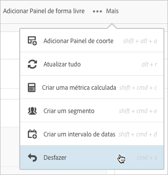

Você também pode usar [atalhos de teclado](/help/analyze/analysis-workspace/build-workspace-project/fa-shortcut-keys.md) padrão do Windows e do Mac (ctrl ou cmd + z) para Desfazer.

*`Undo`* é muito útil para desfazer detalhamentos na tabela.

Ações que não (*`not`*) podem ser desfeitas:

* Changing the configuration of a [!UICONTROL Cohort Table] (such as dragging metrics, changing values). No entanto, você pode clicar **[!UICONTROL Undo]** depois de clicar **[!UICONTROL Run]**.

* Redimensionar ou movimentar painéis e subpainéis.

Ações que limpam ou desfazem seu histórico:

* Salvar o projeto.
* Alterar o conjunto de relatórios.

## Link para o projeto   {#section_453E70F7409F4501B8E976A0D18C9A46}

In a project, click **[!UICONTROL Link to This Project]** from the Actions menu to email a saved project&#39;s URL to other users. Os destinatários administrativos podem editar e salvar um projeto compartilhado dessa forma. Do contrário, esses projetos serão somente leitura.

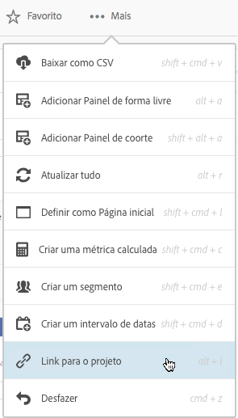

> [!NOTE] O compartilhamento de links de relatório não está disponível se sua empresa usa logon único (tanto o logon único herdado quanto o logon pela Experience Cloud).

## Gráfico de marcadores, Gráfico de dispersão e Visualizações de mapa de árvores {#section_B19EA50EBF5546E99D3A142827153FD6}

As novas visualizações a seguir estarão disponíveis na versão de janeiro de 2016.

**Gráfico em marcadores**

É possível ver como um valor no qual você está interessado se compara ou como ele é medido em comparação a outros intervalos de desempenho (objetivos).

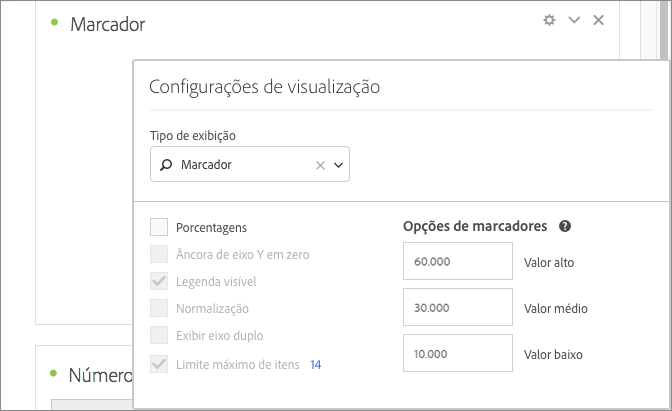

O gráfico em marcadores tem uma única medida principal (por exemplo, rendimento anual até o momento), e compara essa medida a uma ou mais medidas para aprimorar seu significado (por exemplo, em comparação ao rendimento pretendido) e o exibe no contexto de intervalos qualitativos de desempenho, como alto, médio e baixo. You can specify goal ranges in [!UICONTROL Visualization Settings].

**Gráfico de dispersão**

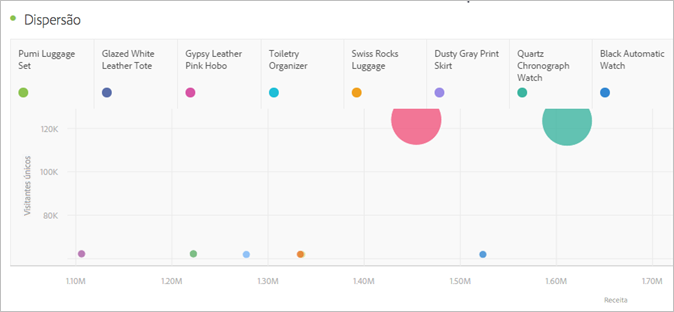

Mostra impressões emitidas e quantos usuários únicos viram essas impressões. O tamanho de cada ponto de dados oferece uma sugestão visual sobre o número médio de vezes que um visualizador foi exposto a um anúncio. O tamanho e os dados variam de acordo com as dimensões, os intervalos de datas e os filtros selecionados.

> [!NOTE] As tabelas associadas a gráficos de dispersão devem ter pelo menos duas colunas. A primeira coluna define o eixo X e a segunda coluna define o eixo Y. Se houver uma terceira coluna disponível, o Gráfico de dispersão a usa para determinar o raio do ponto. Em outras palavras, as colunas *1*, *2* e *3* mapeiam para *X*, *Y* e *raio do ponto*.

**Mapas de árvore**

Exibe dados hierárquicos (estruturados em formato de árvore) como um conjunto de retângulos aninhados. Cada galho da árvore recebe um retângulo, que é empilhado com retângulos menores representando os sub-galhos.

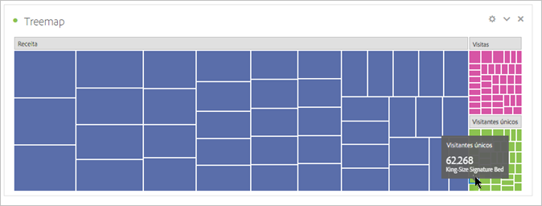

Quando as dimensões de cor e tamanho estão correlacionadas de alguma forma com a estrutura de árvore, é possível, frequentemente, ver padrões que seriam difíceis de enxergar de outras formas, como se determinada cor é particularmente relevante. Uma segunda vantagem dos mapas de árvore é que, por padrão, eles fazem uso eficaz do espaço.

## Salvar como para Segmentos, Métricas e Datas   {#section_04C8B10A0751453AAE5F1BC35938C6CE}

When editing an existing (saved) segment the Analysis Workspace Segment Builder, click **[!UICONTROL Save As]** to make a copy.

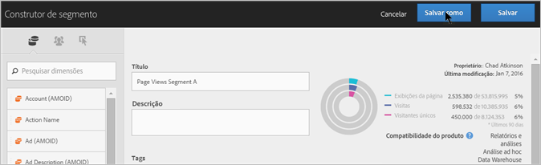

The new segment displays in the [!UICONTROL Segments] group in the [!UICONTROL Components] panel.

*`Save As`* também está disponível para o [!UICONTROL Calculated Metric Builder] e [!UICONTROL Date Range Builder].

## Botão Adicionar novo de segmento {#section_85CC88C02C79456EA2B41F2BFBB64FC4}

The **[!UICONTROL Add New Segment]** button has been added to the location where you drag-and-drop segments onto a project.

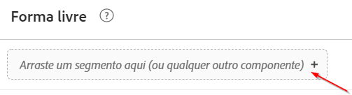

This enhancement is helpful if you prefer to directly create segments when working in a project, rather than using the [!UICONTROL Segment] panel to create segments.

## Formatação condicional   {#section_5775B505D83041408B8C3EAEC5D7C32B}

Nas Configurações de coluna, é possível aplicar formatação condicional a dados de célula.

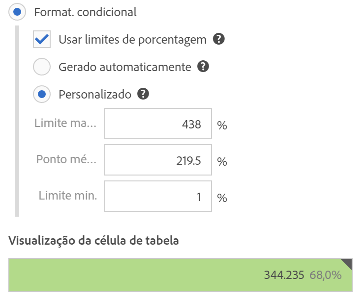

<table id="table_4285E6982FBD4B66AC95AAF6C5C7B347"> 
 <thead> 
  <tr> 
   <th colname="col1" class="entry"> Elemento </th> 
   <th colname="col2" class="entry"> Descrição </th> 
  </tr> 
 </thead>
 <tbody> 
  <tr> 
   <td colname="col1"> Formatação condicional </td> 
   <td colname="col2"> 
 Aplica as seguintes cores a células, com base nos valores dos dados: 
 
    <ul id="ul_97E3AD5F6B41460C882D8B4EE0A8C77A"> 
     <li id="li_88874B4250224DE781C03E4A5931D6A2">Verde: valores altos </li> 
     <li id="li_B4863F967C7544D7AA2847696FB85525">Amarelo: valores intermediários </li> 
     <li id="li_5B06D7CD0C39437898DA55EA653A1124">Vermelho: valores baixos </li> 
    </ul> 
Substituir uma dimensão na tabela redefine os limites da formatação condicional. Substituir uma métrica recalcula os limites da coluna (na qual haja uma métrica no eixo X e uma dimensão no eixo Y). 
 </td> 
  </tr> 
  <tr> 
   <td colname="col1"> Gerado automaticamente </td> 
   <td colname="col2"> 
Gera automaticamente limites de formatação condicional. O limite superior é o valor mais alto na coluna. O limite inferior é o menor valor e o ponto intermediário é a média entre os limites superior e inferior. 
 </td> 
  </tr> 
  <tr> 
   <td colname="col1"> Personalizado </td> 
   <td colname="col2"> 
Você pode atribuir os valores manualmente para os campos de limite Superior, Intermediário e Inferior para formatação condicional. Isso oferece a flexibilidade de determinar quando o valor de uma coluna se torna bom, médio ou ruim. 
 </td> 
  </tr> 
 </tbody> 
</table>

## Visualização da dimensão   {#section_F519EBF889B244E8B25BB6BA2833325A}

In the [!UICONTROL Dimensions] component panel, you can hover over the information icon next to a dimension and see a top-five preview.

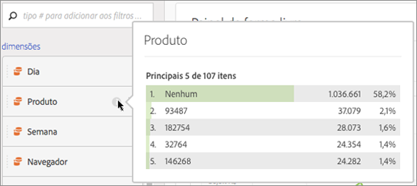

## Legenda visível   {#section_28D10D86CAE343AB838808C1DD2E7983}

Na [!UICONTROL Visualization Settings] opção **[!UICONTROL Legend Visible]** , é exibida ou oculta a legenda de uma visualização.

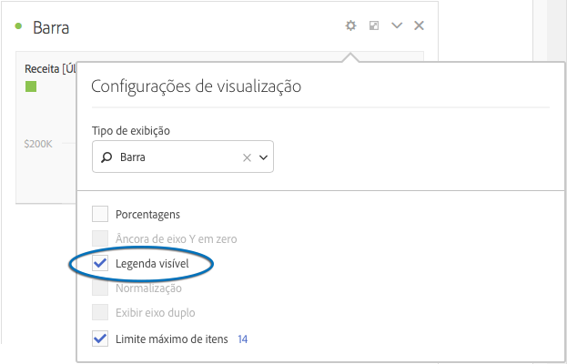

## Ancorar eixo Y no zero {#section_83DF5DE79EF04F9F8DCB3154F5E799B3}

Dependendo de quais sejam os números dos gráficos de linhas e de área, a parte inferior do eixo Y pode não ser zero. Habilitar **[!UICONTROL Anchor Y Axis at Zero]** em força [!UICONTROL Visualization Settings] o eixo Y a zero, para obter uma visão mais precisa das tendências. Os exemplos a seguir mostram como um gráfico de Renda é alterado com essa configuração ativada ou desativada:

**Âncora de eixo Y em zero desativada**

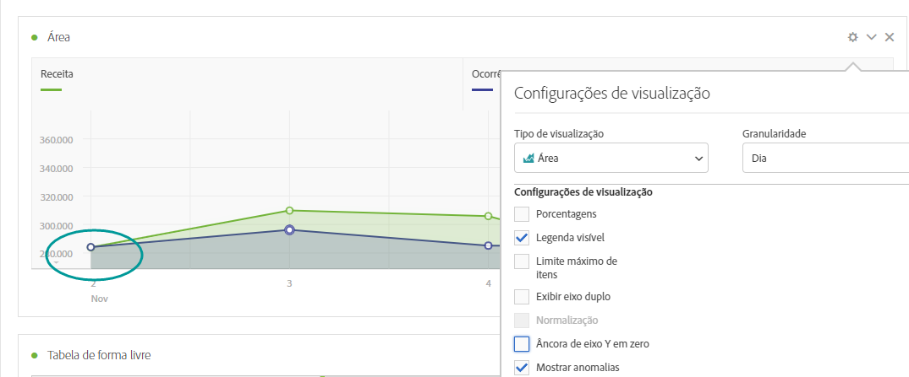

**Âncora de eixo Y em zero ativada**

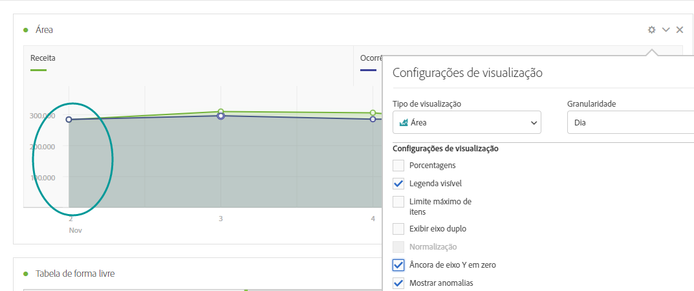

## Nome do projeto no título da guia   {#section_497C61A030984BCCA2CEA553312C3226}

Ao salvar um projeto, o título exibido na guia do navegador será “`<Project Name>` - Analysis Workspace”. Este aprimoramento é útil em casos nos quais você precisa abrir vários projetos em várias guias do navegador.

## Transferir propriedade de projeto   {#section_989C2CCB80B5408EB85E6B12C8D943E3}

Os administradores podem transferir os projetos do [!UICONTROL Analysis Workspace] de um usuário para outro.

Navegue até **[!UICONTROL Admin]** > **[!UICONTROL User Management]** > **[!UICONTROL Transfer]** para transferir projetos.
