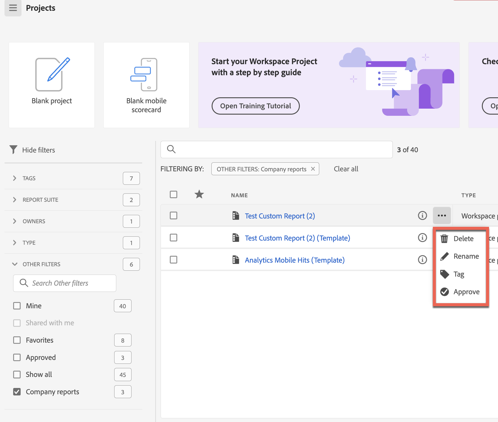

# Criar e gerenciar relatórios da empresa

Você pode criar relatórios personalizados e salvá-los para que outras pessoas na empresa do seu logon os usem. Os relatórios da empresa ficam disponíveis para escolha ao criar um projeto, conforme descrito em [Criar um projeto a partir de um projeto em branco ou de um relatório](/help/analyze/analysis-workspace/build-workspace-project/create-projects.md#create-a-project-from-a-blank-project-or-a-report) no artigo [Criação projetos no Analysis Workspace](/help/analyze/analysis-workspace/build-workspace-project/create-projects.md).

## Criar um relatório de empresa personalizado

Para criar um novo relatório de empresa:

1. Crie um projeto no Analysis Workspace para o estado desejado.
1. Selecione [!UICONTROL **Projeto**] > **[!UICONTROL Salvar como relatório da empresa...]**.

   

1. Atualize o nome do relatório, adicione uma descrição e tags e, em seguida, selecione [!UICONTROL **Salvar como relatório da empresa**].

   O relatório será adicionado à lista de relatórios da empresa no modal Criar projeto e estará disponível para usuários da sua empresa de logon.

   Para obter mais informações sobre como usuários podem criar um projeto com base em um relatório de empresa, consulte “Criar um projeto a partir de um projeto em branco ou um relatório” em [Criar projetos](/help/analyze/analysis-workspace/build-workspace-project/create-projects.md).

## Gerenciar relatórios da empresa

Admins podem filtrar a lista de projetos para exibir e gerenciar relatórios da empresa. Os itens fixados permanecem fixos, seguidos da lista de relatórios da empresa identificados pelo ícone de relatório . Nesta visualização, é possível excluir, renomear, marcar ou aprovar um ou mais relatórios.

Para exibir e gerenciar relatórios da empresa

1. No painel de filtros, selecione **OUTROS FILTROS** e depois selecione **Relatórios da empresa**.
Uma lista dos relatórios da empresa é exibida. Nenhum projeto comum é exibido, a menos que esteja fixado.

   

   Com os relatórios da empresa exibidos, os administradores podem excluir, renomear, adicionar uma tag ou aprovar o relatório.

1. Na lista de relatórios, selecione um único relatório ou selecione vários relatórios.

1. Clique no ícone de reticências **...** ao lado de um relatório para exibir as opções disponíveis (Excluir, Renomear, Tag e Aprovar).

   

1. Selecione uma opção (Excluir, Renomear, Tag e Aprovar).

1. Para retornar à visualização regular quando terminar, no painel de filtros, desmarque a opção Relatórios da empresa novamente.

### Excluir um relatório de empresa

Os administradores podem excluir um relatório usando a opção Lista de relatórios da empresa (descrita acima) ou excluir um relatório do modal Criar projeto.

