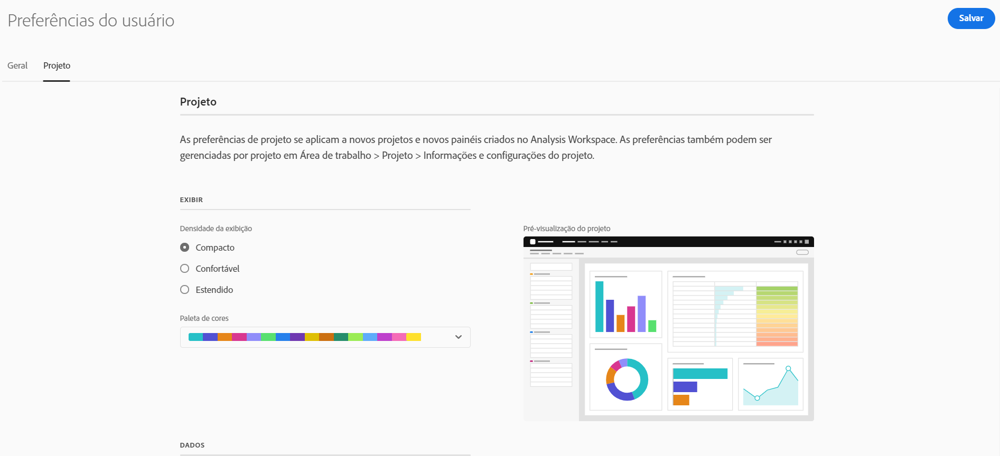

# Preferências do usuário

A página [!UICONTROL Components] > [!UICONTROL User preferences] permite gerenciar configurações para o Analysis Workspace e seus componentes relacionados no nível do usuário. As preferências do usuário se aplicam a todos ** novos projetos ou painéis.

## Preferências gerais

As preferências gerais se aplicam à experiência do Adobe Analytics no navegador.

| Preferência | Opções |
| --- | --- |
| Landing page | <ul><li>Lista de projetos (padrão)</li><li>Projeto em branco</li><li>Projeto específico selecionado em uma lista</li></ul> |
| Dicas | <ul><li>Ativado (padrão)</li><li>Desativado</li></ul> |

## Preferências do projeto

As preferências do projeto se aplicam a novos projetos e painéis criados no Analysis Workspace. Certas preferências também podem ser gerenciadas com base no projeto em [!UICONTROL Workspace] > [!UICONTROL Projeto] > [!UICONTROL Informações e configurações do projeto].

| Seção | Preferência | Opções |
| --- | --- | --- |
| **Exibir** |  |  |
|  | [Densidade da exibição](https://experienceleague.adobe.com/docs/analytics/analyze/analysis-workspace/build-workspace-project/view-density.html?lang=pt-BR) | <ul><li>Compacto</li><li>Confortável</li><li>Expandido (padrão)</li></ul> |
|  | [Paleta de cores](https://experienceleague.adobe.com/docs/analytics/analyze/analysis-workspace/build-workspace-project/color-palettes.html?lang=pt-BR) | <ul><li>Paletas fornecidas pela Adobe (padrão)</li><li>Paletas definidas pelo cliente</li></ul> |
| **Dados** |  |  |
|  | [Conjuntos de relatórios](https://experienceleague.adobe.com/docs/analytics/analyze/analysis-workspace/panels/panels.html?lang=pt-BR#report-suite) | <ul><li>Mais recente (padrão)</li><li>Conjunto de relatórios específico selecionado em uma lista</li></ul> |
|  | [Calendário](https://experienceleague.adobe.com/docs/analytics/analyze/analysis-workspace/panels/panels.html?lang=pt-BR#calendar) | Selecione de uma lista de: <ul><li>Intervalos fornecidos pelo Adobe (o padrão é Este mês)</li><li>Intervalos definidos pelo cliente</li></ul> |
|  | [Tipo de painel](https://experienceleague.adobe.com/docs/analytics/analyze/analysis-workspace/panels/panels.html?lang=pt-BR) | <ul><li>Forma livre (padrão)</li><li>Em branco</li><li>Insights rápidos</li></ul> |
|  | Formato de número | <ul><li>1.000,00 (padrão)</li><li>1.000,00</li><li>1 000,00</li></ul> |
|  | Separador CSV caractere | <ul><li>Vírgula (padrão)</li><li>Ponto e vírgula</li><li>Dois-pontos</li><li>Estágio</li><li>Ponto</li><li>Espaço</li><li>Tabulação</li></ul> |
