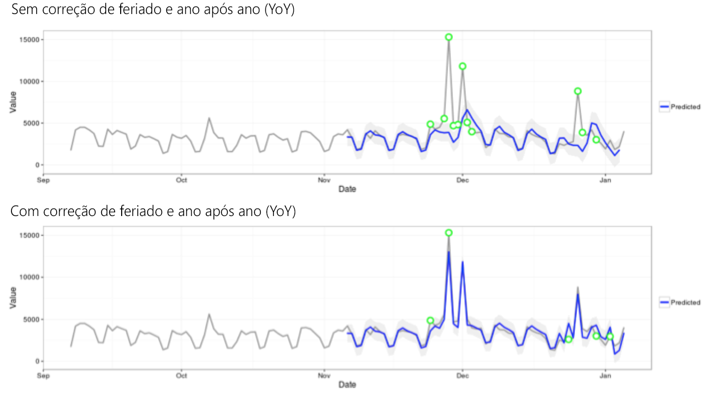

# Técnicas estatísticas usadas na Detecção de anomalias

A detecção de anomalias no Analysis Workspace usa uma série de técnicas estatísticas avançadas para determinar se uma observação deve ser considerada anômala ou não.

Dependendo da granularidade de data usada no relatório, três diferentes técnicas estatísticas são usadas, especificamente para a detecção de anomalias por hora, dia e semana/mês. Cada técnica estatística está descrita abaixo.

## Detecção de anomalias para granularidade diária {#section_758ACA3C0A6B4D399563ECABFB8316FA}

Para os relatórios de granularidade diária, o algoritmo considera vários fatores importantes para fornecer os resultados mais precisos possíveis. Primeiro, o algoritmo determina o tipo de modelo a aplicar com base nos dados disponíveis, dos quais selecionamos uma de duas classes: um modelo baseado em séries de tempo ou um modelo de detecção de valores anômalos (chamado de filtragem funcional).

A seleção do modelo da série de tempo se baseia nas seguintes combinações para tipo de erro, tendência e sazonalidade (ETS), conforme descrito por [Hyndman et al. (2008)](https://www.springer.com/us/book/9783540719168). Especificamente, o algoritmo tenta as seguintes combinações:

1. ANA (erro aditivo, nenhuma tendência, sazonalidade aditiva)
1. AAA (erro aditivo, tendência aditiva, sazonalidade aditiva)
1. MNM (erro multiplicativo, nenhuma tendência, sazonalidade multiplicativa)
1. MNA (erro multiplicativo, nenhuma tendência, sazonalidade aditiva)
1. AAN (erro aditivo, tendência aditiva, nenhuma sazonalidade)

O algoritmo testa a adequação de cada uma dessas combinações, selecionando aquela com o melhor erro percentual médio absoluto (MAPE). Contudo, se o MAPE do modelo de série de tempo for maior que 15%, a filtragem funcional é aplicada. Geralmente, os dados com um grau maior de repetição (por exemplo, semana após semana ou mês após mês) são mais adequados para um modelo de série de tempo.

Após a seleção do modelo, o algoritmo ajusta os resultados com base em feriados e sazonalidade ano a ano. Para feriados, o algoritmo verifica se os seguintes feriados estão presentes no intervalo de datas do relatório:

* Memorial Day (somente EUA)
* 4 de julho (somente EUA)
* Dia de Ação de Graças (somente EUA)
* Black Friday (somente EUA)
* Cyber Monday (somente EUA)
* 24-26 de dezembro
* Janeiro de 1
* 31 de dezembro

Esses feriados foram selecionados com base em análises estatísticas extensivas em vários pontos de dados do cliente para identificar os feriados mais significativos para o maior número de tendências dos clientes. Embora a lista não seja exaustiva para todos os clientes ou ciclos comerciais, descobrimos que aplicar esses feriados melhorou significativamente o desempenho geral do algoritmo para praticamente todos os conjuntos de dados dos clientes.

Uma vez selecionado o modelo e identificados os feriados no intervalo de datas do relatório, o algoritmo procede da seguinte maneira:

1. Constrói o período de referência da anomalia: inclui até 35 dias antes do intervalo de datas do relatório e um intervalo de datas correspondente um ano antes (considerando anos bissextos quando necessário e incluindo qualquer feriado aplicável que tenha ocorrido em um dia de calendário diferente no ano anterior).
1. Testa se os feriados do período atual (exceto o ano anterior) são anômalos com base nos dados mais recentes.
1. Se o feriado no intervalo de datas atual for anômalo, ajusta o valor esperado e o intervalo de confiança do feriado atual, dado o feriado do ano anterior (considerando 2 dias antes e depois). A correção para o feriado atual se baseia no menor erro percentual médio absoluto de:

   1. Efeitos aditivos
   1. Efeitos multiplicativos
   1. Diferença YoY

Observe a melhoria significativa no desempenho do Natal e do Ano Novo no seguinte exemplo:

## Detecção de anomalias para granularidade horária {#section_014C9E9209AF43F8A03D5D46E3B3AEE7}

Os dados horários utilizam a mesma abordagem de algoritmo de séries de tempo que o algoritmo com granularidade diária. Contudo, depende muito de dois padrões de tendências: o ciclo de 24 horas, bem como o ciclo de final de semana/dia da semana. Para capturar esses dois efeitos sazonais, o algoritmo horário constrói dois modelos separados para uma semana e um dia da semana usando a mesma abordagem descrita anteriormente.

A janela de treinamento para tendências horárias depende de uma janela de retrospectiva de 336 horas.

## Detecção de anomalias para granularidades semanais e mensais {#section_5D421576BFBC4B24A58DFCC0A6407545}

As tendências semanais e mensais não exibem as mesmas tendências semanais ou diárias encontradas nas granularidades diária ou horária, portanto, um algoritmo separado é usado. Para semanal e mensal, uma abordagem de detecção de valor atípicos de duas etapas é usada, conhecida como teste de GESD (Generalized Extreme Studentized Deviate). Este teste considera o número máximo de anomalias esperadas combinado com a abordagem de box plot ajustada (um método não paramétrico para a descoberta de outliers) para determinar o número máximo de outliers. As duas etapas são:

1. Função de box plot ajustado: esta função determina o número máximo de anomalias nos dados inseridos.
1. Função GESD: aplicada aos dados de entrada com a saída da etapa 1.

A etapa de detecção de anomalias na sazonalidade YoY e em feriados subtrai os dados do ano anterior dos dados do ano atual e reitera os dados usando o processo de duas etapas acima para verificar se as anomalias são sazonalmente apropriadas. Cada uma dessas granularidades de dados usa uma retrospectiva de 15 períodos, incluindo o intervalo de dados de relatório selecionado (15 meses ou 15 semanas) e um intervalo de dados correspondente há um ano para treinamento.
