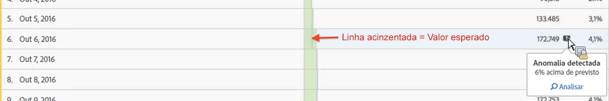
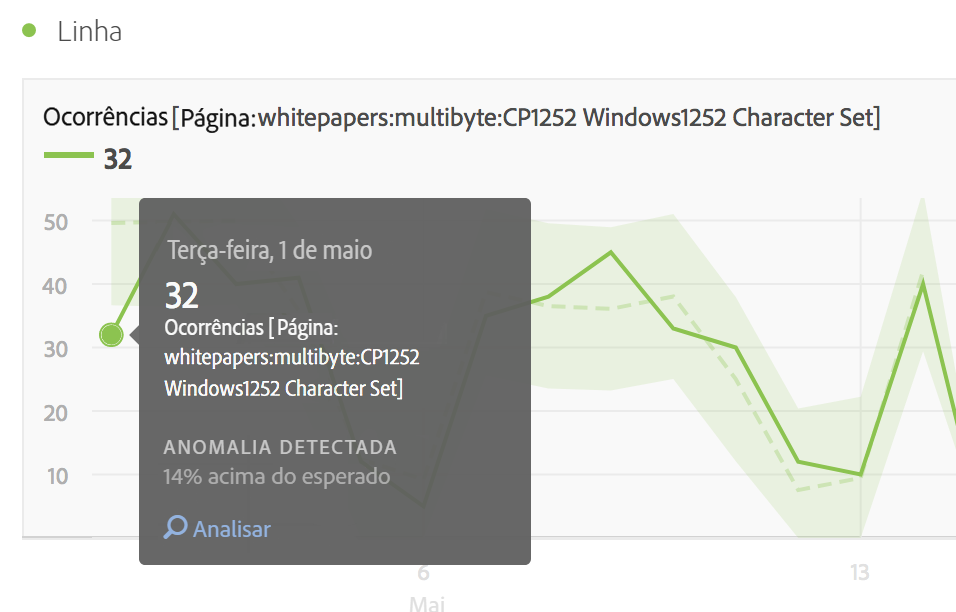
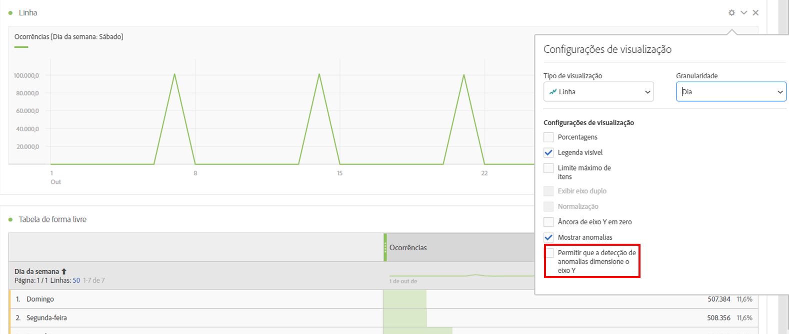

# Exibir anomalias na Analysis Workspace

É possível exibir anomalias em uma tabela ou em um gráfico de linhas.

## View anomalies in a table {#section_869A87B92B574A38B017A980ED8A29C5}

Em uma Tabela de forma livre da série de tempo, cada linha agora é sinalizada automaticamente com uma interrogação cinza-escuro se uma anomalia de dados foi detectada.

A linha cinza vertical em cada linha indica o valor esperado. Ao passar o mouse sobre a interrogação, é indicado como a anomalia difere do valor esperado (em + ou - %).

## View anomalies in a line chart {#section_7C1192AFDB4345A8A2CCFB3AE0C47D82}

O gráfico de linha mostra a faixa de confiança verde-claro com os valores anômalos (pontos brancos).

Ao clicar em um ponto branco, ele ficará verde e exibirá:

* A data de ocorrência da anomalia
* O valor bruto da anomalia
* O valor percentual superior ou inferior ao valor esperado, que é representado pela linha sólida verde.
* O link Analisar para iniciar a [Análise de contribuição](../../../../analyze/analysis-workspace/virtual-analyst/contribution-analysis/ca-tokens.md).

Se você tiver várias métricas no gráfico de linha, podemos mostrar somente as anomalias e você precisa passar o mouse sobre cada uma delas para ver a faixa de confiança para a métrica.

O intervalo de confiança da Detecção de anomalias não dimensiona automaticamente o eixo Y de uma visualização para tornar potencialmente o gráfico mais legível.

Você tem a opção de permitir o dimensionamento do intervalo de confiança no gráfico. Clique no ícone Configurações (engrenagem) e marque **[!UICONTROL Permitir que a Detecção de anomalias dimensione o eixo Y]**.

