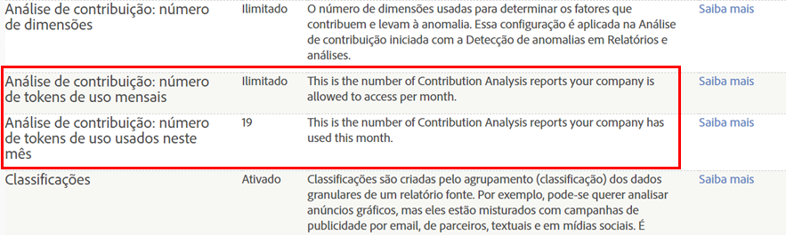

# Visão geral da Análise de contribuição

A Análise de contribuição revela padrões ocultos nos dados para explicar anomalias estatísticas e identificar correlações por trás das ações inesperadas do cliente, valores fora do limite e picos ou declínios repentinos para as métricas selecionadas nos segmentos convergentes do público-alvo.

Algo aconteceu. Por quê? Seu relatório de Detecção de anomalias mostra um pico incomum em pedidos e você quer saber por quê. O que aconteceu fora do comum? Quem é responsável por qual campanha ou indicação? Algo se tornou viral? Quais são os fatores específicos que contribuíram para essa anomalia? E talvez o mais importante: como posso obter informações importantes sobre meu cliente e repetir esse desempenho? (Ou, se um declínio em uma métrica ou um aumento em uma métrica negativa ocorrer, como posso evitar isso no futuro?)

A Análise de contribuição ajuda a avaliar seus dados imediatamente para responder por que uma anomalia aconteceu. Ela analisa o que contribuiu para uma anomalia em segundos, o que antes levaria semanas, fornecendo padrões para os segmentos do público-alvo e ajudando a desenvolver uma narrativa para interações com os clientes. Você pode empregar a Análise de contribuição de forma estratégica para identificar e obter associações significativas com o objetivo de desenvolver novos segmentos do público-alvo, ou usá-la taticamente para identificar atividade fora do comum ou fraudulenta que aciona um alerta.

A [Detecção de anomalias](/help/analyze/analysis-workspace/virtual-analyst/c-anomaly-detection/anomaly-detection.md) identifica picos de dados e declínios estatísticos extremos com base em métricas selecionadas e segmentos selecionados do público-alvo. Ela define uma norma histórica com base em um período de treinamento e, em seguida, representa deslocamentos extremos relacionados a eventos específicos. Ela pode relatar um aumento acentuado em uma métrica positiva de Pedidos ou um aumento em uma métrica negativa de Rejeições, ou declínios em ambos, capturando pontos de dados estatisticamente relevantes para serem avaliados pela Análise de contribuição. Quando a anomalia estatística é identificada, a Análise de contribuição permite detalhar e avaliar variáveis relevantes de marketing e da campanha em todos os pontos de dados anômalos. Ela executa processos de aprendizado automático e de algoritmos avançados para avaliar associações que contribuíram para um pico ou declínio significativo. Esses os cálculos são exibidos em visualizações interativas projetadas para fornecer perspectivas variadas para ajudar a responder por que algo aconteceu e o que fazer sobre ele.

A Análise de contribuição ajuda a elaborar uma narrativa para descrever por que uma anomalia aconteceu e como reagir, obtendo métricas relevantes e identificando pontos ocultos que apresentam uma razão geral para as interações do público-alvo e as tendências dos interesses dos clientes. Às vezes, é fácil visualizar e corrigir uma anomalia, como um pedido equivocado de 2000 caiaques. Outras vezes é complexo, como identificar uma tendência crescente ao longo de um período em uma região que reage apenas a uma campanha direcionada específica. Reunir os itens de contribuição nas métricas para várias dimensões e suas associações dá uma ideia geral das interações do público-alvo e ajuda a contextualizar os pontos de dados anômalos.

Veja algumas ideias:

* Identifique o potencial de recomercialização, monitorando as alterações na demanda do produto.
* Melhore a experiência do cliente, respondendo aos interesses específicos do público-alvo.
* Identifique pedidos fraudulentos precocemente como um relatório fora do comum.
* Proteja-se de espionagem corporativa, identificando os usos e downloads mais comuns.
* Monitore operações como reportar tags de javascript ausentes.

Após uma análise abrangente de uma anomalia, um Resumo das contribuições será gerado para os Principais itens pedidos pelo total de ocorrências e a porcentagem de itens dos valores de contribuição. Uma Pontuação de contribuição permite realizar com facilidade comparações, contrastes e associações com outros itens de dimensão importantes.

## Contribution Analysis Tokens - overview {#section_3EF8D2BBCE6E4C309D753BCF04A453D0}

>[!IMPORTANT]
>
>A Análise de contribuição foi removida do conjunto de recursos do Relatórios e análises e agora está disponível somente por meio da Analysis Workspace.

Todos os clientes com direitos constituídos à Análise de contribuição podem executar Análises de contribuição completas um número limitado de vezes por mês na Analysis Workspace. Isso **exclui** clientes pontuais de produtos (SiteCatalyst 15), clientes da Analytics Foundation e clientes Analytics Select que não têm acesso à Análise de contribuição.

O número de execuções por empresa é limitado por tokens mensais gerados com base no produto do Adobe Analytics adquirido pela sua empresa. Isso inclui a capacidade de restringir o acesso à Análise de contribuição para evitar o uso inadequado de tokens.

## Perguntas frequentes {#section_11D0431AD2014B96AB9561CA66A367CE}

<table id="table_357775E5058644099E26B15A6790E8AF"> 
 <thead> 
  <tr> 
   <th colname="col1" class="entry"> Pergunta </th> 
   <th colname="col2" class="entry"> Resposta </th> 
  </tr>
 </thead>
 <tbody> 
  <tr> 
   <td colname="col1"> 
<b>Por que a Adobe apresentou os tokens? </b> 
 </td> 
   <td colname="col2"> 
A Análise de contribuição é uma das capacidades mais ressonantes do Adobe Analytics desde que ele foi lançado em 2015. Oferecer um pequeno número de execuções completas por mês (em vez de apenas 3 dimensões para alguns produtos do Analytics) permite ter uma ideia melhor do que a Análise de contribuição completa e ilimitada pode fazer. 
 </td> 
  </tr> 
  <tr> 
   <td colname="col1"> 
<b>Como a tokenização funciona na Análise de contribuição? Custa um token para carregar um projeto com uma Análise de contribuição já existente ou apenas ao executar uma nova?</b> 
 </td> 
   <td colname="col2"> 
Cada logon da empresa (não cada usuário) recebe um certo número de tokens por mês, que permitem executar Análises de contribuição completas na Analysis Workspace. 
 
Cada vez que uma nova Análise de contribuição for gerada, um token é pago. Carregar projetos com Análises de contribuição pré-executadas não custa um token. 
 </td> 
  </tr> 
  <tr> 
   <td colname="col1"> 
<b>Os tokens se aplicam à Análise de contribuição no Reports &amp; Analytics?</b> 
 </td> 
   <td colname="col2"> 
Não. A Análise de contribuição não é mais oferecida no Reports &amp; Analytics a partir da versão de abril de 2018. 
 </td> 
  </tr> 
  <tr> 
   <td colname="col1"> 
<b>Se os tokens da minha empresa acabaram e ainda queremos executar Análises de contribuição adicionais, o que podemos fazer?</b> 
 </td> 
   <td colname="col2"> 
É possível atualizar para outro produto do Adobe Analytics, por exemplo do Standard (2 tokens mensais) para o Ultimate (20 tokens mensais). Não é possível apenas comprar mais tokens, é necessário atualizar dentro da estrutura de pacotes existente. 
 </td> 
  </tr> 
  <tr> 
   <td colname="col1"> 
<b>Como restringir o acesso à Análise de contribuição?</b> 
 </td> 
   <td colname="col2"> 
By default, only admins have access to run Contribution Analyses, but admins can grant access to other users by creating a permission group in the <a href="https://docs.adobe.com/content/help/en/core-services/interface/manage-users-and-products/admin-getting-started.html" format="html" scope="external"> Admin Console </a>. Você deve conceder permissão para usar a Análise de contribuição somente para usuários que têm um motivo legítimo para usá-la e são confiáveis para não abusarem de seu acesso. 
 
A permissão se chama “Análise de contribuição” e encontra-se em Analytics &gt; Admin &gt; Gerenciamento de usuários &gt; Editar grupos &gt; Editar acessos a relatórios &gt; Personalizar ferramentas do conjunto de relatórios &gt; Ferramentas e relatórios. 
 </td> 
  </tr> 
  <tr> 
   <td colname="col1"> 
<b>Como posso saber a quantos tokens minha empresa tem direito por mês e quantos já usamos no mês atual?</b> 
 </td> 
   <td colname="col2"> 
Acesse Admin &gt; Configurações da empresa &gt; Exibir níveis de acesso a recursos. Existem 2 itens novos nesta página: 
 
 
 </td> 
  </tr> 
 </tbody> 
</table>

## Anomaly Detection and Contribution Analysis entitlements {#section_9278D58F21A840AA9B1ED1BD07A1EF0A}

Abaixo há uma lista dos direitos de Detecção de anomalias e Análise de contribuição na Analysis Workspace.

>[!IMPORTANT]
>
>A Detecção de anomalias e a Análise de contribuição foram removidas do conjunto de recursos de Reports &amp; Analytics e agora estão disponíveis apenas por meio da Analysis Workspace. Observe que os clientes do Adobe Analytics Select e Adobe Analytics Foundation têm acesso apenas à Detecção de anomalias de “granularidade diária” na Workspace.

<table id="table_5C9B7E4AE82640B5A913519E576889B5"> 
 <thead> 
  <tr> 
   <th colname="col1" class="entry"> Direitos constituídos do Adobe Analytics </th> 
   <th colname="col2" class="entry"> Detecção de anomalias </th> 
   <th colname="col3" class="entry"> Análise de contribuição </th> 
  </tr>
 </thead>
 <tbody> 
  <tr> 
   <td colname="col1"> 
Foundation 
 </td> 
   <td colname="col2"> 
Apenas granularidade diária 
 </td> 
   <td colname="col3" colsep="1"> 
Sem tokens 
 </td> 
  </tr> 
  <tr> 
   <td colname="col1"> 
<a href="https://www.adobe.com/data-analytics-cloud/analytics/select.html?promoid=B4XQ3X7G&amp;mv=other" format="html" scope="external">Select</a> 
 </td> 
   <td colname="col2"> 
Apenas granularidade diária 
 </td> 
   <td colname="col3"> 
Sem tokens 
 </td> 
  </tr> 
  <tr> 
   <td colname="col1"> 
<a href="https://www.adobe.com/data-analytics-cloud/analytics/prime.html?promoid=91BF51TR&amp;mv=other" format="html" scope="external">Prime</a> 
 </td> 
   <td colname="col2"> 
Sim 
 </td> 
   <td colname="col3"> 
10 tokens por mês 
 </td> 
  </tr> 
  <tr> 
   <td colname="col1"> 
<a href="https://www.adobe.com/data-analytics-cloud/analytics/ultimate.html?promoid=8N4B5F1V&amp;mv=other" format="html" scope="external"> Ultimate</a> 
 </td> 
   <td colname="col2"> 
Sim 
 </td> 
   <td colname="col3"> 
20 tokens por mês 
 </td> 
  </tr> 
  <tr> 
   <td colname="col1"> 
+Análise de big data preditiva 
 </td> 
   <td colname="col2"> 
Sim 
 </td> 
   <td colname="col3"> 
Tokens ilimitados 
 </td> 
  </tr> 
  <tr> 
   <td colname="col1"> 
Standard 
 
    <ul id="ul_73D52020793B44868C9CE0F90893075D"> 
     <li id="li_21EE0871C87E43C8B781219B2BA0FA74">Adobe Analytics Core </li> 
     <li id="li_AB3593200F33439BAEE8FEB13CAE57F4">Adobe Analytics OD </li> 
     <li id="li_2B7D625519BC4A4CB598C95F15D3029B">Adobe Analytics MA </li> 
    </ul> </td> 
   <td colname="col2"> 
Sim 
 </td> 
   <td colname="col3"> 
2 tokens por mês 
 </td> 
  </tr> 
  <tr> 
   <td colname="col1"> 
Premium (360, Atribuição) 
 </td> 
   <td colname="col2"> 
Sim 
 </td> 
   <td colname="col3"> 
2 tokens por mês 
 </td> 
  </tr> 
  <tr> 
   <td colname="col1"> 
Premium (Completo, <a href="https://www.adobe.com/data-analytics-cloud/analytics/predictive-intelligence.html" format="html" scope="external">Inteligência preditiva</a>) 
 </td> 
   <td colname="col2"> 
Sim 
 </td> 
   <td colname="col3"> 
Tokens ilimitados 
 </td> 
  </tr> 
 </tbody> 
</table>
