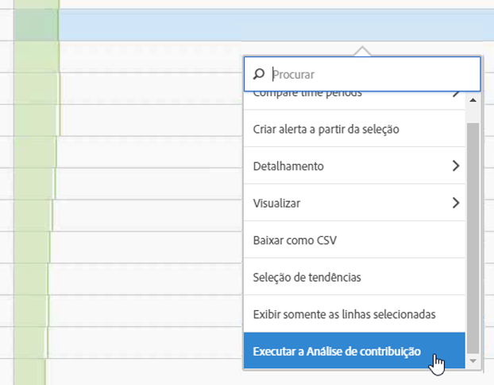
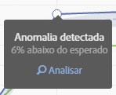
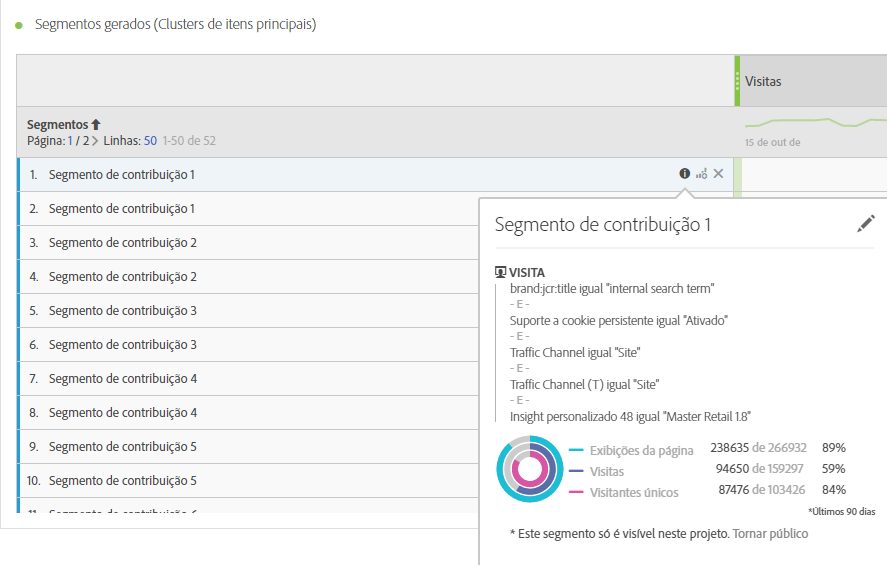
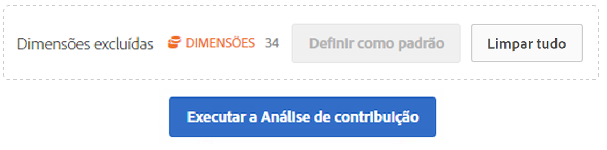
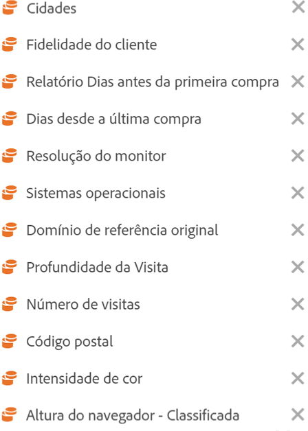

# Executar análise de contribuição

A Análise de contribuição é um processo intensivo de aprendizado de máquina projetado para descobrir contribuintes para uma anomalia observada no Adobe Analytics. O objetivo é auxiliar o usuário a encontrar áreas de foco ou oportunidades para análises adicionais de maneira muito mais rápida do que seria possível de outra forma.

## Executar análise de contribuição {#section_7D2C5E48A5664727941DF4C90976D9DC}

Há duas maneiras de invocar a análise de contribuição em um projeto:

* Em uma tabela de forma livre com granularidade diária, clique com o botão direito em qualquer linha e selecione **[!UICONTROL Executar análise de contribuição]**. Você também pode executá-la em linhas que não exibem nenhuma anomalia.

   >[!NOTE]
   >
   >Atualmente oferecemos suporte à análise de contribuição somente com granularidade diária.

   

* Em um gráfico de linhas, passe o mouse sobre um dado de anomalia. Clique no link **[!UICONTROL Analisar]**.

   

1. (Opcional) Depois de clicar em **[!UICONTROL Executar análise de contribuição]** no gráfico de linhas ou em uma tabela, você pode limitar o escopo (e, portanto, acelerar) da análise, [excluindo dimensões](/help/analyze/analysis-workspace/virtual-analyst/contribution-analysis/run-contribution-analysis.md#section_F6932F4BF74544B5872164E7B1E0C6FC).

1. Aguarde o carregamento da análise de contribuição. Isso pode levar um tempo considerável, dependendo do tamanho do seu conjunto de relatórios e do número de dimensões. A análise de contribuição realiza análises nos 50.000 itens principais por dimensão.
1. O Analysis Workspace carrega um novo painel de Análise de contribuição diretamente neste projeto. Você observará vários painéis familiares se já tiver utilizado a Análise de contribuição nos Reports &amp; Analytics:

   * Uma visualização que mostra o número de **Visitas** no dia.
   * Uma **linha de Tendência de visitas** mensal para contexto.
   * Os **Itens principais** que contribuíram para esta anomalia, classificados por [pontuação de contribuição](https://marketing.adobe.com/resources/help/pt_BR/analytics/contribution/ca_contribution_score.html), mais a métrica em questão e uma métrica de Visitantes exclusivos para colocar a métrica no contexto de uma perspectiva de dimensionamento.

   * A tabela [Segmentos gerados](https://marketing.adobe.com/resources/help/pt_BR/analytics/contribution/ca_workflow_premium.html) (Grupos de itens principais) identifica associações dos itens principais com base na Pontuação de contribuição, nas ocorrências de anomalias e no percentual geral que contribuiu para a métrica anômala. Isso é então capturado como um segmento de público-alvo (Segmento de contribuição 1, Segmento de contribuição 2, etc.). Clicar no botão “i” (informações) fornecerá uma exibição da definição de cada segmento automático, incluindo os itens principais que os constituem:

      

1. Como a análise de contribuição agora faz parte do Analysis Workspace, você pode aproveitar seus vários recursos a partir de um menu acessado clicando com o botão direito em uma tabela, tornando sua análise ainda mais significativa, como:

   * [Detalhar cada item de dimensão por outra dimensão.](/help/analyze/analysis-workspace/components/dimensions/t-breakdown-fa.md)
   * [Executar tendência de uma ou mais linhas.](/help/analyze/analysis-workspace/analysis-workspace-features.md#section_34930C967C104C2B9092BA8DCF2BF81A)
   * [Adicionar novas visualizações.](/help/analyze/analysis-workspace/visualizations/freeform-analysis-visualizations.md)
   * [Criar alertas.](/help/components/c-alerts/intellligent-alerts.md)
   * [Criar ou comparar segmentos.](/help/analyze/analysis-workspace/c-panels/c-segment-comparison/segment-comparison.md)

> [!NOTE] Destacamos a anomalia que está sendo analisada com um ponto azul na Análise de contribuição e nos projetos de alertas inteligentes vinculados a ela. Essa ação oferece uma indicação mais clara da anomalia que está sendo analisada.

## Excluir dimensões da Análise de contribuição {#section_F6932F4BF74544B5872164E7B1E0C6FC}

Certas vezes, você pode querer excluir algumas dimensões da Análise de contribuição. Por exemplo, você pode não se preocupar sobre qualquer navegador ou dimensões relacionadas ao hardware, e deseja agilizar a análise os removendo.

1. Depois de clicar em **[!UICONTROL Executar Análise de contribuição]** (ou em **[!UICONTROL Analisar]** em um gráfico de linhas), o painel **[!UICONTROL Dimensões excluídas]** é exibido.

1. Arraste qualquer dimensão não desejada até o painel **[!UICONTROL Dimensões excluídas]** e salve a lista clicando em **[!UICONTROL Definir como padrão]**. Ou clique em **[!UICONTROL Limpar tudo]** para começar de novo a seleção de dimensões a serem excluídas.

   

1. Depois de ter adicionado as dimensões a serem excluídas (ou não), clique novamente em **[!UICONTROL Executar análise de contribuição]**.
1. Caso precise revisar a lista de dimensões excluídas, clique duas vezes em Dimensões e a lista de dimensões excluídas é exibida:

   

1. Exclua qualquer dimensão não desejada ao clicar no x próximo a ela. Em seguida, salve a lista ao clicar em **[!UICONTROL Definir como padrão]**.

