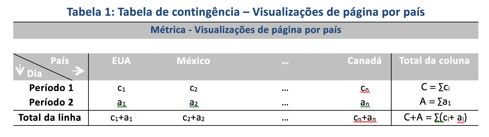

# Técnicas estatísticas usadas na Análise de contribuição

A Análise de contribuição é um processo intensivo de aprendizado de máquina projetado para descobrir contribuintes para uma anomalia observada no Adobe Analytics. O objetivo é auxiliar o usuário a encontrar áreas de foco ou oportunidades para análises adicionais de maneira muito mais rápida do que seria possível de outra forma.

A Análise de contribuição consegue isso através da execução de um algoritmo de duas partes em cada item de dimensão disponível no relatório de Análise de contribuição do usuário. O algoritmo opera nesta ordem:

1. Para cada dimensão, calcula a estatística de teste V de Cramer. No seguinte exemplo, considere uma tabela de contingência com exibições de página por país ao longo de dois períodos:

   

   Na Tabela 1, o V de Cramer pode ser usado para medir a associação entre as exibições de página por países para o período 1 (por exemplo, histórico) e o período 2 (por exemplo, o dia em que a anomalia ocorreu). Um valor de V de Cramer baixo implica um baixo nível de associação. Intervalos de V de Cramer de 0 (nenhuma associação) a 1 (associação completa). A estatística V de Cramer pode ser calculada:

   

1. Para cada item de dimensão, o Residual da pessoa (PR) é usado para medir a associação entre a métrica anômala e cada item de dimensão. O PR segue uma distribuição normal padrão, que permite ao algoritmo comparar PRs de duas variáveis aleatórias, mesmo que os desvios não sejam comparáveis. Na prática, o erro não é conhecido e é estimado usando correção de amostra finita.

   No exemplo anterior da Tabela 1, o PR com correção de amostra finita para o país i e o período 2 é determinado por

   

   Aqui,

   

   (Uma fórmula semelhante pode ser obtida para o período 1.)

   Para os resultados finais, a pontuação para cada item de dimensão é ponderada pela medida V de Cramer e ajustada para um número entre 0 e 1 para fornecer sua pontuação de contribuição.

