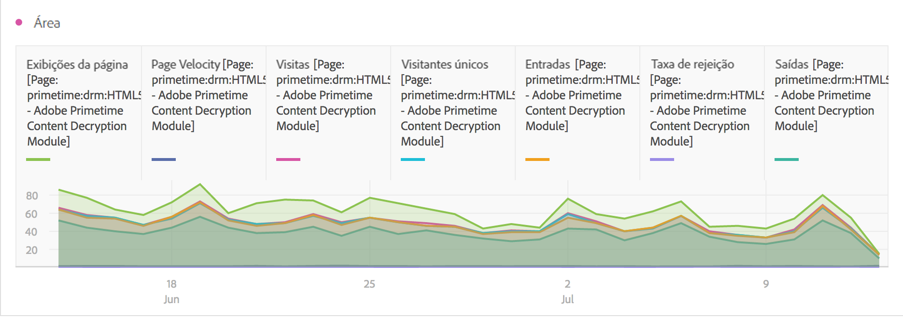
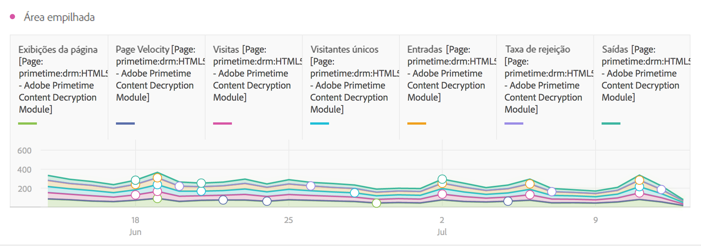
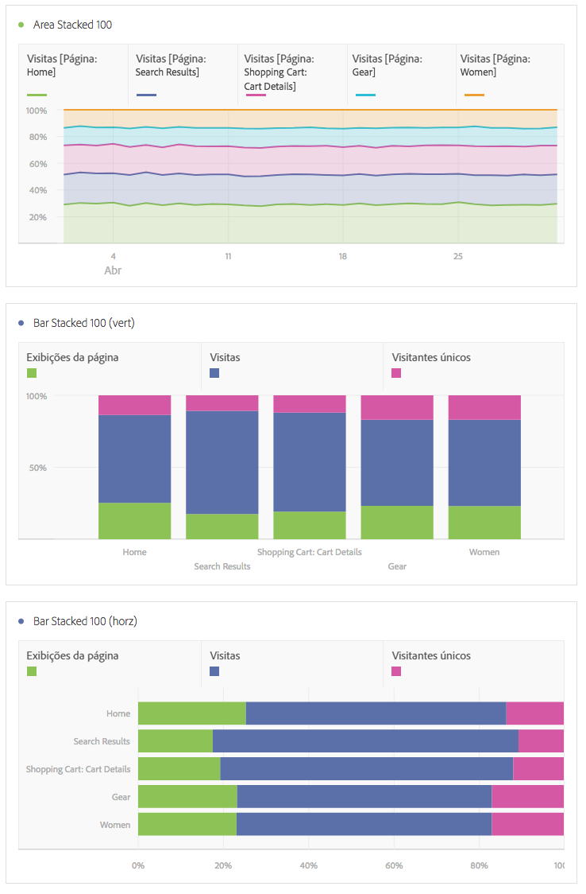

# Área e área empilhada

## Área {#section_FDC4B6AA944F4F8AAAEAA5E17359F28A}

Esta visualização se parece com um gráfico de linha, mas apresenta uma área colorida abaixo da linha. Use um gráfico de área quando você tiver diversas métricas e desejar visualizar a área expressa pela interseção de duas ou mais métricas.

## Area stacked {#section_922BBC5A6D254778A050DF710B0BD8D9}

Esta visualização se parece com um Gráfico de área, mas cada série se inicia sobre a série anterior.

Uma nova configuração de visualização nas visualizações empilhadas por área transforma o gráfico em uma visualização 100% empilhada.

