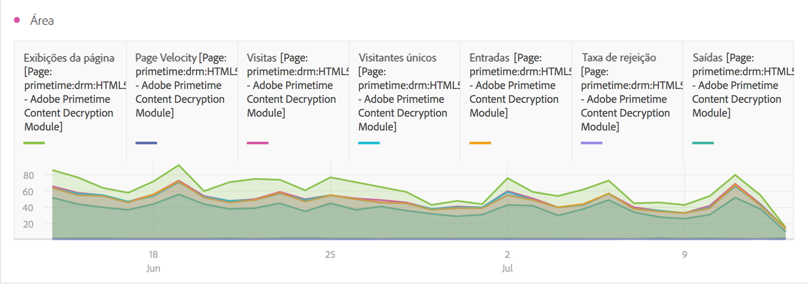
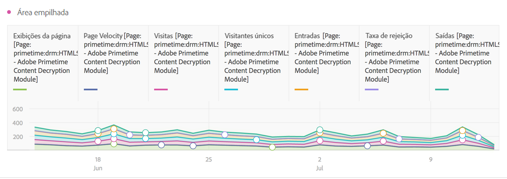

# Área (empilhada)

>[!BEGINSHADEBOX]

_Este artigo documenta as visualizações de Área e Área empilhada em_  _&#x200B;**Adobe Analytics**._ _Consulte [Área e área empilhada](https://experienceleague.adobe.com/pt-br/docs/analytics-platform/using/cja-workspace/visualizations/area) para a versão_  _&#x200B;**Customer Journey Analytics** deste artigo._

>[!ENDSHADEBOX]

A visualização de área tem uma opção padrão e uma opção empilhada.

## Área {#area}

<!-- markdownlint-disable MD034 -->

>[!CONTEXTUALHELP]
>id="workspace_area_button"
>title="Gráfico de área"
>abstract="Crie uma visualização de gráfico de área para representar a interseção de várias métricas."

<!-- markdownlint-enable MD034 -->

A visualização de  **[!UICONTROL Área]** é como um gráfico de linhas, mas apresenta uma área colorida abaixo da linha. Adicione um gráfico de área quando tiver diversas métricas e quiser visualizar a área expressa pela interseção de duas ou mais métricas.

## Área empilhada {#area-stacked}

<!-- markdownlint-disable MD034 -->

>[!CONTEXTUALHELP]
>id="workspace_areastacked_button"
>title="Área empilhada"
>abstract="Crie uma visualização de gráfico de área para representar o empilhamento de várias métricas."

<!-- markdownlint-enable MD034 -->

A visualização de  **[!UICONTROL Área empilhada]** é como um gráfico de área, mas cada série começa acima da série anterior.

Use a opção **[!UICONTROL 100% empilhada]** em  **[!UICONTROL Configurações]** para transformar o gráfico em uma visualização 100% empilhada.

>[!MORELIKETHIS]
>
>[Adicionar uma visualização a um painel](/help/analyze/analysis-workspace/visualizations/freeform-analysis-visualizations.md#add-visualizations-to-a-panel)
>[Configurações de visualização](/help/analyze/analysis-workspace/visualizations/freeform-analysis-visualizations.md#settings)
>[Menu de contexto da visualização](/help/analyze/analysis-workspace/visualizations/freeform-analysis-visualizations.md#context-menu)
>
