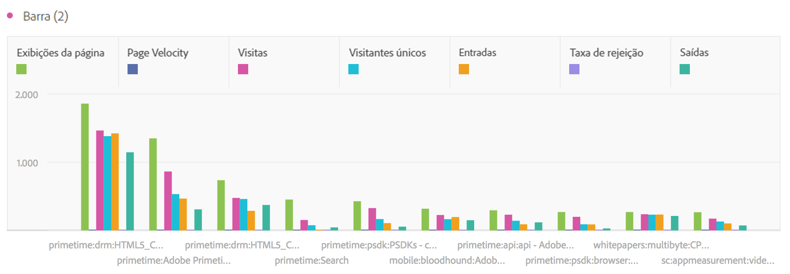
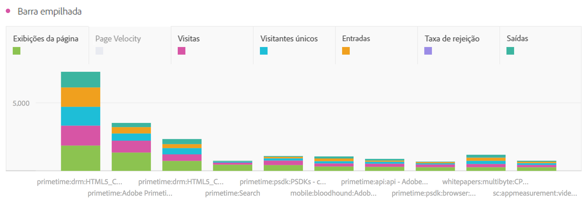

# Barra e barra empilhada

## Barra {#section_2E96E55D4E8E488CBCA6A3508DDF3918}

Esta visualização mostra barras verticais que representam vários valores de uma ou mais métricas.

Uma opção suspensa de granularidade nas configurações de visualização permite alterar uma visualização com tendência (por exemplo, linha, barra) de diária para semanal, mensal etc.

## Bar stacked {#section_9EA83779AE964635907EE5031A785A49}

Esta visualização se parece com um gráfico de barra, mas apresenta barras de série empilhadas.

Uma nova configuração de visualização nas visualizações empilhadas por barra transforma o gráfico em uma visualização 100% empilhada:

