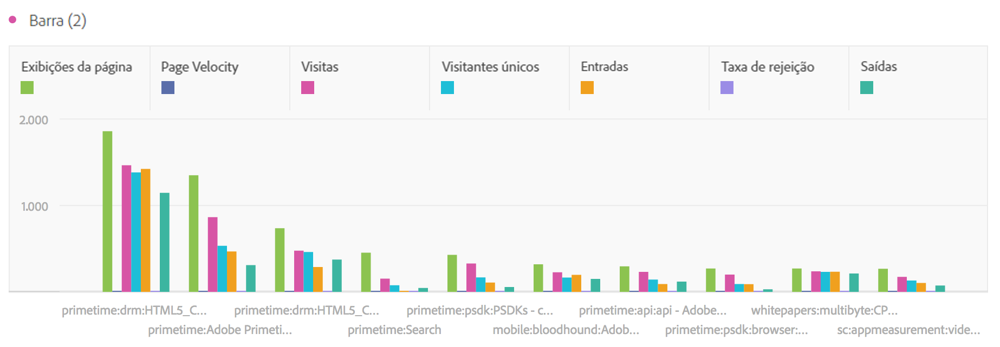
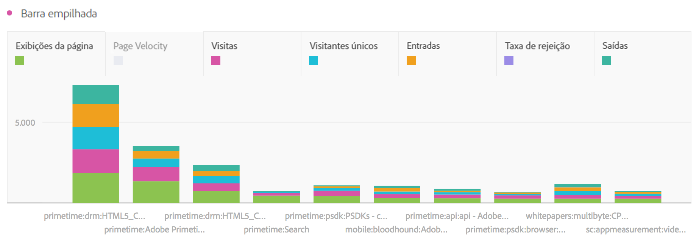

# Barra (empilhada)

>[!BEGINSHADEBOX]

_Este artigo documenta as visualizações de Barra e Barra empilhadas na_  _&#x200B;**Adobe Analytics**._ _Consulte [Barra e Barra empilhadas](https://experienceleague.adobe.com/pt-br/docs/analytics-platform/using/cja-workspace/visualizations/bar) para a versão_  _&#x200B;**Customer Journey Analytics** deste artigo._

>[!ENDSHADEBOX]

A visualização de barra tem uma opção padrão e uma opção empilhada.

## Barra {#bar}

<!-- markdownlint-disable MD034 -->

>[!CONTEXTUALHELP]
>id="workspace_bar_button"
>title="Barra"
>abstract="Crie uma visualização de barra para representar vários valores em uma ou mais métricas."

<!-- markdownlint-enable MD034 -->

A visualização de  **[!UICONTROL Barra]** mostra barras verticais que representam vários valores em uma ou mais métricas.

Um menu suspenso de granularidade nas configurações de visualização permite alterar uma visualização de tendências (por exemplo, linha, barra) de diária para semanal, mensal etc.

## Barra empilhada {#bar-stacked}

<!-- markdownlint-disable MD034 -->

>[!CONTEXTUALHELP]
>id="workspace_barstacked_button"
>title="Barra empilhada"
>abstract="Crie uma visualização de barra para representar vários valores em uma ou mais métricas empilhadas."

<!-- markdownlint-enable MD034 -->

A visualização de  **[!UICONTROL Barra empilhada]** é como um gráfico de barras, mas apresenta barras em série empilhadas umas sobre as outras.

Use a opção **[!UICONTROL 100% empilhada]** em  **[!UICONTROL Configurações]** para transformar o gráfico em uma visualização 100% empilhada.

>[!MORELIKETHIS]
>
>[Adicionar uma visualização a um painel](/help/analyze/analysis-workspace/visualizations/freeform-analysis-visualizations.md#add-visualizations-to-a-panel)
>[Configurações de visualização](/help/analyze/analysis-workspace/visualizations/freeform-analysis-visualizations.md#settings)
>[Menu de contexto da visualização](/help/analyze/analysis-workspace/visualizations/freeform-analysis-visualizations.md#context-menu)
>