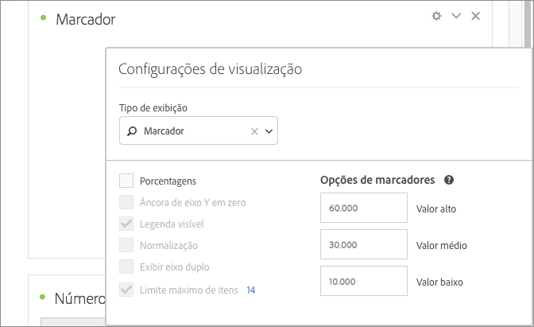

# Gráfico de marcador

Permite ver como um valor de seu interesse se compara ou são mensurados em relação a outros intervalos de desempenho (metas).

O gráfico de marcadores tem uma única medida principal (por exemplo, receita anual atual) e permite que você insira intervalos de desempenho de intervalos qualitativos (por exemplo, em comparação com uma receita de destino). Você pode especificar alto, médio e baixo. É possível especificar intervalos de meta em [!UICONTROL Configurações de visualização].
