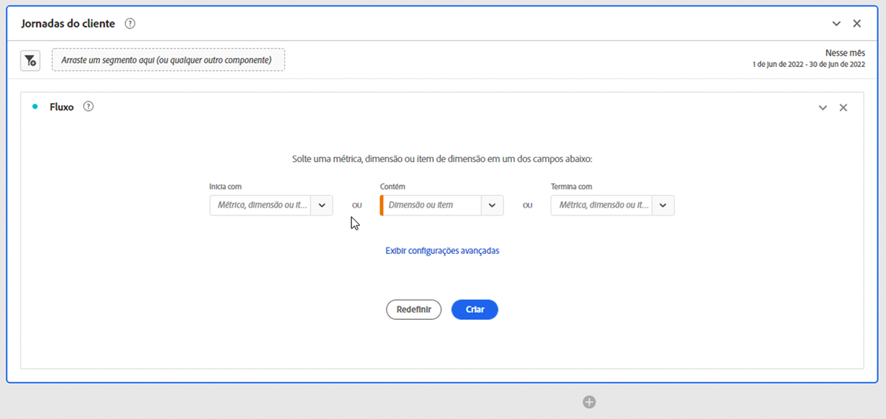
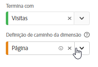
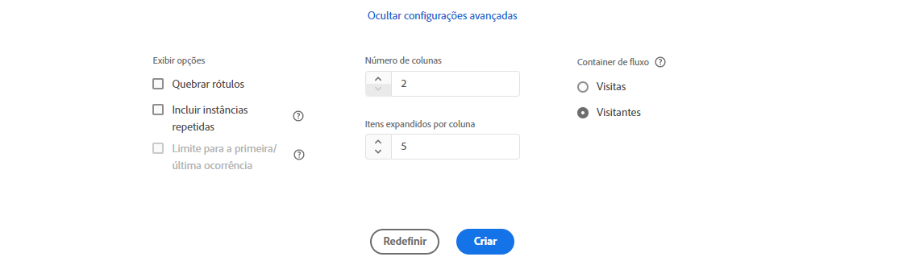
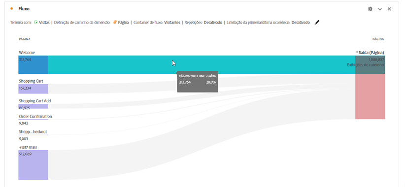
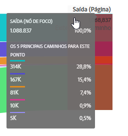

# Configurar uma visualização de fluxo

>[!NOTE]
>
>Esta nova versão da visualização de [!UICONTROL Fluxo] está em testes limitados no momento.

A visualização de fluxo atualizada permite que você entenda a jornada decorrente ou que leva a um evento de conversão específico em seu site ou aplicativo. Ela rastreia um caminho pelas suas dimensões (e itens de dimensão) ou métricas. O fluxo permite configurar o início ou o fim do caminho em que você está interessado ou analisar todos esses caminhos que fluem por uma dimensão ou item de dimensão.

A nova experiência de [!UICONTROL fluxo] aprimora o fluxo de trabalho de várias maneiras:

* Agora é possível optar por iniciar ou terminar seu caminho com a combinação de uma métrica e uma dimensão de definição de caminho.
* Ele contém [!UICONTROL Configurações avançadas] para permitir personalizar ainda mais o [!UICONTROL fluxo].
* O novo botão “Criar” economiza tempo na análise, permitindo configurar a jornada de uma só vez, depois consultar e criar automaticamente várias colunas e nós de uma só vez.

## Etapas de configuração {#configure}

1. Para começar a criar um diagrama de fluxo, adicione um painel em branco ao projeto e clique no ícone de visualizações no painel à esquerda. Em seguida, arraste a visualização de Fluxo para o painel. Ou arraste a visualização de [!UICONTROL Fluxo] a um projeto existente.

1. Ancore a visualização de Fluxo usando uma das três opções:

   * [!UICONTROL Começa com] (métricas, dimensões ou itens) ou
   * [!UICONTROL Contém] (dimensões ou itens), ou
   * [!UICONTROL Termina com] (métricas, dimensões ou itens)

   Cada uma dessas categorias é mostrada na tela como uma “área”. É possível preencher a área de lançamento de 3 maneiras:

   * Use o menu suspenso para selecionar métricas ou dimensões.
   * Arraste itens da lista de dimensões ou métricas.
   * Use a pesquisa para encontrar as métricas ou dimensões que você está procurando.

   Por exemplo, vamos supor que você queira rastrear tudo o que leva a um evento de check-out. Você arrastaria uma dimensão ou métrica relacionada ao check-out (como [!UICONTROL Pedido existente]) na área **[!UICONTROL Termina com]**.

1. Se você escolher uma métrica, também precisará fornecer uma [!UICONTROL Dimensão de definição de caminho], como mostrado aqui, que você usará para criar o caminho. O padrão é [!UICONTROL Página].

   

   >[!IMPORTANT]
   >
   >As métricas calculadas não podem ser soltas nas áreas **[!UICONTROL Começa com]** ou **[!UICONTROL Termina com]**.

1. (Opcional) Clique em **[!UICONTROL Mostrar configurações avançadas]** para configurar as Configurações avançadas:

   

   | Configuração | Descrição |
   | --- | --- |
   | **[!UICONTROL Rótulos de quebra de linha]** | Normalmente, os rótulos nos Elementos de fluxo são truncados para não poluir visualmente a tela, mas é possível tornar todos os rótulos visíveis ao selecionar esta caixa.  Padrão = desmarcado. |
   | **[!UICONTROL Incluir instâncias repetidas]** | As visualizações de fluxo são baseadas em instâncias de uma dimensão. Essa configuração oferece a opção de incluir ou excluir instâncias repetidas, por exemplo, recarregamentos de página. No entanto, as repetições não podem ser removidas das Visualizações de fluxo que incluem dimensões com vários valores, como listVars, listProps, s.product, eVars de merchandising etc. Padrão = desmarcado. |
   | **[!UICONTROL Limite para a primeira/última ocorrência]** | Limite os caminhos para aqueles que começam/terminam com a primeira/última ocorrência de uma dimensão/item/métrica. Consulte a seção abaixo intitulada “Exemplo de cenário para &#39;limitar à primeira/última ocorrência” para obter uma explicação mais detalhada. |
   | **[!UICONTROL Número de colunas]** | Determina quantas colunas você deseja incluir no diagrama de Fluxo. |
   | **[!UICONTROL Itens expandidos por coluna]** | Quantos itens você deseja em cada coluna. |
   | **[!UICONTROL Contêiner de fluxo]** | <ul><li>Visita</li><li>Visitante</li></ul> Permite alternar entre Visita e Visitante para analisar a definição do caminho do visitante. Essas configurações ajudam você a entender o envolvimento no nível dos visitantes (ao longo das visitas) ou restringir a análise a uma só visita. |

1. Clique em **[!UICONTROL Criar]**.

## Exibir e alterar a saída do fluxo {#output}

Um resumo da configuração de fluxo é exibido na parte superior do diagrama. Os caminhos no diagrama são proporcionais. Caminhos com maior atividade aparecem mais grossos.

Para detalhar ainda mais os dados, você tem várias opções:

* O diagrama de fluxo é interativo. Passe o mouse sobre o diagrama para alterar os detalhes exibidos.

* Ao clicar em um nó no diagrama, os detalhes dele são exibidos. Clique no nó novamente para recolhê-lo.

   

* É possível filtrar uma coluna para exibir apenas determinados resultados, como incluir e excluir, especificar critérios etc.

* Clique no sinal de mais (+) à esquerda para expandir uma coluna.

* Use as opções de clique com o botão direito explicadas abaixo para personalizar ainda mais a saída.

* Clique no ícone de lápis ao lado do resumo da configuração para editar ainda mais o fluxo ou recriá-lo com opções diferentes.

* Além disso, é possível exportar e analisar posteriormente o diagrama de Fluxo como parte de um arquivo .CSV de um projeto. Basta ir até **[!UICONTROL Projeto]** > **[!UICONTROL Baixar CSV]**.

## Filtragem

Acima de cada coluna, um filtro é exibido quando você passa o mouse sobre ele. Ao clicar no filtro, você obtém a mesma caixa de diálogo de filtro que existe na tabela de Forma livre hoje. Esse filtro funciona da mesma forma que na tabela de Forma livre.

* Use as configurações avançadas para incluir ou excluir determinados critérios com nossa lista de operadores.
* Depois de filtrar um item da lista, essa coluna específica refletirá a filtragem. O filtro o reduz para mostrar apenas o item permitido no filtro, ou remove todos os itens, exceto o item que você deseja no filtro.
* Todas as colunas downstream e upstream devem persistir, desde que haja dados fluindo para os nós restantes.
* Depois de aplicado, o ícone de filtro aparece em azul acima da coluna em que está filtrando.
* Para remover um filtro, clique no ícone de filtro para abrir o menu de filtro. Remova os filtros aplicados e clique em **[!UICONTROL Salvar]**. O fluxo deve retornar ao estado anterior e não filtrado.

## Opções de clique com o botão direito do mouse {#right-click}

| Opção | Descrição |
|--- |--- |
| [!UICONTROL Concentre-se neste nó] | Altere o foco para o nó selecionado. O nó de foco é exibido no centro do diagrama de fluxo. |
| [!UICONTROL Recomeçar] | Retomar ao criador de diagrama de Forma livre, no qual você pode criar um novo diagrama de Fluxo. |
| [!UICONTROL Criar segmentos a partir deste ponto no fluxo] | Criar um segmento. Isso leva você ao Construtor de segmentos, onde você pode configurar o novo segmento. |
| [!UICONTROL Detalhamento] | Detalhe o nó por Dimensões, Métricas ou Tempo disponíveis. |
| [!UICONTROL Tendência] | Crie um diagrama de tendências para o nó. |
| [!UICONTROL Expandir toda a coluna] | Expanda uma coluna para exibir todos os nós. Por padrão, somente os cinco principais nós são exibidos. |
| [!UICONTROL Recolher toda a coluna] | Ocultar todos os nós em uma coluna. |
| [!UICONTROL Excluir item]/[!UICONTROL Restaurar itens excluídos] | Remove um nó específico da coluna e o cria automaticamente como filtro na parte superior da coluna. Para restaurar o item excluído, clique com o botão direito do mouse novamente e selecione **[!UICONTROL Restaurar item excluído]**. Você também pode abrir o filtro na parte superior da coluna e remover a caixa de seleção com o item que acabou de excluir. |

## Exemplo de cenário para “limitar à primeira/última ocorrência”

Ao usar essa opção, lembre-se de que:

* **[!UICONTROL Limitar à primeira/última ocorrência]** conta somente a primeira/última ocorrências na série. Todas as outras ocorrências dos critérios **[!UICONTROL Começa com]** ou **[!UICONTROL Termina com]** são descartados.
* Se usada com um fluxo **[!UICONTROL Começa com]**, somente a primeira ocorrência que corresponde aos critérios de início é incluída.
* Se usada com um fluxo **[!UICONTROL Termina com]**, somente a última ocorrência que corresponde aos critérios finais será incluída.
* As séries utilizadas diferem de acordo com o container. Se estiver usando o container **[!UICONTROL Visita]**, a série de ocorrências será a sessão. Se estiver usando o container **[!UICONTROL Visitante]**, a série de ocorrências será todas as ocorrências de um determinado usuário no intervalo de datas fornecido.
* A opção **[!UICONTROL Limitar à primeira/última ocorrência]** pode ser definida nas configurações avançadas ao usar uma Métrica ou Item de dimensão nos campos “Inicia com” ou “Termina com”.

Exemplo de série de ocorrências:

Início > Produtos > Adicionar ao carrinho > Produtos > Adicionar ao carrinho > Faturamento > Confirmação de pedido

### Considere uma análise de fluxo usando as seguintes configurações:

* Comece com[!UICONTROL  Adicionar ao carrinho] (Item de dimensão)
* Dimensão da definição de caminho de [!UICONTROL Página] 
* Container de [!UICONTROL Visita]

If **[!UICONTROL Limitar à primeira/última ocorrência]** é *desativado*, essa única série de ocorrências conta 2 ocorrências de &quot;Adicionar ao carrinho&quot;.
Saída de fluxo esperada:
“Adicionar ao carrinho” (2) —> “Produtos” (1)
-> “Faturamento” (1)

No entanto, se **[!UICONTROL Limitar à primeira/última ocorrência]** é *ativado*, somente a primeira ocorrência de &quot;Adicionar ao carrinho&quot; é incluída na análise.
Saída de fluxo esperada:
“Adicionar ao carrinho” (1) —> “Produtos” (1)

### Considere a mesma série de ocorrências, mas use as seguintes configurações:

* Termina com [!UICONTROL Adicionar ao carrinho] (Item de dimensão)
* Dimensão da definição de caminho de [!UICONTROL Página]
* Container de [!UICONTROL Visita]

Se a opção **[!UICONTROL Limitar à primeira/última ocorrência]** está *desativada*, essa única série de ocorrências contaria 2 ocorrências de “Adicionar ao carrinho”.
Saída de fluxo esperada:
“Produtos” (2) &lt;— “Adicionar ao carrinho” (2)

No entanto, se a opção **[!UICONTROL Limitar à primeira/última ocorrência]** está *ativada*, somente a última ocorrência de [!UICONTROL Adicionar ao carrinho] seria incluída na análise.
Saída de fluxo esperada:
“Produtos” (1) &lt;— “Adicionar ao carrinho” (1)
