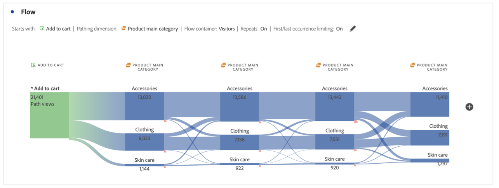
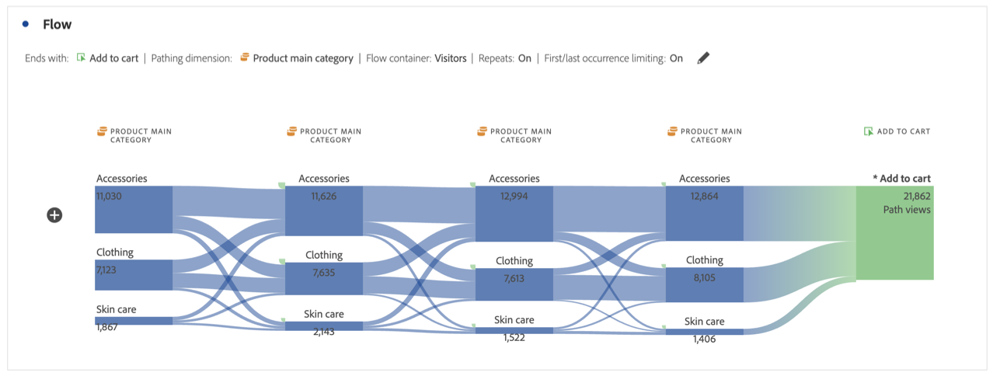

# Configurar uma visualização de fluxo {#configure-a-flow-visualization}

>[!CONTEXTUALHELP]
>id="workspace_flow_startswith"
>title="Começa com"
>abstract="Esse campo só pode ser definido na criação inicial. Para atualizar esse campo, selecione **[!UICONTROL Redefinir]** para criar uma nova Visualização de fluxo."

>[!CONTEXTUALHELP]
>id="workspace_flow_contains"
>title="Contém"
>abstract="Esse campo só pode ser definido na criação inicial. Para atualizar esse campo, selecione **[!UICONTROL Redefinir]** para criar uma nova Visualização de fluxo."

>[!CONTEXTUALHELP]
>id="workspace_flow_endswith"
>title="Termina com"
>abstract="Esse campo só pode ser definido na criação inicial. Para atualizar esse campo, selecione **[!UICONTROL Redefinir]** para criar uma nova Visualização de fluxo."

>[!CONTEXTUALHELP]
>id="workspace_flow_pathingdimension"
>title="Dimensão de definição de caminho"
>abstract="Selecione uma dimensão para usar como caminho que conduz ou sai do componente selecionado."

>[!CONTEXTUALHELP]
>id="workspace_flow_container"
>title="Container de fluxo"
>abstract="Selecione o container a ser usado para exibir (números para) a definição de caminho."

>[!CONTEXTUALHELP]
>id="workspace_flow_include_repeats_disabled"
>title="Incluir repetições (desabilitado)"
>abstract="As repetições não podem ser removidas das Visualizações de fluxo que incluem dimensões de vários valores."

>[!CONTEXTUALHELP]
>id="workspace_flow_include_repeats_default"
>title="Incluir repetições"
>abstract="As visualizações de fluxo são baseadas em instâncias de uma dimensão. Essa configuração oferece a opção de incluir ou excluir instâncias repetidas, por exemplo, recarregamentos de página. "

>[!CONTEXTUALHELP]
>id="workspace_flow_limit_occurrence"
>title="Limitar à primeira/última ocorrência"
>abstract="Os resultados são limitados a caminhos quando o primeiro/último ponto de contato é uma entrada/saída."

>[!CONTEXTUALHELP]
>id="workspace_flow_numberofcolumns"
>title="Número de colunas"
>abstract="Esse campo só pode ser definido na criação inicial. Para atualizar este campo, selecione **[!UICONTROL Redefinir]** para criar uma nova Visualização de fluxo."

>[!CONTEXTUALHELP]
>id="workspace_flow_itemsexpandedpercolumn"
>title="Itens expandidos por coluna"
>abstract="Esse campo só pode ser definido na criação inicial. Para atualizar este campo, selecione **[!UICONTROL Redefinir]** para criar uma nova Visualização de fluxo."

>[!CONTEXTUALHELP]
>id="workspace_flow_resettoupdate"
>title="Redefinir para atualizar"
>abstract="Esse campo só pode ser definido na criação inicial. Para atualizar esse campo, selecione **[!UICONTROL Redefinir]** para criar uma nova Visualização de fluxo."

As visualizações de fluxo ajudam você a entender a jornada originada de um evento de conversão específico em seu site ou aplicativo. Ou que leva a um evento de conversão específico. A visualização rastreia um caminho pelas suas dimensões (e itens de dimensão) ou métricas.

Você pode configurar o início ou o fim do caminho em que está interessado. Ou analisar todos os caminhos que fluem por uma dimensão ou item de dimensão.

## Usar

1. Adicione uma visualização de  **[!UICONTROL fluxo]**. Consulte [Adicionar uma visualização a um painel](../freeform-analysis-visualizations.md#add-visualizations-to-a-panel).

1. Crie uma âncora para a visualização de fluxo usando uma das seguintes opções:

   * [!UICONTROL **Começa com**] (métricas, dimensões ou itens) ou
   * [!UICONTROL **Contém**] (dimensões ou itens), ou
   * [!UICONTROL **Termina com**] (métricas, dimensões ou itens)

   Cada uma dessas categorias é exibida na tela como uma *área de destino*. É possível preencher a área de lançamento de 3 maneiras:

   * Use o menu suspenso para selecionar métricas ou dimensões.
   * Arraste dimensões ou métricas do painel esquerdo.
   * Comece a digitar o nome de uma dimensão ou métrica e selecione-a quando aparecer na lista suspensa.

   >[!IMPORTANT]
   >
   >Não é possível usar métricas calculadas nos campos **[!UICONTROL Começa com]** ou **[!UICONTROL Termina com]**.

1. Se você escolher uma métrica, também precisará fornecer uma [!UICONTROL **Dimensão de definição de caminho**] para usar como o caminho de entrada ou saída do componente selecionado, conforme exibido aqui. O padrão é [!UICONTROL **Página**].

   

1. (Opcional) Selecione **[!UICONTROL Mostrar configurações avançadas]** para configurar qualquer uma das seguintes opções:

   | Configuração | Descrição |
   | --- | --- |
   | **[!UICONTROL Rótulos de quebra de linha]** | Normalmente, os rótulos nos Elementos de fluxo são truncados para não poluir visualmente a tela, mas é possível tornar todos os rótulos visíveis ao selecionar esta caixa.  Padrão = desmarcado. |
   | **[!UICONTROL Incluir instâncias repetidas]** | As visualizações de fluxo são baseadas em instâncias de uma dimensão. Essa configuração oferece a opção de incluir ou excluir instâncias repetidas, por exemplo, recarregamentos de página. No entanto, as repetições não podem ser removidas das Visualizações de fluxo que incluem dimensões com vários valores, como listVars, listProps, s.product, eVars de merchandising etc. 
Essa opção está desabilitada por padrão.
 |
   | **[!UICONTROL Limitar à primeira/última ocorrência]** | Limite os caminhos àqueles que começam ou terminam com a primeira ou última ocorrência de uma dimensão, item ou métrica. Consulte [Limitar à primeira/última ocorrência](#example-scenario-for-limit-to-firstlast-occurrence) para obter uma explicação mais detalhada. |
   | **[!UICONTROL Número de colunas]** | O número de colunas que você deseja no diagrama de fluxo. É possível especificar um máximo de cinco colunas. |
   | **[!UICONTROL Itens expandidos por coluna]** | O número de itens que você deseja em cada coluna. É possível especificar no máximo 10 itens expandidos por coluna. |
   | **[!UICONTROL Container de fluxo]** | É possível alternar entre **[!UICONTROL Sessões]** e **[!UICONTROL Pessoa]** para analisar o caminho definido. Essas configurações ajudam a entender o engajamento de uma pessoa no nível da pessoa (em sessões) ou a restringir a análise a uma única sessão. |

   >[!IMPORTANT]
   >
   >A combinação de **[!UICONTROL Número de colunas]** e **[!UICONTROL Itens expandidos por coluna]** determina o número de solicitações subjacentes necessárias para criar a visualização de fluxo. Quanto mais altos esses números, mais tempo leva para renderizar uma visualização.

1. Selecione **[!UICONTROL Criar]**.

### Exemplo

Suponhamos que você queira rastrear o caminho que os usuários percorreram para entrar e sair das páginas mais populares do site.

1. Crie uma visualização de fluxo conforme descrito acima.
1. Arraste a dimensão [!UICONTROL **Página**] para o campo **[!UICONTROL Contém]** e selecione [!UICONTROL **Criar**].
1. A visualização de fluxo é criada com a página mais exibida visível no nó destacado, no centro da visualização. É possível ver também as principais páginas que levam a essa página (à esquerda do nó destacado), bem como as principais páginas que levam para fora dela (à direita do nó destacado).
1. Analisar dados no fluxo, conforme descrito em [Configurar](#configure).

## Configurar

Um resumo da configuração de fluxo é exibido na parte superior das visualizações. Os caminhos no diagrama são proporcionais. Caminhos com maior atividade aparecem mais grossos.

Para detalhar ainda mais os dados, você tem várias opções:

* O diagrama de fluxo é interativo. Passe o mouse sobre o diagrama para alterar os detalhes exibidos.

* Ao clicar em um nó no diagrama, os detalhes dele são exibidos. Clique no nó novamente para recolhê-lo.

  

* É possível filtrar uma coluna para exibir apenas determinados resultados, incluir, excluir, especificar critérios etc.

* Selecione  no lado esquerdo ou direito para expandir uma coluna.

* Para personalizar a saída, use as opções do [menu de contexto](#context-menu).

* Para editar o fluxo ou recriá-lo com opções diferentes, selecione  ao lado do resumo da configuração.

## Filtro

Acima de cada coluna, há um  que aparece com o passar do mouse. Ao clicar no filtro, você abrirá a mesma caixa de diálogo de filtro contida na tabela de forma livre. Consulte [Filtrar e classificar](freeform-table/../../freeform-table/filter-and-sort.md).

* Use **[!UICONTROL Mostrar opções avançadas]** para definir as configurações avançadas e incluir ou excluir alguns critérios com uma lista de operadores. Consulte [Filtros e classificação](../freeform-table/filter-and-sort.md) para obter mais informações.
* Depois de filtrar uma coluna, essa coluna específica reflete a filtragem. Um ícone  azul indica que a coluna foi filtrada.  O filtro reduz a coluna para mostrar somente o item definido no filtro. Ou remove todos os itens, exceto o item definido no filtro.
* Todas as colunas posteriores e anteriores são mantidas, desde que haja dados fluindo para os nós restantes.
* Para remover um filtro, selecione  e abra o menu. Remova os filtros aplicados e clique em **[!UICONTROL Salvar]**. O fluxo deve retornar ao estado anterior e não filtrado.

## Menu de contexto

Use um menu de contexto em qualquer nó na visualização de fluxo com as seguintes opções:

| Opção | Descrição |
|--- |--- |
| **[!UICONTROL Concentre-se neste nó]** | Altere o foco para o nó selecionado. O nó de foco é exibido no centro do diagrama de fluxo. |
| **[!UICONTROL Começar de novo]** | Retorna ao criador de diagrama de forma livre, no qual é possível criar um novo diagrama de fluxo. |
| **[!UICONTROL Criar um filtro para este caminho]** | Criar um filtro. Essa seleção leva ao criador de filtros, onde é possível configurar o novo filtro. |
| **[!UICONTROL Detalhamento]** | Detalhe o nó por Dimensões, Métricas ou Tempo disponíveis. |
| **[!UICONTROL Filtrar coluna]** | As mesmas opções de filtro são exibidas conforme disponíveis na tabela de forma livre. Para obter mais informações sobre as opções disponíveis, consulte a seção “Aplicar um filtro simples ou avançado em uma tabela” em [Filtrar e classificar tabelas](/help/analyze/analysis-workspace/visualizations/freeform-table/filter-and-sort.md). |
| **[!UICONTROL Excluir item]** ou **[!UICONTROL Restaurar itens excluídos]** | Remove um nó específico da coluna e o cria automaticamente como filtro na parte superior da coluna. Para restaurar o item excluído, selecione **[!UICONTROL Restaurar item excluído]** no menu de contexto. Também é possível abrir o filtro na parte superior da coluna e remover a caixa de seleção com o item que acabou de excluir. |
| **[!UICONTROL Tendência]** | Crie um diagrama de tendências para o nó. |
| **[!UICONTROL Mostrar próxima coluna]** / **[!UICONTROL Mostrar coluna anterior]** | Revela a próxima coluna (direita) ou a coluna anterior (esquerda) da visualização. |
| **[!UICONTROL Ocultar coluna]** | Oculta a coluna selecionada da visualização. |
| **[!UICONTROL Expandir toda a coluna]** | Expanda uma coluna para exibir todos os nós. Por padrão, somente os cinco principais nós são exibidos. |
| **[!UICONTROL Criar público-alvo a partir da seleção]** | Cria um público-alvo com base na coluna selecionada. |
| **[!UICONTROL Recolher toda a coluna]** | Ocultar todos os nós em uma coluna. |

## Limitar à primeira/última ocorrência

Ao usar essa opção, lembre-se de que:

* **[!UICONTROL Limitar à primeira/última ocorrência]** conta somente a primeira/última ocorrências na série. Todas as outras ocorrências dos critérios **[!UICONTROL Começa com]** ou **[!UICONTROL Termina com]** são descartados.
* Se usado com um fluxo **[!UICONTROL Começa com]**, somente a primeira ocorrência correspondente aos critérios de início é incluída.
No exemplo abaixo, **todas** as ocorrências de *Adicionar ao carrinho* e *Categoria principal do produto* em cada etapa do fluxo são incluídas.
  

  No exemplo abaixo, apenas as **primeiras** ocorrências de *Adicionar ao carrinho* e *Categoria principal do produto* em cada etapa do fluxo estão incluídas.
  
* Se usado com um fluxo **[!UICONTROL Termina com]**, somente a última ocorrência correspondente aos critérios finais será incluída.
No exemplo abaixo, **todas** as ocorrências de *Categoria principal do produto* e *Adicionar ao carrinho* em cada etapa do fluxo são incluídas.
  

  No exemplo abaixo, apenas as **últimas** ocorrências de *Categoria principal do produto* e *Adicionar ao carrinho* em cada etapa do fluxo são incluídas.
  
* As séries utilizadas diferem de acordo com o container. Se estiver usando o container **[!UICONTROL Pessoa]**, a série de eventos será a sessão. Se estiver usando o container **[!UICONTROL Sessão]**, a série de eventos serão todos os eventos de um determinado usuário no intervalo de datas fornecido.
* A opção **[!UICONTROL Limitar à primeira/última ocorrência]** pode ser definida nas configurações avançadas ao usar uma métrica ou item de dimensão nos campos **[!UICONTROL Inicia com]** ou **[!UICONTROL Termina com]**.

>[!MORELIKETHIS]
>
>[Adicionar uma visualização em um painel](/help/analyze/analysis-workspace/visualizations/freeform-analysis-visualizations.md#add-visualizations-to-a-panel)
>>[Configurações de visualização](/help/analyze/analysis-workspace/visualizations/freeform-analysis-visualizations.md#settings)
>>[Menu de contexto da visualização](/help/analyze/analysis-workspace/visualizations/freeform-analysis-visualizations.md#context-menu)
>

<!--
## Create a flow visualization {#configure}

1. Add a blank panel to your project and click the visualizations icon in the left rail. 

   Or
   
   Add a visualization in any of the ways described in the "Add visualizations to a panel" section in [Visualizations overview](/help/analyze/analysis-workspace/visualizations/freeform-analysis-visualizations.md).

1. Anchor your Flow visualization using one of the following options:

   * [!UICONTROL **Starts with**] (metrics, dimensions, or items), or
   * [!UICONTROL **Contains**] (dimensions, or items), or
   * [!UICONTROL **Ends with**] (metrics, dimensions, or items)

   Each of these categories is shown onscreen as a "drop zone." You can populate the drop zone in 3 ways:

   * Use the drop-down menu to select metrics or dimensions.
   * Drag dimensions or metrics from the left rail.
   * Begin typing the name of a dimension or metric, then select it when it appears in the drop-down list.

   >[!IMPORTANT]
   >
   >Calculated metrics cannot be used in the  **[!UICONTROL Starts with]** or **[!UICONTROL Ends with]** fields.

1. If you choose a metric, you also need to provide a [!UICONTROL **Pathing Dimension**] to use as your path leading to or coming from your selected component, as shown here. The default is [!UICONTROL **Page**].

   

1. (Optional) Select **[!UICONTROL Show advanced settings]** to configure any of the following options:

   

   | Setting | Description |
   | --- | --- |
   | **[!UICONTROL Wrap labels]** | Normally, the labels on the Flow elements are truncated to save screen real estate, but you can make the entire label visible by checking this box.  Default = unchecked. |
   | **[!UICONTROL Include repeat instances]** | Flow visualizations are based on instances of a dimension. This setting gives you the option to include or exclude repeated instances, e.g. Page reloads. However, repeats cannot be removed from Flow visualizations that include multi-valued dimensions, such as listVars, listProps, s.product, merchandising eVars, etc. 
This option is disabled by default.
 |
   | **[!UICONTROL Limit to first/last occurrence]** | Limit paths to those that start/end with the first/last occurrence of a dimension/item/metric. See the section below, [Example scenario for 'limit to first/last occurrence'](#example-scenario-for-limit-to-firstlast-occurrence), for a more detailed explanation. |
   | **[!UICONTROL Number of columns]** | The number of columns you want in your Flow diagram. You can specify a maximum of 5 columns. |
   | **[!UICONTROL Items expanded per column]** | The number of items you want in each column. You can specify a maximum of 10 items expanded per column.  |
   | **[!UICONTROL Flow container]** | <ul><li>Visit</li><li>Visitor</li></ul> Lets you switch between Visit and Visitor to analyze visitor pathing. These settings help you understand visitor engagement at the visitor level (across visits), or constrain the analysis to a single visit.|

   >[!IMPORTANT]
   >
   >The combination of **[!UICONTROL Number of columns]** and **[!UICONTROL Items expanded per column]** determine the number of underlying requests required to create the flow visualization. The higher those numbers, the longer it takes to render a visualization.

1. Select **[!UICONTROL Build]**.

>[!INFO]
>
>**Example:** Suppose that you want to trace the path that users took both to and from the most popular pages on your site.
>
>To do this, you would
> 
>1. Begin creating a flow visualization as described above.
>1. Drag the [!UICONTROL **Page**] dimension into the **[!UICONTROL Contains]** field, then select [!UICONTROL **Build**].
>1. The Flow visualization builds with the most-viewed page visible in the focus node in the center of the visualization. You also see the top pages leading into that page (to the left of the focus node) as well as the top pages leading out of that page (to the right of the focus node).
>1. Analyze data in the flow, as described in [View and change the Flow output](#view-and-change-the-flow-output).

## View and change the Flow output {#output}

A summary of the Flow configuration appears at the top of the diagram. The thickness of a path in the diagram is proportional to its activity, with paths with more activity appearing thicker than those with less activity.

To drill down further into the data, you have several options:

* The flow diagram is interactive. Mouse over the diagram to change the details that are shown.

* When you select on a node in the diagram, the details for that node appear. Select on the node again to collapse it.

   

* You can filter a column to display only certain results, such as including and excluding, specifying criteria, and so forth.

* Select the plus sign (+) on the left to expand a column.

* Use the right-click options explained below to further customize the output.

* Select the pencil icon next to the configuration summary to further edit the flow or rebuild it with different options.

* You can also export and further analyze your Flow diagram as part of a project's .CSV file by going to **[!UICONTROL Project]** > **[!UICONTROL Download CSV]**.

## Filtering

Above each column, a filter appears when you hover over it. By selecting the filter, you get the same filter dialog that exists in the Freeform table today. This filter works the same as it does in the Freeform table.

* Use advanced settings to include or exclude certain criteria with our list of operators.
* Once you have filtered an item from the list, that specific column will reflect the filtering. (The filter either reduces it to only show the item allowed in the filter, or it removes all items except for the one item you want in the filter.
* All downstream and upstream columns should persist, as long as there is data flowing into the remaining nodes.
* Once applied, the filter icon appears in blue above the column it is filtering.
* To remove a filter, select the filter icon to open the filter menu. Remove any filters applied and then select **[!UICONTROL Save]**. The flow should return to its previous, unfiltered state.

## Right-click options {#right-click}

| Option | Description |
|--- |--- |
| [!UICONTROL Start over] | Returns you to the Freeform diagram builder, where you can build a new Flow diagram. |
| [!UICONTROL Create segment for this path] | Create a segment. This takes you into the Segment Builder, where you can configure the new segment. |
| [!UICONTROL Breakdown] | Break the node down by available Dimensions, Metrics, or Time. |
| [!UICONTROL Trend] | Create a trended diagram for the node. |
| Show next column / Show previous column | Reveals the next (right) or previous (left) column of the visualization. |
| Hide column | Hides the selected column from the visualization. | 
| [!UICONTROL Expand entire column] | Expand a column to show all nodes. By default, only the top five nodes display. |

## Example scenario for 'limit to first/last occurrence'

When using this option, keep in mind that:

* **[!UICONTROL Limit to first/last occurrence]** counts only the first/last occurrence in the series. All other occurrences of the **[!UICONTROL Starts with]** or **[!UICONTROL Ends with]** criteria are discarded.
* If used with a **[!UICONTROL Starts with]** flow, only the first occurrence that matches the start criteria is included.
* If used with an **[!UICONTROL Ends with]** flow, only the last occurrence that matches the end criteria will be included.
* The series used differs based on the container. If using the **[!UICONTROL Visit]** container, the series of hits will be the session. If using the **[!UICONTROL Visitor]** container, the series of hits will be all the hits for a given user in the provided date range.
* The **[!UICONTROL Limit to first/last occurrence]** option can be configured in the advanced settings when using a Metric or Dimension Item in the "Starts with" or "Ends with" fields.

Example series of hits:

Home > Products > Add to cart > Products > Add to Cart > Billing > Order Confirmation

### Consider a flow analysis using the following settings:

* Start with[!UICONTROL  Add to cart] (Dimension Item)
* [!UICONTROL Page] pathing dimension
* [!UICONTROL Visit] container

If **[!UICONTROL Limit to first/last occurrence]** is *disabled*, then this single series of hits counts 2 occurrences of "Add to Cart".
Expected Flow Output:
"Add to Cart" (2) —> "Products" (1)
                  -> "Billing" (1)

However, if **[!UICONTROL Limit to first/last occurrence]** is *enabled*, only the first occurrence of "Add to cart" is included in the analysis.
Expected Flow Output:
"Add to Cart" (1) —> "Products" (1)

### Consider the same series of hits but using the following settings:

* Ends with [!UICONTROL Add to cart] (Dimension Item)
* [!UICONTROL Page] pathing dimension
* [!UICONTROL Visit] container

If **[!UICONTROL Limit to first/last occurrence]** is *disabled*, then this single series of hits would count 2 occurrences of "Add to Cart".
Expected Flow Output:
"Products" (2) <— "Add to cart" (2)

However, if **[!UICONTROL Limit to first/last occurrence]** is *enabled*, only the last occurrence of [!UICONTROL Add to cart] would be included in the analysis.
Expected Flow Output:
"Products" (1) <— "Add to cart" (1)

-->