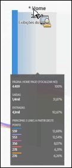
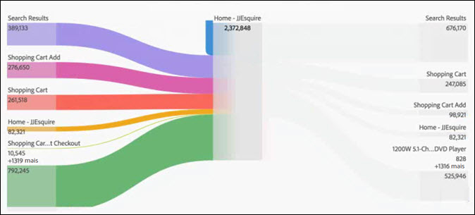
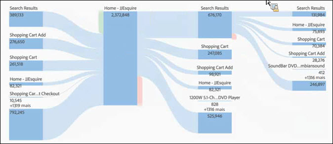

# Configurar uma visualização de fluxo

O fluxo permite rastrear um caminho pelas suas páginas ou dimensões, como eVars

* Entrada (somente dimensões)
* Dimensões ou itens
* Saída (somente dimensões)

Cada uma dessas categorias é mostrada na tela como uma “área”. Arraste os itens da lista e solte-os na área desejada. Páginas ou outros itens que não são dimensões somente podem ser adicionados à área central. Se soltar uma dimensão na área central, um relatório é executado automaticamente, inserindo os itens principais da dimensão.

Ao soltar um item em uma área, o diagrama de Fluxo abre. O conteúdo do diagrama de fluxo depende da área onde o item ou dimensão é adicionada. Saída e Entrada mostram todos os itens para a dimensão (como páginas) soltada nas áreas de Entrada e Saída. Por exemplo, se você soltar uma dimensão na área central, um diagrama de fluxo para a dimensão abre.

Passe o mouse sobre o Nó de foco no centro do diagrama para ver as informações sobre o nó.

O diagrama de fluxo é interativo. Passe o mouse sobre o diagrama para alterar os detalhes exibidos.

Os caminhos no diagrama são proporcionais. Caminhos com maior atividade aparecem mais grossos.

Ao clicar em um nó no diagrama, os detalhes dele são exibidos. Por exemplo, se você clicar em **[!UICONTROL Resultados da pesquisa]na parte superior direita do diagrama principal acima, o diagrama se expande para mostrar mais detalhes sobre o nó de resultados da pesquisa.** Clique em um nó novamente para recolhe-lo.

Por padrão, o diagrama mostra os cinco fluxos principais. Se clicar no nó **[!UICONTROL Mais]na parte inferior do diagrama, o diagrama se expande para mostrar mais cinco fluxos.** Continue a clicar em **[!UICONTROL Mais]para expandir até não haver mais fluxos adicionais para mostrar.**

Não há limites para explorar o diagrama de Fluxo.

You can also export and further analyze your Flow diagram as part of a project's .CSV file by going to **[!UICONTROL Project]** &gt; **[!UICONTROL Download CSV]**.
