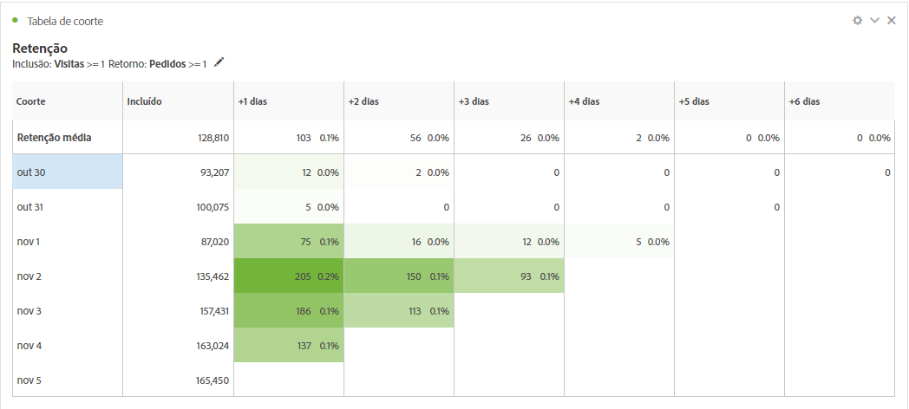
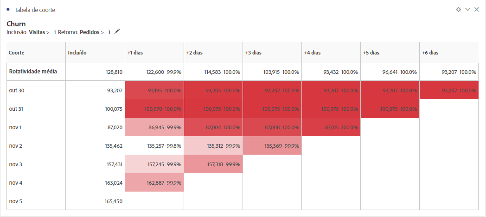
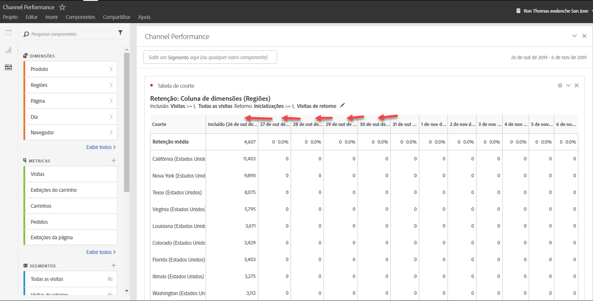
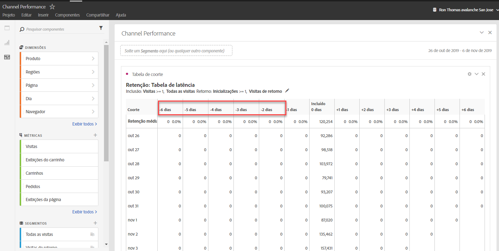
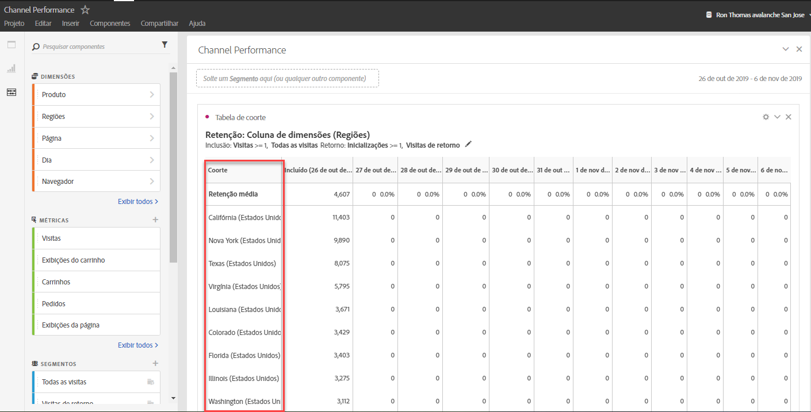

# O que é a análise de coorte?

A *`cohort`* é um grupo de pessoas com características comuns em um período específico. A análise de coorte é útil, por exemplo, quando você deseja saber como uma coorte interage com uma marca. Você pode detectar facilmente as mudanças nas tendências e atuar de acordo com elas. (Há explicações sobre a análise de coorte disponíveis na Web, por exemplo, em [Análise de coorte 101](https://en.wikipedia.org/wiki/Cohort_analysis).)

Após criar um relatório de coorte, você pode preparar seus componentes (dimensões, métricas e segmentos específicos), em seguida, compartilhá-lo com qualquer pessoa. Consulte  [Preparar e compartilhar](/help/analyze/analysis-workspace/curate-share/curate.md).

Exemplos do que você pode fazer com a análise de coorte:

* Lançar campanhas projetadas para estimular uma ação desejada.
* Deslocar o orçamento de marketing no momento certo do ciclo de vida do cliente.
* Reconhecer quando finalizar uma avaliação ou uma oferta para maximizar o valor.
* Obter ideias para o teste A/B em áreas como o estabelecimento de preços, o caminho de atualização, etc.
* Exibir um relatório de análise de coorte em um relatório de análise orientada.
* Reconhecer quando finalizar uma avaliação ou uma oferta para maximizar o valor.
* Obter ideias para o teste A/B em áreas como o estabelecimento de preços, o caminho de atualização, etc.

A Análise de coorte está disponível a todos os clientes do Analytics com direitos de acesso à Analysis Workspace.

[Análise de coorte no YouTube](https://www.youtube.com/watch?v=kqOIYrvV-co&amp;index=45&amp;list=PL2tCx83mn7GuNnQdYGOtlyCu0V5mEZ8sS) (4:36)

>[!IMPORTANT]
>
>A Análise de coorte não suporta métricas calculadas.

## Recursos da análise de coorte

Em janeiro de 2019, a Adobe lançou uma versão nova e significativamente aprimorada da Análise de coorte. Permite um controle mais refinado sobre os coortes que você cria. Estes são os recursos aprimorados:

### Tabela de retenção

Os relatórios de coorte de retenção registram os visitantes: cada célula de dados mostra o número bruto e a porcentagem de visitantes da coorte que realizaram a ação durante esse período. É possível incluir até 3 métricas e 10 segmentos.

### Tabela de abandono

A coorte de abandono é o inverso da tabela de retenção e mostra os visitantes que abandonaram ou que nunca atenderam aos critérios de retorno da sua coorte ao longo do tempo. É possível incluir até 3 métricas e 10 segmentos.

### Cálculo contínuo

Permite calcular a retenção ou o abandono com base na coluna anterior em vez da coluna incluída.

### Tabela de latência

Mede o tempo decorrido antes e depois da ocorrência do evento de inclusão. Essa é uma ferramenta excelente para ser usada antes ou depois da análise. Uma coluna “Incluída” encontra-se no centro da tabela e períodos de tempo anteriores e posteriores ao evento de inclusão são exibidos em ambos os lados.

### Coorte de dimensão personalizada

Crie coortes com base em uma dimensão selecionada, em vez de coortes com base em tempo, que são o padrão. Use dimensões como canal de marketing, campanha, produto, página, região ou qualquer outra dimensão no Adobe Analytics para exibir como a retenção é alterada com base nos valores diferentes destas dimensões.

Para obter instruções sobre como configurar e executar um relatório de coorte, acesse   [Configurar um relatório de análise de coorte](/help/analyze/analysis-workspace/visualizations/cohort-table/t-cohort.md).

