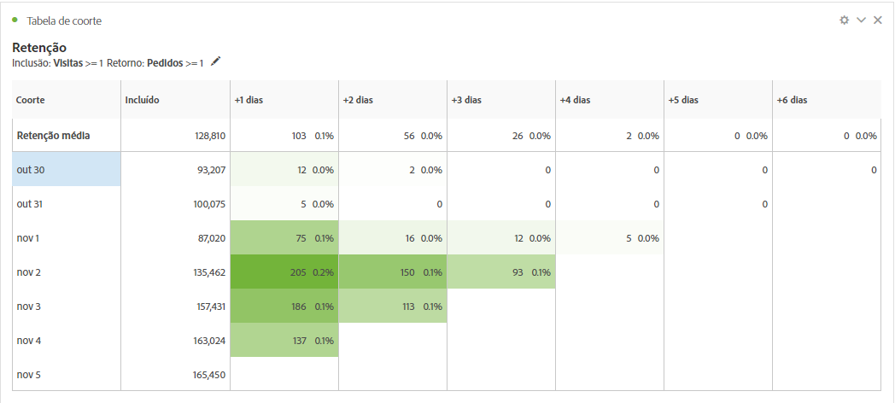
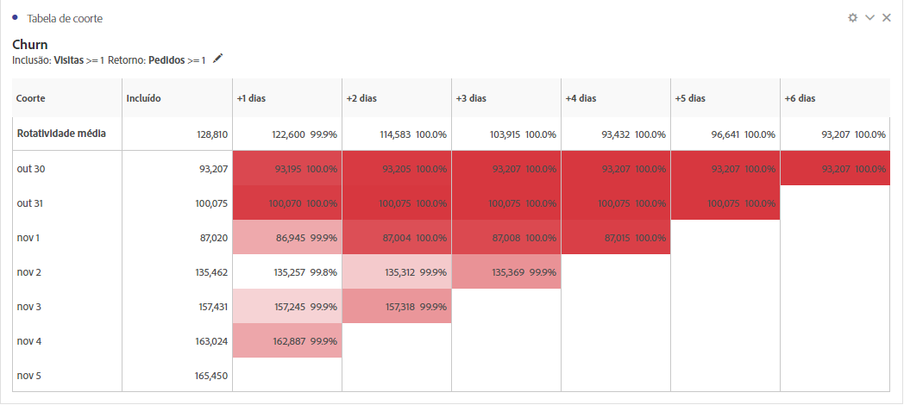
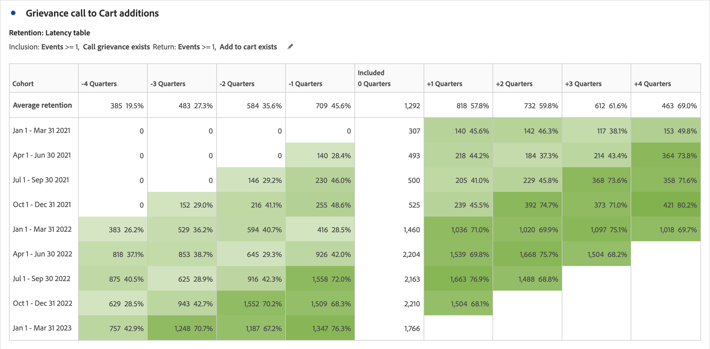
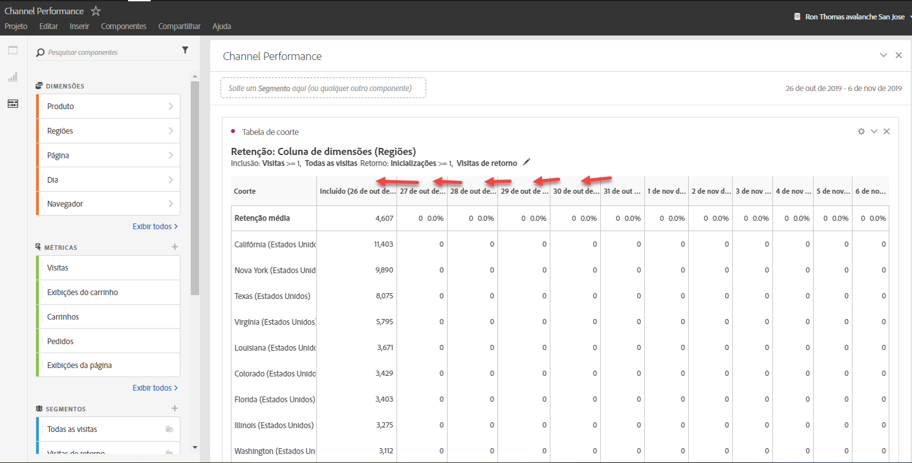
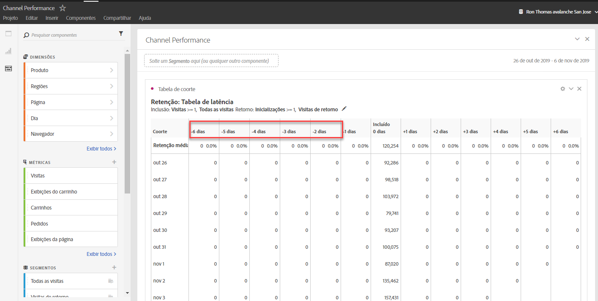
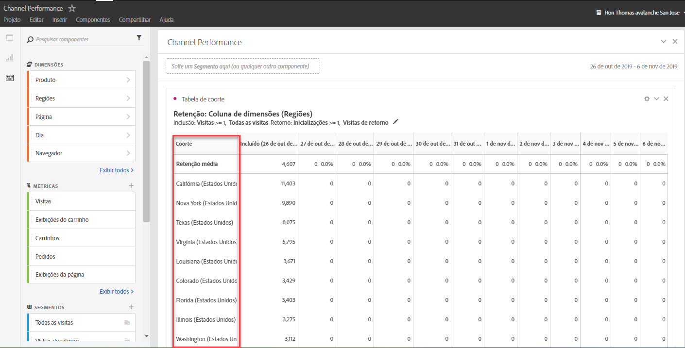

# Visão geral da tabela de coorte {#cohort-table-overview}

<!-- markdownlint-disable MD034 -->

>[!CONTEXTUALHELP]
>id="workspace_cohorttable_button"
>title="Tabela de coorte"
>abstract="Crie uma visualização de coorte para agrupar usuários com base na conclusão de um evento e analise o engajamento contínuo e o churn ao longo do tempo."

<!-- markdownlint-enable MD034 -->

<!-- markdownlint-disable MD034 -->

>[!CONTEXTUALHELP]
>id="workspace_cohorttable_panel"
>title="Tabela de coorte"
>abstract="Agrupe os usuários com base na conclusão de um evento e analise o engajamento contínuo e o churn ao longo do tempo.  **Parâmetros &#x200B;** **Critérios de inclusão**: os componentes usados para definir os coortes de visitantes iniciais. **Critérios de retorno**: os componentes usados para determinar se um visitante retornou."

<!-- markdownlint-enable MD034 -->

>[!BEGINSHADEBOX]

_Este artigo documenta a tabela de Coorte no_  _&#x200B;**Adobe Analytics**._ _Consulte a [tabela de Coorte](https://experienceleague.adobe.com/pt-br/docs/analytics-platform/using/cja-workspace/visualizations/cohort-table/cohort-analysis) para a versão_  _&#x200B;**Customer Journey Analytics** deste artigo._

>[!ENDSHADEBOX]

A *coorte* é um grupo de pessoas com características comuns em um período específico. A visualização da  **[!UICONTROL tabela de coorte]** é útil, por exemplo, quando você deseja saber como uma coorte interage com uma marca. Você pode detectar facilmente as mudanças nas tendências e atuar de acordo com elas. (Há explicações sobre a [!UICONTROL análise de coorte] disponíveis na Web, por exemplo, em [Análise de coorte 101](https://pt.wikipedia.org/wiki/Cohort_analysis).)

Após criar um relatório de coorte, você pode preparar seus componentes (dimensões, métricas e filtros específicos) e, em seguida, compartilhá-lo com qualquer pessoa. Consulte [Preparar e compartilhar](/help/analyze/analysis-workspace/curate-share/curate.md).

Exemplos do que é possível fazer com uma [!UICONTROL tabela de coorte]:

* Inicie campanhas projetadas para estimular uma ação desejada.
* Mudar o orçamento de marketing no momento exato do ciclo de vida do cliente.
* Reconhecer quando finalizar uma avaliação ou uma oferta para maximizar o valor.
* Obter ideias para o teste A/B em áreas como o estabelecimento de preços, o caminho de atualização, etc.

A [!UICONTROL Tabela de coorte] está disponível para todos os clientes da Adobe Analytics com direitos de acesso ao [!UICONTROL Analysis Workspace].

>[!BEGINSHADEBOX]

Consulte  [Análise de coorte no Analysis Workspace](https://experienceleague.adobe.com/pt-br/docs/analytics-learn/tutorials/analysis-workspace/cohort-analysis/cohort-analysis-workspace){target="_blank"} para assistir a um vídeo de demonstração.

>[!ENDSHADEBOX]

>[!IMPORTANT]
>
>A [!UICONTROL análise de coorte] não é compatível com métricas não filtráveis (incluindo métricas calculadas), métricas não inteiras (como Receita) ou Ocorrências. Somente as métricas que podem ser usadas em filtros são compatíveis com a [!UICONTROL análise de coorte] e só é possível incrementá-las uma por vez.

As tabelas de coorte no Adobe Analytics são compatíveis com métricas com base dupla (ou com base numérica). Por exemplo, &quot;Purchase.Value&quot; (um valor duplo) pode ser usado como uma métrica de inclusão/retorno. Além disso, todas as métricas enviadas à Adobe Experience Platform por meio do conector de origem do Analytics também possuem valor duplo.

## Recursos da tabela de coorte

As seções a seguir descrevem os recursos da análise de coorte que permitem o controle aprimorado sobre as coortes que você está criando.

Para obter informações mais detalhadas sobre como criar uma coorte e executar um relatório de [!UICONTROL Análise de coorte], consulte [Configurar uma tabela de coorte](/help/analyze/analysis-workspace/visualizations/cohort-table/t-cohort.md).

### Tabela de retenção

Uma tabela de coorte de [!UICONTROL retenção] retorna pessoas: cada célula de dados mostra o número bruto e a porcentagem de pessoas da coorte que realizaram a ação durante esse período. É possível incluir até 3 métricas e 10 filtros.

### Tabela de churn

Uma tabela de coorte de [!UICONTROL churn] é o inverso da tabela de retenção e mostra as pessoas que abandonaram ou que nunca atenderam aos critérios de retorno da coorte ao longo do tempo. É possível incluir até 3 métricas e 10 filtros.

### Cálculo contínuo

É possível calcular a retenção ou churn com base na coluna anterior, não na coluna incluída, o que é chamado de cálculo contínuo.

### Tabela de latência

Uma tabela de latência mede o tempo decorrido antes e depois da ocorrência do evento de inclusão. A medição da latência é uma ferramenta excelente para análise prévia e posterior. Uma coluna **[!UICONTROL Incluída]** encontra-se no centro da tabela e períodos de tempo anteriores e posteriores ao evento de inclusão são exibidos em ambos os lados.

### Coorte de dimensão personalizado

É possível criar coortes com base em uma dimensão selecionada ao invés de coortes baseadas em tempo (que são o padrão). Use dimensões como [!UICONTROL cidade geográfica], [!UICONTROL canal de marketing], [!UICONTROL campanha], [!UICONTROL produto], [!UICONTROL página], [!UICONTROL região] ou qualquer outra para mostrar como a retenção é alterada. Com base nos diferentes valores dessas dimensões.

>[!MORELIKETHIS]
>
>[Configurar uma tabela de coorte](/help/analyze/analysis-workspace/visualizations/cohort-table/t-cohort.md).
>

<!--
A *`cohort`* is a group of people sharing common characteristics over a specified period. [!UICONTROL Cohort Analysis] is useful, for example, when you want to learn how a cohort engages with a brand. You can easily spot changes in trends, then respond accordingly. (Explanations of [!UICONTROL Cohort Analysis] are available on the web, such as at [Cohort Analysis 101](https://en.wikipedia.org/wiki/Cohort_analysis).)

After creating a cohort report, you can curate its components (specific dimensions, metrics, and segments), then share the cohort report with anyone. See [Curate and Share](/help/analyze/analysis-workspace/curate-share/curate.md).

Examples of what you can do with [!UICONTROL Cohort Analysis]:

* Launch campaigns designed to spur a desired action.
* Shift marketing budget at exactly the right time in the customer lifecycle.
* Recognize when to end a trial or an offer, in order to maximize value.
* Gain ideas for A/B testing in areas such as pricing, upgrade path, and so on.

[!UICONTROL Cohort Analysis] is available for all Adobe Analytics customers with access rights to [!UICONTROL Analysis Workspace].

>[!BEGINSHADEBOX]

See  [Cohort analysis in Analysis Workspace](https://experienceleague.adobe.com/en/docs/analytics-learn/tutorials/analysis-workspace/cohort-analysis/overview-of-cohort-tables-in-analysis-workspace){target="_blank"} for a demo video.

>[!ENDSHADEBOX]

>[!IMPORTANT]
>
>[!UICONTROL Cohort Analysis] does not support non-segmentable metrics (including calculated metrics), non-integer metrics (such as Revenue), or Occurrences. 
>
>Only metrics that can be used in segments can be used in [!UICONTROL Cohort Analysis], and they can only be incremented by >1 at a time. 

## Cohort Analysis capabilities

The following sections describe Cohort Analysis features that allow for fine-tuned control over the cohorts you are building.

For more detailed information about creating a cohort and running a [!UICONTROL Cohort Analysis] report, see [Configure a Cohort Analysis report](/help/analyze/analysis-workspace/visualizations/cohort-table/t-cohort.md).

### [!UICONTROL Retention] Table

A [!UICONTROL Retention] cohort report returns visitors: each data cell shows the raw number and percentage of visitors in the cohort who did the action during that time period. You can include up to 3 metrics and up to 10 segments.

>[!BEGINSHADEBOX]

See  [Calculate rolling retention](https://experienceleague.adobe.com/en/docs/analytics-learn/tutorials/analysis-workspace/cohort-analysis/calculate-rolling-retention-in-cohort-tables){target="_blank"} for a demo video.

>[!ENDSHADEBOX]

### [!UICONTROL Churn] Table

A [!UICONTROL Churn] cohort is the inverse of a retention table and shows the visitors who fell out or never met the return criteria for your cohort over time. You can include up to 3 metrics and up to 10 segments.

>[!BEGINSHADEBOX]

See  [Churn analysis](https://experienceleague.adobe.com/en/docs/analytics-learn/tutorials/analysis-workspace/cohort-analysis/churn-analysis-with-cohort-tables){target="_blank"} for a demo video.

>[!ENDSHADEBOX]

### [!UICONTROL Rolling Calculation]

Lets you calculate retention or churn based on the previous column, not the included column.

### [!UICONTROL Latency] Table

Measures the time that has elapsed before and after the inclusion event occurred. This is an excellent tool for pre/post analysis. The **[!UICONTROL Included]** column is in the center of the table and time periods before and after the inclusion event are shown on both sides.

### [!UICONTROL Custom Dimension] Cohort

Create cohorts based on a selected dimension, and not time-based cohorts, which are the default. Use dimensions such as [!UICONTROL marketing channel], [!UICONTROL campaign], [!UICONTROL product], [!UICONTROL page], [!UICONTROL region], or any other dimension in Adobe Analytics to show how retention changes based on the different values of these dimensions.

-->
