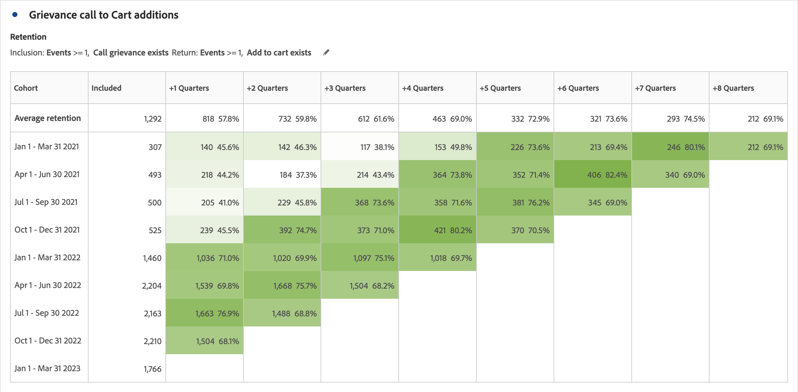

# What is [!UICONTROL Cohort Analysis]?

A *`cohort`* é um grupo de pessoas com características comuns em um período específico. [!UICONTROL A análise de coorte é útil, por exemplo, quando você deseja saber como uma coorte interage com uma marca. ] Você pode detectar facilmente as mudanças nas tendências e atuar de acordo com elas. (Explanations of [!UICONTROL Cohort Analysis] are available on the web, such as at [Cohort Analysis 101](https://en.wikipedia.org/wiki/Cohort_analysis).)

Após criar um relatório de coorte, você pode preparar seus componentes (dimensões, métricas e segmentos específicos), em seguida, compartilhá-lo com qualquer pessoa. Consulte [Preparar e compartilhar](/help/analyze/analysis-workspace/curate-share/curate.md).

Examples of what you can do with [!UICONTROL Cohort Analysis]:

* Lançar campanhas projetadas para estimular uma ação desejada.
* Deslocar o orçamento de marketing no momento certo do ciclo de vida do cliente.
* Reconhecer quando encerrar uma avaliação ou uma oferta, para maximizar o valor.
* Obter ideias para o teste A/B em áreas como o estabelecimento de preços, o caminho de atualização, etc.
* View a [!UICONTROL Cohort Analysis] report within a Guided Analysis report.

[!UICONTROL A Análise] de coorte está disponível para todos os clientes da Adobe Analytics com direitos de acesso ao [!UICONTROL Analysis Workspace].

[Análise de coorte no YouTube](https://www.youtube.com/watch?v=kqOIYrvV-co&amp;index=45&amp;list=PL2tCx83mn7GuNnQdYGOtlyCu0V5mEZ8sS) (4:36)

>[!IMPORTANT]
>
>[!UICONTROL Análise de coorte]
>
>não suporta métricas não segmentáveis (incluindo métricas calculadas), métricas não-inteiras (como Receita) ou Ocorrências. Somente as métricas que podem ser usadas em segmentos podem ser usadas em
>[!UICONTROL Análise]de coorte, que só pode ser aumentada em 1 de cada vez.

## Recursos da análise de coorte

Os seguintes recursos permitem controle ajustado sobre os coortes que você está criando:

### [!UICONTROL Tabela de retenção]

A [!UICONTROL Retention] cohort report returns visitors: each data cell shows the raw number and percentage of visitors in the cohort who did the action during that time period. É possível incluir até 3 métricas e 10 segmentos.

### [!UICONTROL Tabela de abandono]

A [!UICONTROL Churn] cohort is the inverse of a retention table and shows the visitors who fell out or never met the return criteria for your cohort over time. É possível incluir até 3 métricas e 10 segmentos.

### [!UICONTROL Cálculo contínuo]

Permite calcular a retenção ou o abandono com base na coluna anterior em vez da coluna incluída.

### [!UICONTROL Tabela de latência]

Mede o tempo decorrido antes e depois da ocorrência do evento de inclusão. Essa é uma ferramenta excelente para ser usada antes ou depois da análise. The **[!UICONTROL Included]** column is in the center of the table and time periods before and after the inclusion event are shown on both sides.

### [!UICONTROL Coorte de dimensão personalizada]

Crie coortes com base em uma dimensão selecionada, em vez de coortes com base em tempo, que são o padrão. Use dimensions such as [!UICONTROL marketing channel], [!UICONTROL campaign], [!UICONTROL product], [!UICONTROL page], [!UICONTROL region], or any other dimension in Adobe Analytics to show how retention changes based on the different values of these dimensions.

Para obter instruções sobre como configurar e executar um relatório de coorte, acesse [Configurar um relatório de análise de coorte](/help/analyze/analysis-workspace/visualizations/cohort-table/t-cohort.md).

