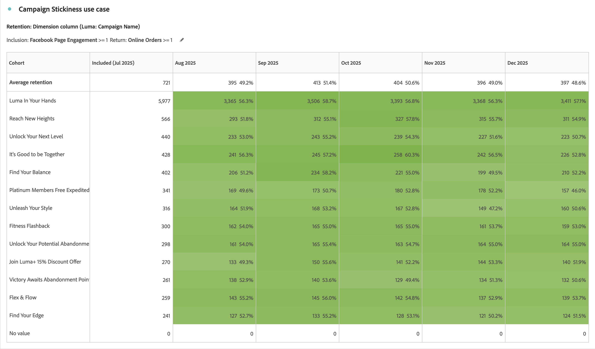

# Casos de uso da análise de coorte

Este artigo discute vários casos de uso típicos para os quais as tabelas de coorte são úteis para fornecer insights úteis para as próximas ações.

## Engajamento no aplicativo

Suponha que você queira analisar como os usuários que instalam seu aplicativo se envolvem com o aplicativo ao longo do tempo. Os usuários instalam o aplicativo e nunca o usam depois? Ou eles usam o aplicativo por algum tempo e depois param de usá-lo? Ou os usuários permanecem envolvidos ao longo do tempo?

Você pode criar uma análise de coorte de seis meses. Os visitantes não contam como *`engaged`* nos meses seguintes, a menos que esses usuários tenham uma sessão ou, pelo menos, inicializem o aplicativo. A [!UICONTROL análise de coorte] mostraria padrões de uso em que sempre *`App Install`* ocorre no Mês 0. Você pode notar que o uso diminui no mês 2, independentemente de quando os usuários instalaram o aplicativo. Essa análise permite enviar um email ou uma mensagem por push a todos os usuários durante o segundo mês após a instalação do aplicativo, para lembrá-los de usar o aplicativo.

+++ Exemplo de visualização de tabela de coorte

+++

## Assinatura

Você trabalha em Adobe.com e oferece uma assinatura gratuita do Creative Cloud. O objetivo é que os usuários atualizem da versão gratuita para a versão de avaliação de 30 dias ou, em última análise, a versão paga.

Use a [!UICONTROL Análise de coorte] para entender, por exemplo, que entre 8% e 10% dos usuários gratuitos do Creative Cloud atualizam no primeiro mês após a instalação, independentemente de quando ela foi feita. Em seguida, atualização de 12 a 15% no segundo mês de uso. Depois disso, a atualização diminui significativamente: 4-5% no terceiro mês, 3-4% no quarto mês e 1-2% no quinto mês.

Reconhecendo que você não deseja perder clientes em potencial no terceiro mês, você configurou uma campanha de email projetada para sair no terceiro mês do segundo a uma amostra de usuários. Nessa campanha, você oferece um cupom de US$ 50 para usuários que ainda não atualizaram.

Verifique com sua análise de coorte alguns meses depois. Para coortes formados após o lançamento da campanha, a conversão para assinaturas pagas do Creative Cloud no terceiro mês aumentou de 4-5% para 13-14%. A conversão resulta em centenas de milhares de dólares por coorte para cada coorte mensal que atinja o terceiro mês a partir desse ponto.

+++ Exemplo de visualização de tabela de coorte

+++

## Segmentos complexos de coorte

Você faz análises para uma grande cadeia de hotéis que segmenta vários grupos de clientes para promoções e rastreia os grupos de clientes em relação ao desempenho. Para identificar os melhores grupos de coortes de usuários a serem segmentados, é necessário criar grupos de coorte muito específicos. Use os critérios aumentados de [!UICONTROL Inclusão] e [!UICONTROL Retorno] nas tabelas de [!UICONTROL Coorte] para definir apenas os agrupamentos de coorte corretos com várias métricas e segmentos. Essa análise ajuda a identificar grupos de clientes com baixo desempenho, para que você possa direcioná-los com promoções e ofertas para aumentar as reservas.

+++ Exemplo de visualização de tabela de coorte

+++

## Adoção da versão do aplicativo

Você é o analista de uma grande empresa de seguros que orienta o engajamento do cliente por meio do uso de seu aplicativo móvel. À medida que novos recursos são adicionados ao aplicativo, os clientes devem atualizar para a versão mais recente do aplicativo. É possível analisar e comparar as versões do aplicativo lado a lado usando o Coorte do [!UICONTROL Dimension personalizado] para ver quais clientes e suas respectivas versões do aplicativo para direcionar. Além disso, você pode rastrear a retenção e a rotatividade para ver se versões específicas do aplicativo estão afastando os clientes do uso do aplicativo ao longo do tempo. Por meio dos esforços de mensagens móveis, você pode reengajar esses usuários para que eles atualizem para a versão mais recente e aproveitem os recursos mais recentes.

+++ Exemplo de visualização de tabela de coorte

+++

## Adesão à campanha

Você é o analista de uma empresa de mídia multinacional que usa campanhas direcionadas para direcionar usuários para suas várias plataformas, gerando engajamento. O gasto com anúncios por plataforma se baseia no envolvimento e na retenção do cliente. Campanhas bem-sucedidas são essenciais para o sucesso da empresa. Você usa o novo recurso de Coorte [!UICONTROL Dimension personalizado] nas Tabelas [!UICONTROL Coorte] para comparar várias campanhas lado a lado, para identificar quais campanhas são mais eficazes para conquistar e reter usuários para aumentar o engajamento. Você pode identificar quais aspectos tornam uma campanha bem-sucedida e aplicar esse conhecimento a outras campanhas para aumentar o engajamento em várias plataformas.

+++ Exemplo de visualização de tabela de coorte

+++

## Lançamento de produto

Você é o analista de uma grande retailer de vestuário que tem muitos segmentos de clientes específicos que geram grandes parcelas de receita para seus negócios. Cada segmento tem produtos específicos projetados e criados com o segmento em mente. A cada lançamento de produto, você quer saber como o novo produto impulsionou as vendas para vários coortes ao longo do tempo. Usando a nova configuração de [!UICONTROL Tabela de latência] na [!UICONTROL Análise de coorte], você pode analisar o comportamento e a receita de pré-lançamento e pós-lançamento de um determinado segmento de cliente. Usando essas informações, você pode identificar quais produtos estão gerando novas receitas e quais não estão ganhando força com os clientes.

+++ Exemplo de visualização de tabela de coorte

+++

## Adesão individual - usuários mais fiéis

Você é o analista de uma grande companhia aérea que obtém a maior parte de seu sucesso e receita de clientes recorrentes e fiéis. Em muitos casos, viajantes fiéis compõem a maior parte da receita e manter esses clientes é essencial para o sucesso a longo prazo. Identificar os clientes mais leais e consistentes pode ser difícil. Entretanto, usando a nova configuração [!UICONTROL Cálculo contínuo] na [!UICONTROL Análise de coorte], você pode analisar segmentos de clientes fiéis e descobrir quais viajantes eram compradores recorrentes mês a mês. Você pode direcionar a esses viajantes recompensas e benefícios por sua fidelidade. Além disso, ao alternar o tipo de coorte de retenção para churn, você também pode identificar quais clientes não eram compradores recorrentes mês a mês. Em seguida, você pode direcionar esses segmentos com promoções para reengajar com esses clientes, de modo que eles permaneçam fiéis no futuro.

+++ Exemplo de visualizações de tabela de coorte

+++
