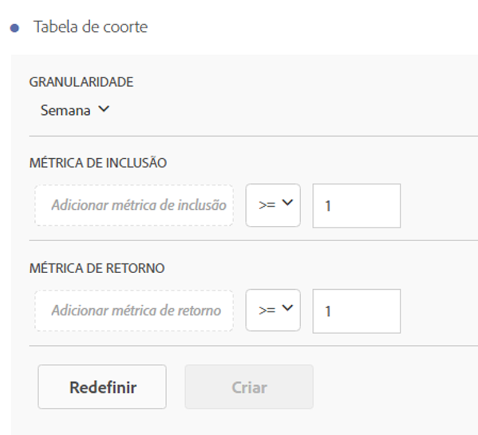
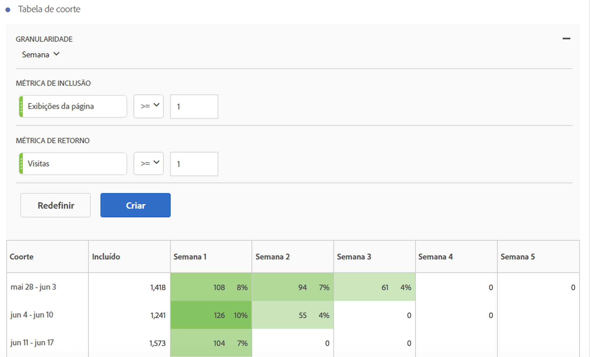

# Configurar um relatório de análise de coorte

Crie um coorte e execute um relatório de análise de coorte na Analysis Workspace.

1. In Analysis Workspace, click the **[!UICONTROL Visualizations]** icon in the left rail and drag a **[!UICONTROL Cohort Table]** to the canvas.

   

1. Define the **[!UICONTROL Inclusion Criteria]**, **[!UICONTROL Return Criteria]**, **[!UICONTROL Cohort Type]**, and **[!UICONTROL Settings]** as defined in the table below.

| Elemento | Descrição |
|--- |--- |
| **[!UICONTROL Critérios de inclusão]** | É possível aplicar até 10 segmentos de inclusão e até 3 métricas de inclusão. A métrica especifica o que coloca um usuário em um coorte. Por exemplo, se a métrica de inclusão for Pedidos, apenas os usuários que fizeram um pedido durante o período da análise de coorte serão incluídos no coorte inicial. O operador padrão entre métricas é E, mas você pode alterá-lo para OU. Além disso, pode-se adicionar filtros numéricos a essas métricas. Por exemplo: "Visitas &gt;= 1".  |
| **[!UICONTROL Critério de retorno]** | É possível aplicar até 10 segmentos de retorno e até 3 métricas de retorno. A métrica indica se o usuário foi retido (retenção) ou não (churn). Por exemplo, se a métrica de retorno for Visualizações de vídeo, apenas os usuários que visualizaram os vídeos durante os períodos subsequentes (após o período em que foram adicionados a um coorte) serão representados como retidos. A métrica Visitas também quantifica a retenção. |
| **[!UICONTROL Granularidade]** | A granularidade de tempo do dia, semana, mês, trimestre ou ano. |
| **[!UICONTROL Tipo]** | **** Retenção (padrão): um coorte de retenção mede o desempenho de retorno de seus coortes de visitante em sua propriedade ao longo do tempo. Esse é o coorte padrão que sempre tivemos e indica o comportamento de usuários repetidos e que retornam. Um Coorte de retenção é indicado pela cor verde na tabela. **[!UICONTROL Churn]**: Um coorte de conversão (também conhecido como "atrito" ou "fallout") mede como os coortes de visitante saem da propriedade ao longo do tempo. Churn = 1 - Retenção. O Churn é uma boa maneira de medir a adesão, bem como uma oportunidade, mostrando a frequência com que clientes não retornam. Você pode usar a conversão para analisar e identificar áreas de foco: quais segmentos de coorte poderiam usar alguma atenção. A Churn Cohort is indicated by the color red in the table (similar to fallout in our **[!UICONTROL Flow]** visualization).  |
| **[!UICONTROL Configurações]** | **[!UICONTROL Cálculo contínuo]**: calcule a retenção ou o churn com base na coluna anterior em vez da coluna Incluídos (padrão). O Cálculo contínuo altera o método de cálculo para seus períodos de “retorno”. O cálculo normal encontra usuários de maneira independende que atendem ao critério de “retorno” e faziam parte do período de inclusão, mesmo se estavam ou não no coorte do período anterior. Em vez disso, o Cálculo contínuo encontra usuários que atendem ao critério de “retorno” e faziam parte do período anterior. Portanto, o Cálculo contínuo filtra os usuários que continuamente atendem ao critério de “retorno” ao longo do tempo. O critério de retorno é aplicado a cada período até o período selecionado.   **[!UICONTROL Tabela de latência]**: uma tabela de latência mede o tempo decorrido antes e depois da ocorrência do evento de inclusão. A Latência é ideal para ser usada antes e depois da análise. Por exemplo, se você tiver um lançamento de produto ou campanha em breve e deseja monitorar o comportamento previamente, além de acompanhar o desempenho posteriormente, a tabela de Latência mostrará os comportamentos de antes e depois lado a lado para que você veja o impacto direto. As células de pré-inclusão na Tabela de latência são calculadas por usuários que atendem ao critério de “inclusão” no período de inclusão e ao critério de “retorno” em períodos anteriores ao de inclusão. Observe que Tabelas de latência e o Coorte de dimensão personalizado não podem ser usados juntos.  **[!UICONTROL Coorte de dimensão personalizado]**: crie coortes com base na dimensão selecionada, em vez de coortes com base no tempo (padrão). Muitos usuários desejam analisar seus coortes em comparação a algo diferente de tempo e o novo recurso de Coorte de dimensão personalizado permite ter flexibilidade para criar coortes com base nas dimensões desejadas. Use dimensões como canal de marketing, campanha, produto, página, região ou qualquer outra dimensão no Adobe Analytics para exibir como a retenção é alterada com base nos valores diferentes destas dimensões. A definição de segmento Dimensão de coorte personalizada aplica o item de dimensão somente como parte do período de inclusão, não como parte da definição de retorno.  Depois de escolher a opção Coorte de dimensão personalizado, você pode arrastar e soltar qualquer dimensão que desejar na área designada. Isso permite comparar itens de dimensão similares entre o mesmo período de tempo. Por exemplo, é possível comparar o desempenho de cidades lado a lado, produtos, campanhas etc. Retornará seus 14 itens de dimensão principais. Entretanto, você pode usar um filtro (acesse-o passando o mouse sobre o lado direito da dimensão que foi arrastada) para exibir somente os itens de dimensão desejados. Um Coorte de dimensão personalizado não pode ser usado com o recurso de Tabela de latência.  |

1. Ajuste as Configurações **[!UICONTROL da tabela de]** coorte clicando no ícone de engrenagem.

| Configuração| Descrição|| Mostrar apenas percentagem| Remove o valor do número e mostra somente a porcentagem. || Percentagem arredondada para o inteiro mais próximo| Arredonda o valor percentual para o inteiro mais próximo em vez de mostrar o valor decimal. || Mostrar linha de porcentagem média| Insere uma nova linha na parte superior da tabela e adiciona a média para os valores dentro de cada coluna. |

## Criar o relatório de Análise de coorte

1. Clique em **[!UICONTROL Construir]**.

   

   O relatório mostra os visitantes que fizeram um pedido ( *`Included`* coluna) e que retornaram ao site em visitas subsequentes. A redução nas visitas ao longo do tempo permite que você detecte os problemas e aja conforme o necessário.
1. (Opcional) Crie um segmento a partir de uma seleção.

   Selecione as células (adjacentes ou não adjacentes), em seguida, clique com o botão direito do mouse em &gt; **[!UICONTROL Criar segmento a partir da seleção]**.

1. In the [Segment Builder](https://marketing.adobe.com/resources/help/en_US/analytics/segment/seg_build.html), further edit the segment, then click **[!UICONTROL Save]**.

   O segmento salvo está disponível para uso no painel [!UICONTROL Segmento] na Analysis Workspace.
1. Nomeie e salve seu projeto de coorte.
1. (Optional) [Curate and share](../../../../analyze/analysis-workspace/curate-share/curate.md#concept_4A9726927E7C44AFA260E2BB2721AFC6) the project components.

   >[!NOTE]
   >
   >You must save your project before curation is available.

