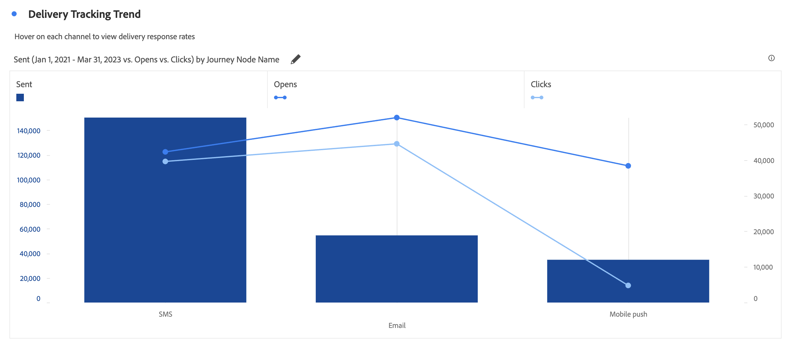

# Gráfico de combinação

A visualização do [!UICONTROL Gráfico de combinação] facilita a construção rápida de uma visualização de comparação sem ter que construir uma tabela primeiro. Você pode visualizar facilmente as tendências em seus dados em uma combinação de linha/barra.

Use um [!UICONTROL Gráfico de combinação] para

* Compare os pedidos desta semana com pedidos do mesmo período no mês passado (ou no ano passado) com apenas alguns cliques.

* Analisar e comparar várias métricas rapidamente (como [!UICONTROL Visitantes únicos] e [!UICONTROL Receita]) no mesmo gráfico.

* Analisar uma métrica em relação a uma função (como [!UICONTROL Média acumulada]) ao longo de um horizonte de tempo.

Lembre-se:

* É possível adicionar várias comparações em um único [!UICONTROL gráfico de combinação].
* Se você adicionar uma ou mais comparações, elas devem ser do mesmo tipo, como [!UICONTROL Comparação de tempo].
* Você pode adicionar até 5 comparações.
* É possível aplicar até 3 filtros (segmentos) a uma métrica.
* Métricas calculadas não são compatíveis com gráficos de combinação.

## Criar um gráfico de combinação

1. Na lista suspensa Visualizações, no painel à esquerda, arraste a visualização do [!UICONTROL Gráfico de combinação] para um painel em branco.

   

1. Nas listas suspensas, selecione uma dimensão para o eixo X e uma métrica para o eixo Y.

1. Selecione o tipo de [!UICONTROL Comparação de linhas] que deseja usar.

   | Tipo de comparação de linha | Definição |
   | --- | --- |
   | **[!UICONTROL Comparação de tempo]** | O tipo de comparação mais comum: comparar esse período com 4 semanas atrás, por exemplo. Se você selecionou [!UICONTROL Comparação de tempo], selecione uma segunda opção para definir com qual período deseja comparar.
 |
   | **[!UICONTROL Função]** | Você pode incluir uma função, como [!UICONTROL Média], na comparação. Consulte uma lista de funções compatíveis abaixo.
 |
   | **[!UICONTROL Métrica secundária]** | Você pode, por exemplo, comparar a [!UICONTROL Receita] com outra métrica.
 |

   {style="table-layout:auto"}

1. Clique em **[!UICONTROL Criar]**.

   O resultado será semelhante a este:

   

   O período atual é mostrado no gráfico de barras e o período de comparação é representado pelo gráfico de linhas. Os pontos no gráfico de linha são conhecidos como “barras”.

## Funções compatíveis

Se você escolher **[!UICONTROL Função]** como o [!UICONTROL Tipo de comparação de linha], uma função da métrica escolhida será retornada.

| Função | Definição |
| --- | --- |
| **[!UICONTROL Soma da coluna]** | Adiciona todos os valores numéricos de uma métrica em uma coluna (nos elementos de uma dimensão) |
| **[!UICONTROL Média acumulada]** | Retorna a média das últimas N linhas. |
| **[!UICONTROL Medianiz]** | Retorna a mediana de uma métrica em uma coluna. A mediana é o número presente no meio de um conjunto de números, ou seja, metade dos números apresentam valores maiores ou iguais à mediana e metade são menores ou iguais à mediana. |
| **[!UICONTROL Cumulativo]** | A soma cumulativa de N linhas. |
| **[!UICONTROL Máximo da coluna]** | Retorna o maior valor em um conjunto de elementos de dimensão para uma coluna de métrica. |
| **[!UICONTROL Média]** | Retorna a média aritmética de uma métrica. |
| **[!UICONTROL Mínimo da coluna]** | Retorna o menor valor em um conjunto de elementos de dimensão para uma coluna de métrica. |

{style="table-layout:auto"}

Este é um exemplo da média cumulativa da métrica Receita:

Este é um exemplo de um gráfico de combinação com as funções Média cumulativa e Média:

## Configurações do gráfico de combinação

Clique no ícone de engrenagem na parte superior direita de um gráfico de combinação para alterar suas configurações.

| Configuração | Definição |
| --- | --- |
| **[!UICONTROL Tipo de visualização]** | Permite alternar para outro tipo de visualização. |
| **[!UICONTROL Granularidade]** | Para visualizações de tendências, você pode alterar a granularidade de tempo (dia, semana, mês etc.) nesta lista suspensa. |
| **[!UICONTROL Geral]** |  |
| **[!UICONTROL Porcentagens]** | Exibe os valores em porcentagens. |
| **[!UICONTROL Legenda visível]** | Permite ocultar o texto detalhado da legenda para a visualização dos gráficos de combinação. |
| **[!UICONTROL Limite máximo de itens]** | Reduz o número de itens no eixo X. Se você tiver um conjunto de dados grande, será possível exibir apenas os primeiros 10 itens (ou qualquer valor que escolher). |
| **[!UICONTROL Sobreposições]** | Mostrar ou ocultar barras nas linhas. |
| **[!UICONTROL Eixo]** | |
| **[!UICONTROL Exibir eixo duplo]** | Somente se aplica se você tiver duas métricas. Você pode ter um eixo Y à esquerda (para uma métrica) e outro à direta (para a outra métrica). Isso é útil quando métricas projetadas têm magnitudes muito diferentes. A cor do eixo duplo corresponde à cor da tabela, a menos que haja várias comparações. Nesse caso, a cor de todas as comparações é cinza. |
| **[!UICONTROL Normalização]** | Força as métricas para proporções iguais. Isso é útil quando métricas projetadas têm magnitudes muito diferentes. |
| **[!UICONTROL Mostrar eixo X]** | Exibe ou oculta o eixo X. |
| **[!UICONTROL Mostrar eixo Y]** | Exibe ou oculta o eixo Y. |
| **[!UICONTROL Ancorar o eixo Y em zero]** | Se todos os valores exibidos no gráfico forem consideravelmente superiores a zero, o padrão do gráfico tornará a parte inferior do eixo y DIFERENTE DE ZERO. Se marcar esta caixa, o eixo y será forçado a zero (e o gráfico será redesenhado). |

{style="table-layout:auto"}
