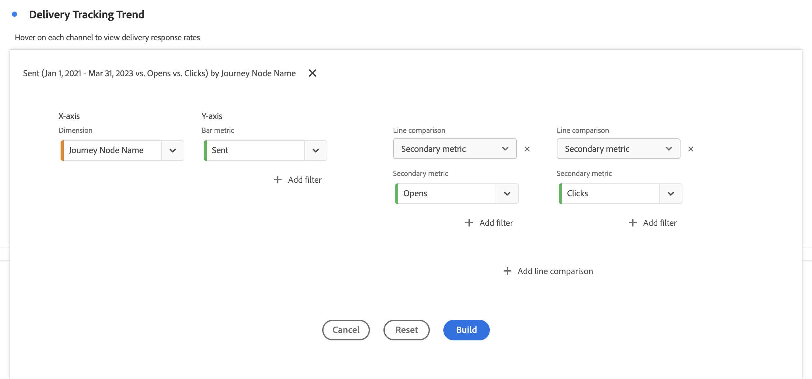

# Gráfico de combinação {#combo}

<!-- markdownlint-disable MD034 -->

>[!CONTEXTUALHELP]
>id="workspace_combo_button"
>title="Combo"
>abstract="Crie uma visualização de gráfico de combinação rapidamente, sem precisar criar uma tabela de forma livre primeiro."

<!-- markdownlint-enable MD034 -->

>[!BEGINSHADEBOX]

_Este artigo documenta a Visualização de combinação no_  _**Adobe Analytics**._

_Consulte [Combinação](https://experienceleague.adobe.com/en/docs/analytics-platform/using/cja-workspace/visualizations/combo-charts) para a_  _**Customer Journey Analytics** versão deste artigo._

>[!ENDSHADEBOX]

A visualização  **[!UICONTROL Combo]** facilita a criação rápida de uma visualização de comparação sem precisar criar uma tabela primeiro. Você pode visualizar facilmente as tendências em seus dados em uma combinação de linha/barra.

Use uma [!UICONTROL Combinação] para:

* Compare os pedidos desta semana com pedidos do mesmo período no mês passado (ou no ano passado).
* Analisar e comparar várias métricas rapidamente (como [!UICONTROL Pessoas] e [!UICONTROL Receita]) no mesmo gráfico.
* Analisar uma métrica em relação a uma função (como [!UICONTROL Média acumulada]) ao longo de um horizonte de tempo.

Lembre-se:

* É possível adicionar várias comparações em um único [!UICONTROL gráfico de combinação].
* Se você adicionar uma ou mais comparações, elas devem ser do mesmo tipo, como [!UICONTROL Comparação de tempo].
* Você pode adicionar até 5 comparações.
* É possível aplicar até 3 filtros a uma métrica.
* Métricas calculadas não são compatíveis com gráficos de combinação.

## Usar

1. Adicione uma visualização de  [!UICONTROL Combinação]. Consulte [Adicionar uma visualização a um painel](freeform-analysis-visualizations.md#add-visualizations-to-a-panel)

1. Nas listas suspensas, selecione uma dimensão para o eixo X e uma métrica para o eixo Y.

1. Selecione o tipo de [!UICONTROL Comparação de linhas] que deseja usar.

   | Tipo de comparação de linha | Definição |
   | --- | --- |
   | **[!UICONTROL Comparação de tempo]** | O tipo de comparação mais comum: comparar esse período com 4 semanas atrás, por exemplo. Se você selecionou [!UICONTROL Comparação de tempo], selecione uma segunda opção para definir com qual período deseja comparar.
 |
   | **[!UICONTROL Função]** | Você pode incluir uma função, como [!UICONTROL Média], na comparação. Consulte a lista de [funções com suporte](#supported-functions).
 |
   | **[!UICONTROL Métrica secundária]** | Você pode, por exemplo, comparar a [!UICONTROL Receita] com outra métrica.
 |

   {style="table-layout:auto"}

1. Selecione **[!UICONTROL Criar]**.

   A saída é semelhante a:

   

   O período atual é mostrado no gráfico de barras. O gráfico de linhas representa o período de comparação. Os pontos no gráfico de linhas são conhecidos como *barras*.

## Funções compatíveis

Se você selecionar **[!UICONTROL Função]** como o [!UICONTROL Tipo de comparação de linha], uma função da métrica escolhida será retornada.

| Função | Definição |
| --- | --- |
| **[!UICONTROL Soma da coluna]** | Adiciona todos os valores numéricos de uma métrica em uma coluna (nos elementos de uma dimensão) |
| **[!UICONTROL Média acumulada]** | Retorna a média das últimas N linhas. |
| **[!UICONTROL Medianiz]** | Retorna a mediana de uma métrica em uma coluna. A mediana é o número no meio de um conjunto de números. Metade dos números tem valores maiores ou iguais à mediana e metade do número tem valores menores ou iguais à mediana. |
| **[!UICONTROL Cumulativo]** | A soma cumulativa de N linhas. |
| **[!UICONTROL Máximo da coluna]** | Retorna o maior valor em um conjunto de elementos de dimensão para uma coluna de métrica. |
| **[!UICONTROL Média]** | Retorna a média aritmética de uma métrica. |
| **[!UICONTROL Mínimo da coluna]** | Retorna o menor valor em um conjunto de elementos de dimensão para uma coluna de métrica. |

{style="table-layout:auto"}

Este é um exemplo da média cumulativa da métrica Receita:

Este é um exemplo de um gráfico de combinação com as funções Média cumulativa e Média:

>[!MORELIKETHIS]
>
>[Adicionar uma visualização a um painel](/help/analyze/analysis-workspace/visualizations/freeform-analysis-visualizations.md#add-visualizations-to-a-panel)
>[Configurações de visualização](/help/analyze/analysis-workspace/visualizations/freeform-analysis-visualizations.md#settings)
>[Menu de contexto de visualização](/help/analyze/analysis-workspace/visualizations/freeform-analysis-visualizations.md#context-menu)
>
