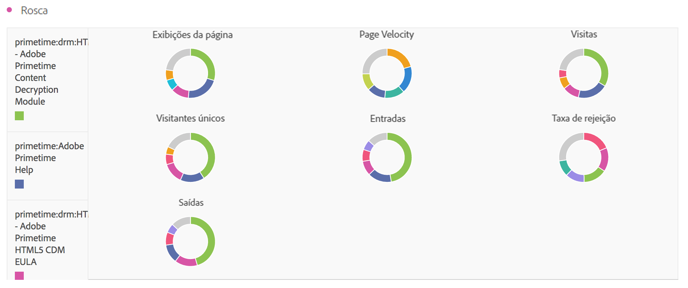

# Rosca

Semelhante ao gráfico de pizza, essa visualização mostra os dados como partes ou segmentos de um todo. Use um gráfico de rosca ao comparar porcentagens de um total, normalmente com um pequeno número de itens.

