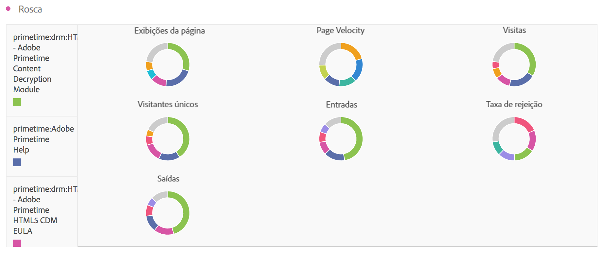

# [!UICONTROL Rosca] {#donut}

<!-- markdownlint-disable MD034 -->

>[!CONTEXTUALHELP]
>id="workspace_donut_button"
>title="Rosca"
>abstract="Crie uma visualização de donut para comparar porcentagens de um total, normalmente com um pequeno número de itens."

<!-- markdownlint-enable MD034 -->

>[!BEGINSHADEBOX]

_Este artigo documenta a visualização de Rosca no_  _&#x200B;**Adobe Analytics**._ _Consulte [Rosca](https://experienceleague.adobe.com/pt-br/docs/analytics-platform/using/cja-workspace/visualizations/donut) para a versão_  _&#x200B;**Customer Journey Analytics** deste artigo._

>[!ENDSHADEBOX]

Semelhante ao gráfico de pizza, a visualização de  **[!UICONTROL rosca]** exibe os dados como partes ou filtros de um todo. Use uma visualização de rosca ao comparar porcentagens de um total, normalmente com um pequeno número de itens.

>[!BEGINSHADEBOX]

Consulte  [Adicionar uma visualização de rosca](https://experienceleague.adobe.com/en/docs/analytics-learn/tutorials/analysis-workspace/visualizations/using-the-donut-visualization){target="_blank"} para ver um vídeo de demonstração.

>[!ENDSHADEBOX]

>[!MORELIKETHIS]
>
>[Adicionar uma visualização a um painel](/help/analyze/analysis-workspace/visualizations/freeform-analysis-visualizations.md#add-visualizations-to-a-panel)
>[Configurações de visualização](/help/analyze/analysis-workspace/visualizations/freeform-analysis-visualizations.md#settings)
>[Menu de contexto da visualização](/help/analyze/analysis-workspace/visualizations/freeform-analysis-visualizations.md#context-menu)
>

